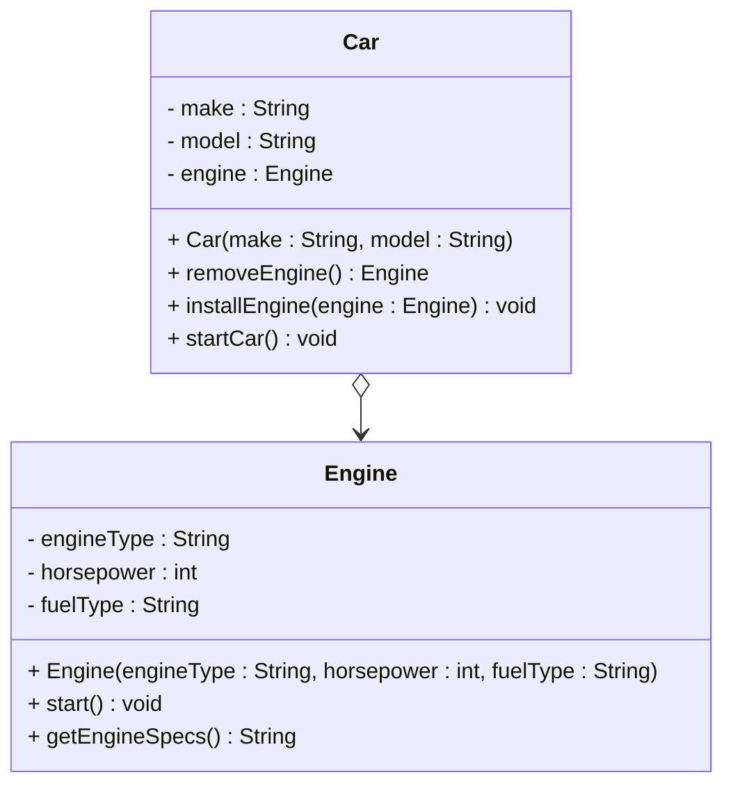

# Aggregation in UML diagrams

The aggregation relationship is represented in UML diagrams as an arrow, with an "open" or "empty" diamond at the start, and open arrow head at the end. Like this:

Notice the empty diamond is at the "owner" side, and the open arrow head is at the "owned" side.
Here, Car knows about Engine, but Engine does not know about Car.