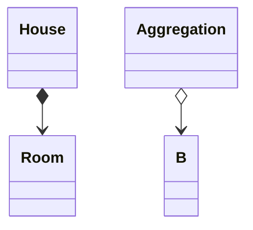

# Composition in UML Diagrams

In UML composition is represented by a solid line with a filled diamond at one end and an "open" arrowhead at the other end, connecting two classes. Notice how aggregation uses a not-filled diagmond.


For example, composition between House and Room, and aggregation between A and B:



And in code, this relationship is implemented by having a field variable of Room in House, where the Room object is created and managed by the House, and no class outside of the House can access this specific Room instance. 
Like this:

```java
public class House {
    private Room livingRoom;  // <--- This is the field variable, making it a composition

    public House(String address) {
        this.address = address;
        this.livingRoom = new Room("Living Room", 300.0, true); // Created internally
    }
}
```

The direction of the arrowhead is important. It _starts_ at the class with the field variable (the container). And _points_ to the class that is the _type_ of the field variable (the contained object).

This means `House` knows about `Room`, but `Room` doesn't know about `House`.\
It is a one-way composition, where only the container knows about the contained object.

