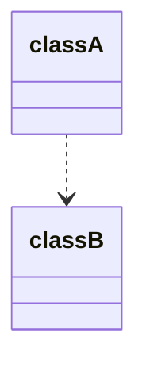
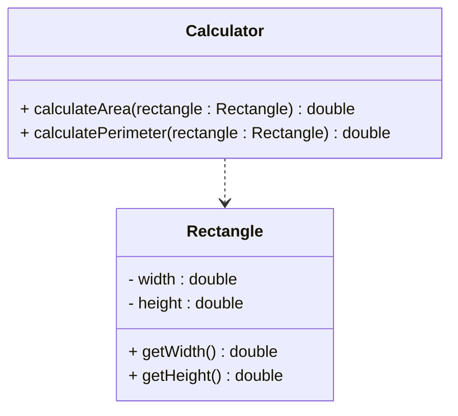

# Dependency in UML Diagrams

In UML class diagrams, dependency is represented by a **dashed line** with an "open" arrowhead at one end, connecting two classes.

## Basic Dependency Notation

For example:

The direction of the arrowhead is important. It _starts_ at the class that depends on another class and _points_ to the class that is being depended upon.

This means `classA` depends on `classB`, but `classB` does not know about `classA`.

## Complete Dependency Examples

Here are the three main types of dependency relationships:

### 1. Dependency through Method Parameters

## When to Show Dependencies in UML

Dependencies are often not shown in UML diagrams because they can quickly clutter the diagram. Show dependencies when:

1. **Method Parameters**: One class uses another as a method parameter
2. **Local Creation**: One class creates another locally within methods
3. **Static Calls**: One class calls static methods of another
4. **Important Relationships**: When the dependency is significant to the system design