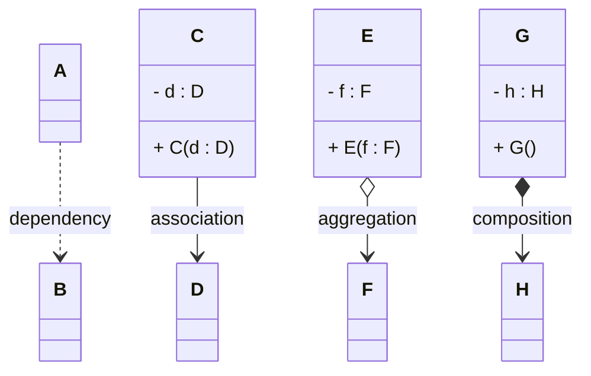

# Overview

This page just quickly recaps the four different relationships we have seen so far.

In UML we have the following, from left to right, weakest to strongest (perhaps a bit abstract):

- **Dependency** : A uses B temporarily, weakest relationship, we rarely and only selectively show this in diagrams.
- **Association** : C knows about D, basic relationship, we show this in diagrams.
- **Aggregation** : E has F as a part, weak ownership, we show this in diagrams, though it rarely is relevant, as we cannot enforce it.
- **Composition** : G owns H completely, strongest relationship, we show this in diagrams.

