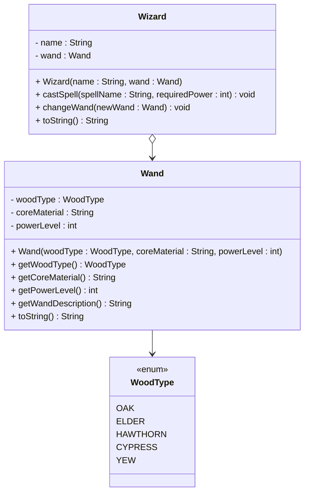

# Exercises 2 - Aggregation

On this page, we will practice implementing aggregation relationships in Java. You will notice, there is little difference between aggregation and association.

## Exercise 2.1: Wizard and Wand

Create a `Wizard` class and a `Wand` class with a one-to-one association. The wizard can cast spells using their wand, and the wand has magical properties.

### Requirements:
- `Wand` class with properties: wood type, core material, and power level
- `Wizard` class with properties: name and aggregated wand
- Method for casting a spell, on the wizard. This method takes a spell name, and the required power level. Check if the wand's power level is sufficient to cast the spell. If it is, cast the spell, and print a message for the effect. If it is not, print some kind of error message.
- Ability to change wands (showing loose coupling)


### UML Diagram:

Below you will find the UML diagram for the exercise.




### Example Output:
```
Gandalf casts 'Fireball' with his Oak wand (Phoenix feather core, Power: 85)
Wand changed! Gandalf now wields an Elder wand (Dragon heartstring core, Power: 95)
```

### Comment
In this exercise, note that the wand is an object, and the wizard has a reference to it. This is a one-to-one aggregation. It does not make sense for a wizard to have multiple wands, in this example. And each wand is wielded by one wizard at a time. We can change the wand, making this a loosly coupled relationship, and thereby an aggregation.\
This is all _intent_ based. Nothing is stopping anyone from doing the following:

```java
Wand wand = new Wand(WoodType.ELDER, "Dragon heartstring", 95);
Wizard wizard = new Wizard("Gandalf", wand);
Wizard wizard2 = new Wizard("Saruman", wand);
```

But when the UML shows aggregation, the intent is that the above should not be done. It is not allowed. So, it's more like a guide line, for fellow developers.
