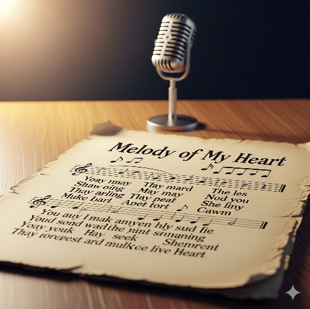
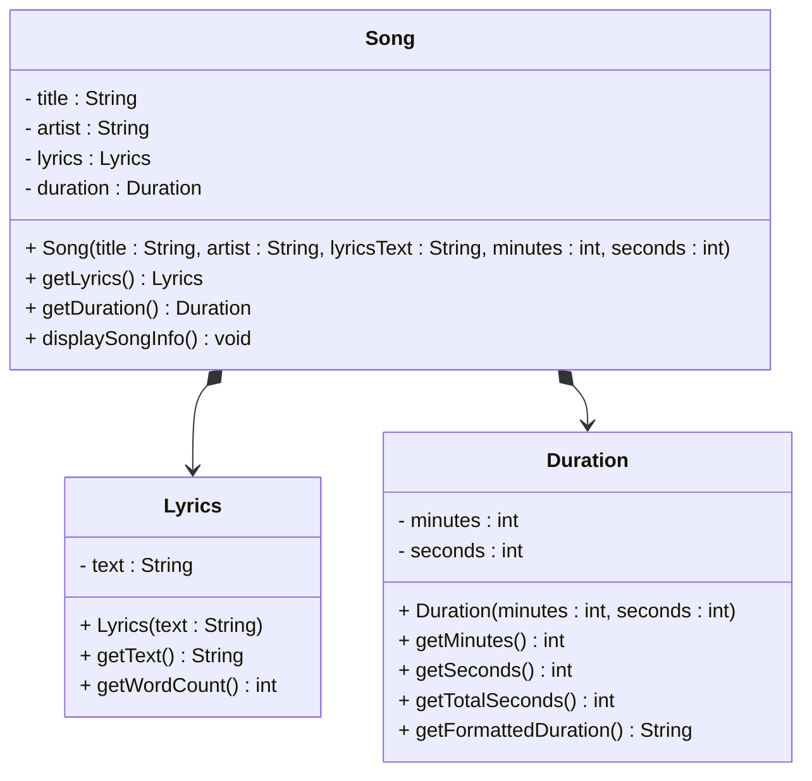

# Composition Exercises

This exercise will practice a composition relationship.



## Exercise 3.1: Song with Lyrics and Duration

Create a `Song` class that has a composition relationship with both `Lyrics` and `Duration` objects. The song should create these objects internally and provide getter methods that return copies of the lyrics and duration.

### Requirements

1. **Song Class**: 
   - Contains a `Lyrics` object and a `Duration` object
   - Creates both objects in its constructor
   - Provides getter methods that return copies (not references) of the lyrics and duration
   - Has a method to display song information

2. **Lyrics Class**:
   - Contains the song's lyrics as a string
   - Has a method to get the lyrics text
   - Should be created internally by the Song

3. **Duration Class**:
   - Contains the song's duration in minutes and seconds
   - Has methods to get duration information
   - Should be created internally by the Song

### UML Diagram



### Why These Are Composition Relationships

**Song and Lyrics**: The lyrics are an integral part of the song's identity. Without the song, the lyrics have no context or meaning. The lyrics cannot exist independently - they are created specifically for this song and are meaningless without it. At least, we pretend so for this exercise. I will have better examples next session.

**Song and Duration**: The duration is a fundamental property of the song itself. It's not just a measurement that could be applied to any song - it's the specific duration of this particular song. The duration is created when the song is created and is an essential characteristic of that song. Even though two songs could have the same duration, they are still different. If one song were to be updated, the duration would change.

### Implementation Notes

- Use **copy constructors** or **copy methods** in your getter methods to return copies of the lyrics and duration
- The Song class should create both Lyrics and Duration objects in its constructor
- Do not provide direct access to the original lyrics or duration objects
- The copy functionality ensures that external code cannot modify the song's internal components

### Example Usage

```java
Song mySong = new Song("Bohemian Rhapsody", "Queen", 
                      "Is this the real life? Is this just fantasy? Caught in a landslide, no escape from reality", 5, 55);

// Get copies of the song's components
Lyrics lyricsCopy = mySong.getLyrics();
Duration durationCopy = mySong.getDuration();

// Use the copies without affecting the original song
System.out.println("Lyrics: " + lyricsCopy.getText());
System.out.println("Duration: " + durationCopy.getFormattedDuration());
```

### Key Learning Points

1. **Strong Ownership**: The Song completely owns its Lyrics and Duration
2. **Internal Creation**: Both child objects are created within the Song constructor
3. **Copy Methods**: Getter methods return copies to preserve composition principles
4. **No External Access**: The original child objects cannot be accessed or modified from outside
5. **Dependent Lifecycle**: When the Song is destroyed, its Lyrics and Duration are also destroyed
