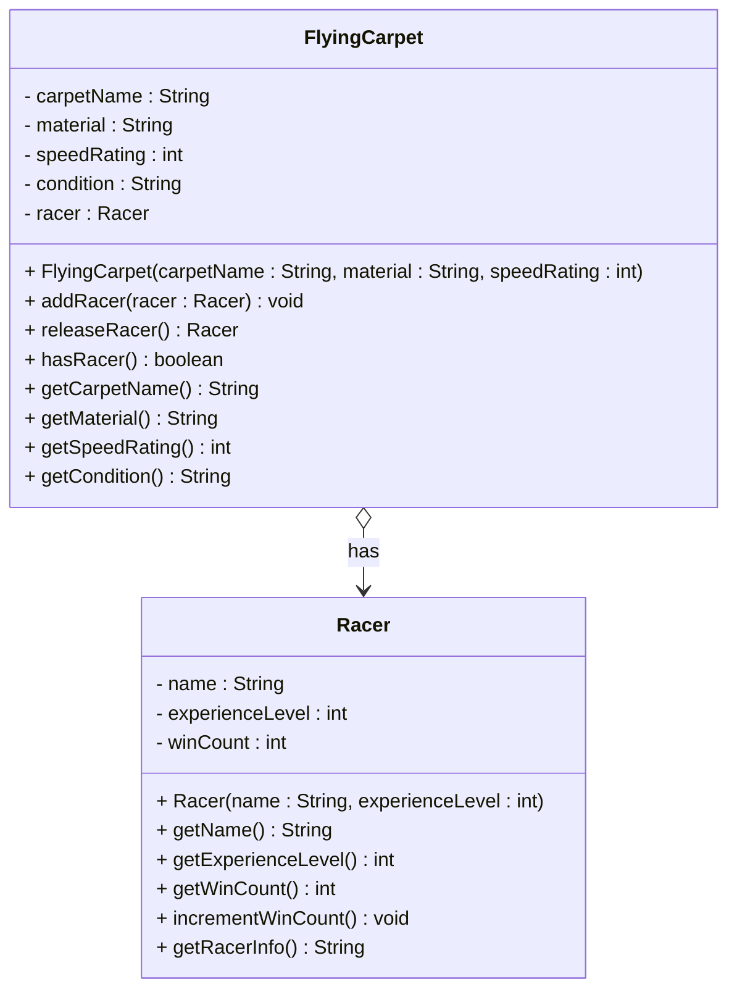
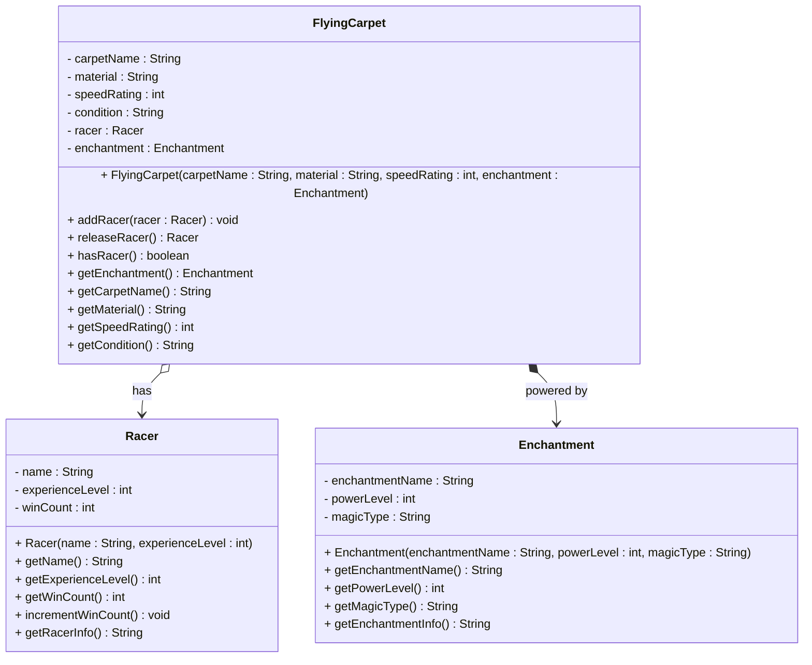

# Flying Carpet Racing Exercises


## Exercise 4.1: Flying Carpet and Racer

Create a `FlyingCarpet` class and a `Racer` class with an **aggregation** relationship. A flying carpet can have a racer, but the racer can exist independently and can switch between different carpets.

### Requirements

1. **FlyingCarpet Class**: 
   - Contains carpet name, material (silk, wool, etc), speed rating, and condition
   - Can acquire and release racers
   - Has methods to manage the racer relationship

2. **Racer Class**:
   - Contains name and experience level
   - Has methods to get racer information and increment win count
   - Can exist independently of any flying carpet

### UML Diagram



### Why This Is an Aggregation Relationship

The `FlyingCarpet` class has an **aggregation** relationship with `Racer` because:
- A flying carpet can have a racer (whole-part relationship)
- The racer can exist independently of any flying carpet
- The racer can be transferred between different carpets
- The relationship is weaker than composition - the racer is not an integral part of the carpet

### Implementation Notes

- The `addRacer` method should accept a `Racer` object as a parameter
- The `releaseRacer` method should return the current racer and set the field to null
- The `hasRacer` method should check if the carpet currently has a racer
- The racer should be created externally and passed to the carpet

### Example Usage

```java
FlyingCarpet magicCarpet = new FlyingCarpet("Thunderbolt", "Silk", 95);
Racer speedDemon = new Racer("Aria Windrider", 8);

magicCarpet.addRacer(speedDemon);
System.out.println("Carpet has racer: " + magicCarpet.hasRacer());

Racer releasedRacer = magicCarpet.releaseRacer();
System.out.println("Racer released: " + (releasedRacer != null));
```

### Key Learning Points

1. **Aggregation**: Flying carpet has a racer as a component but doesn't own it completely
2. **Independent Existence**: Racer can exist without a flying carpet
3. **Transferable Ownership**: Racer can be passed between different carpets
4. **Weaker Ownership**: Racer is not an integral part of the carpet
5. **External Creation**: Racer is created outside and passed to carpet

## Exercise 4.2: Flying Carpet with Enchantment

Expand the previous exercise by adding an `Enchantment` class to the `FlyingCarpet` class with a **composition** relationship. The enchantment serves as the "engine" of the carpet and is an integral part of it. Up until now, the carpet was actually just a normal carpet, no magic flying powers about it. But now! Now we enchant the carpet, and it can fly! Or we can at least pretend so.

### Requirements

1. **Enchantment Class**:
   - Contains enchantment name, power level, and magic type
   - Has methods to get enchantment information
   - Composition relationship

2. **Updated FlyingCarpet Class**:
   - Now has an enchantment field (composition)
   - Constructor accepts an enchantment and creates a copy of it
   - Has methods to get enchantment information (returns copy)

You may choose your own strategy for handling the composition relationship. See page 9 and 10 for inspiration.

### UML Diagram



### Why This Is a Composition Relationship

The `FlyingCarpet` class has a **composition** relationship with `Enchantment` because:
- The enchantment is an integral part of the flying carpet (like an engine)
- The enchantment cannot exist independently of the carpet
- The carpet owns the enchantment completely
- The enchantment is essential for the carpet's functionality
- The relationship is stronger than aggregation - the enchantment is part of the carpet's identity


### Key Learning Points

1. **Composition**: Flying carpet has an enchantment as an integral part
2. **Exclusive Ownership**: Enchantment belongs exclusively to the carpet
3. **Internal Creation**: Enchantment is created internally by the carpet
4. **Copy Safety**: Getters return copies to maintain encapsulation
5. **Essential Component**: Enchantment is essential for carpet functionality