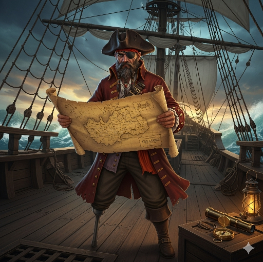
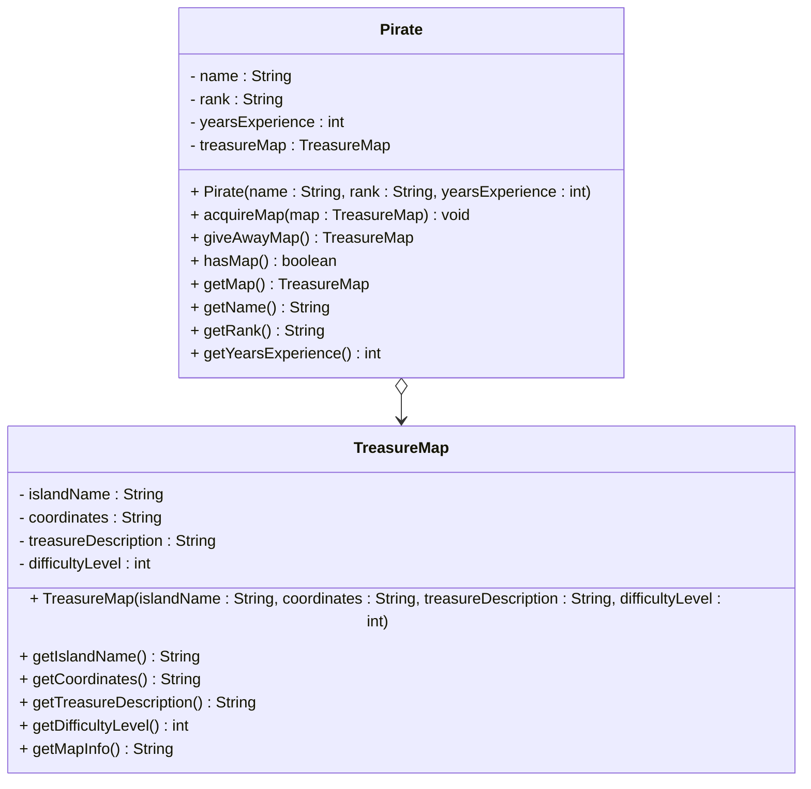
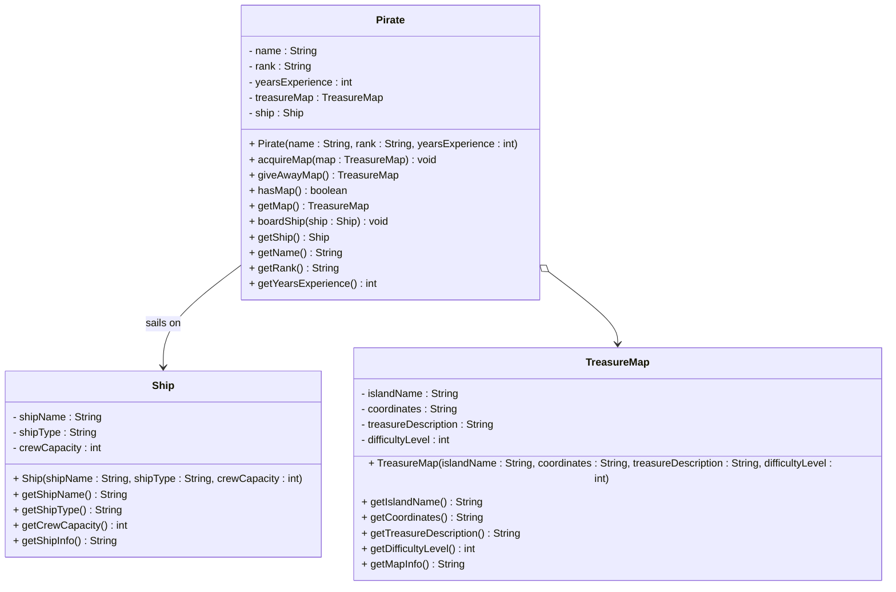
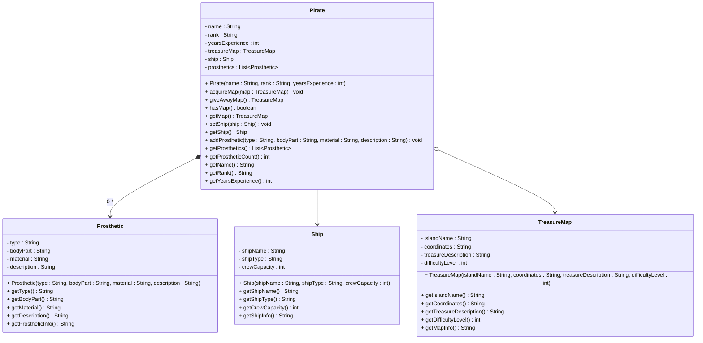

# Even more exercises



## Exercise 5.1: Pirate and Treasure Map

I recommend making a package for this exercise. Because in later exercises, you will expand on this exercise, by copying it and adding more classes. New versions will then be in different packages.

Create a `Pirate` class and a `TreasureMap` class with an aggregation relationship. A pirate can have a treasure map, but the map can exist independently and can be passed between pirates.

### Requirements

1. **Pirate Class**: 
   - Contains name, rank (captain, first mate, etc), and years of experience
   - Can acquire and give away treasure maps
   - Has methods to manage the treasure map relationship

2. **TreasureMap Class**:
   - Contains island name, coordinates, treasure description, and difficulty level
   - Has methods to get map information
   - Can exist independently of any pirate

### UML Diagram



### Why This Is an Aggregation Relationship

The `Pirate` class has an aggregation relationship with `TreasureMap` because:
- A pirate can have a treasure map (whole-part relationship)
- The treasure map can exist independently of any pirate
- The map can be passed between different pirates
- The relationship is weaker than composition - the map is not an integral part of the pirate

### Implementation Notes

- The `acquireMap` method should accept a `TreasureMap` object as a parameter
- The `giveAwayMap` method should return the current map and set the field to null
- The `hasMap` method should check if the pirate currently has a map
- The `getMap` method should return the current map (or null if none)
- The map should be created externally and passed to the pirate

### Example Usage

```java
Pirate blackbeard = new Pirate("Blackbeard", "Captain", 15);
TreasureMap skullIslandMap = new TreasureMap("Skull Island", "N15°30' W75°45'", "Ancient gold coins", 8);

blackbeard.acquireMap(skullIslandMap);
System.out.println("Pirate has map: " + blackbeard.hasMap());

TreasureMap returnedMap = blackbeard.giveAwayMap();
System.out.println("Map returned: " + (returnedMap != null));
```

## Exercise 5.2: Pirate, Ship, and Treasure Map

Copy your solution from Exercise 4.2 (Pirate and Treasure Map) and add a `Ship` class with an **association** relationship from the `Pirate` class.

### Additional Requirements

1. **Ship Class**:
   - Contains ship name, type (galleon, sloop, etc), and crew capacity
   - Has methods to get ship information
   - Can exist independently of any pirate

2. **Updated Pirate Class**:
   - Add a field variable for the ship (association)
   - A method to board the ship
   - The pirate can change ships (association allows this)

### UML Diagram



### Why This Is an Association Relationship

The `Pirate` class has an **association** relationship with `Ship` because:
- A pirate can sail on a ship (basic relationship)
- Both pirate and ship can exist independently
- The pirate can change ships (flexible relationship)
- No strong ownership - just a working relationship

## Exercise 5.3: Pirate with Prosthetics

**Task**: Extend your solution from Exercise 4.3 and add a `Prosthetic` class with a **composition** relationship to the `Pirate` class. A pirate can have multiple prosthetics (like peg-leg, eye-patch, hook-for-hand).

### Additional Requirements

1. **Prosthetic Class**:
   - Contains prosthetic type, body part, material, and description
   - Has methods to get prosthetic information
   - Created internally by the pirate

2. **Updated Pirate Class**:
   - Add a list of prosthetics (composition)
   - Add methods to add prosthetics internally (with body part parameter)
   - Add methods to get prosthetic information (return copies)
   - Prosthetics cannot exist without the pirate

### UML Diagram

Notice the 0-\* on the composition relationship from Pirate to Prosthetic. This means, each `Pirate` can have 0 or more `Prosthetic`s. And this is implemented by the `Pirate` class having a `List<Prosthetic>` field variable.



### Why This Is a Composition Relationship

The `Pirate` class has a **composition** relationship with `Prosthetic` because:
- Prosthetics are integral parts of the pirate's identity
- Prosthetics cannot exist without the pirate
- Prosthetics are created internally by the pirate
- When pirate is destroyed, prosthetics are also destroyed

Sure, you might argue that an eye-patch can be ripped off, or if pirate dies, their peg-leg can be reused. But for the sake of this exercise, we will assume that prosthetics are integral parts of the pirate's identity, and they cannot exist without the pirate. When it is marked as composition, this is the intent, and the code must support this.

### Example Usage

```java
// Create pirate
Pirate blackbeard = new Pirate("Blackbeard", "Captain", 15);

// Add prosthetics (composition - created internally)
blackbeard.addProsthetic("Peg Leg", "left leg", "Wood", "Oak peg leg for left leg");
blackbeard.addProsthetic("Eye Patch", "right eye", "Leather", "Black leather eye patch");
blackbeard.addProsthetic("Hook Hand", "right hand", "Steel", "Steel hook for right hand");

// Set ship (association)
Ship blackPearl = new Ship("Black Pearl", "Galleon", 50);
blackbeard.setShip(blackPearl);

// Add treasure map (aggregation)
TreasureMap skullIslandMap = new TreasureMap("Skull Island", "N15°30' W75°45'", "Ancient gold coins", 8);
blackbeard.acquireMap(skullIslandMap);

// Display pirate information
System.out.println("Pirate: " + blackbeard.getName());
System.out.println("Ship: " + blackbeard.getShip().getShipName());
System.out.println("Prosthetics: " + blackbeard.getProstheticCount());
System.out.println("Has treasure map: " + blackbeard.hasMap());
```

### Key Learning Points

1. **Three Relationship Types**: Association, Aggregation, and Composition in one system
2. **Different Ownership Levels**: No ownership, weak ownership, strong ownership
3. **Creation Patterns**: External creation, external addition, internal creation
4. **Mixed Relationships**: One class can have multiple relationship types
5. **Real-world Modeling**: How different objects relate in complex systems