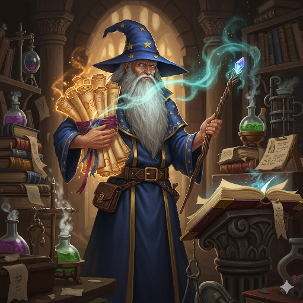
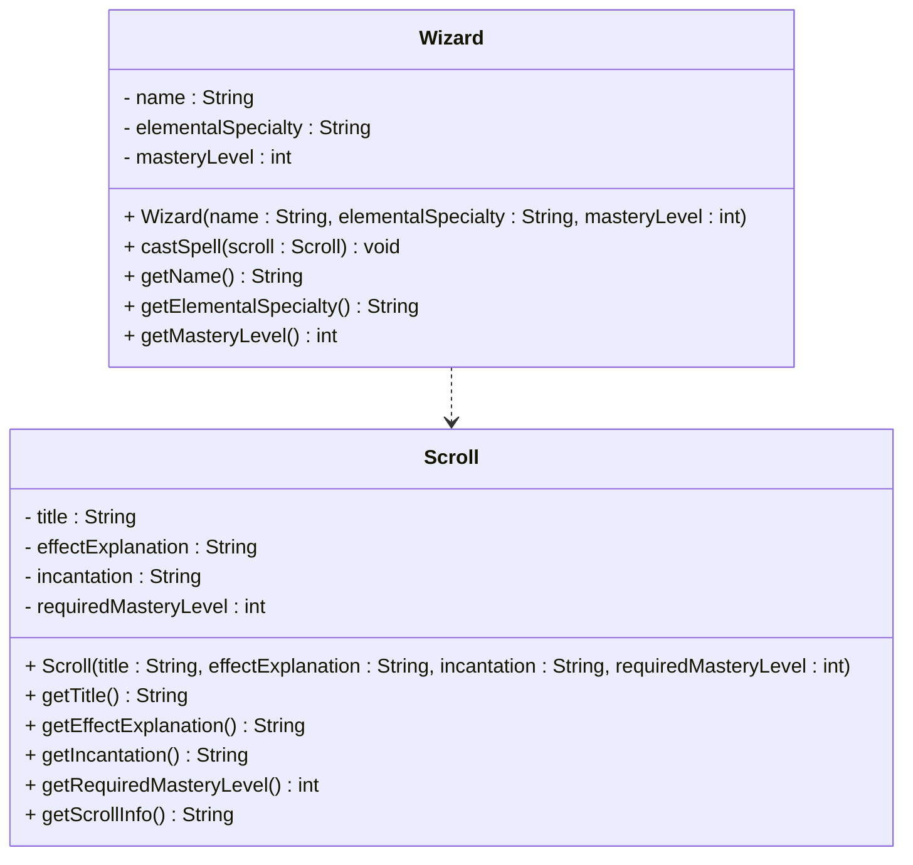
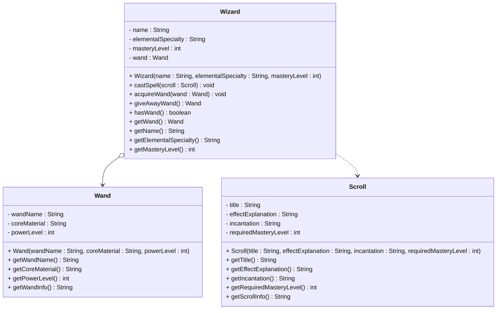

# More exercises



I recommend making a package for each exercise. This page will task you with solving an exercise, and then progressively adding more classes. In order to have a better snapshot for each exercise, you can copy the code into a new package.

Yes, we have seen this case before, slightly altered now.

## Exercise 6.1: Wizard and Scroll

Create a `Wizard` class and a `Scroll` class with a dependency relationship. The wizard can cast spells by using scrolls for incantations, but the wizard doesn't store scrolls as field variables.

### Requirements

1. **Wizard Class**: 
   - Contains name, elemental specialty (fire, wind, light, etc), and mastery level
   - Has a method to cast a spell using a scroll
   - Does not store scrolls as field variables

2. **Scroll Class**:
   - Contains title, explanation of effect, incantation, and required magic mastery level
   - Has methods to get scroll information
   - Can be used by wizards temporarily

### UML Diagram



### Why This Is a Dependency Relationship

The `Wizard` class depends on the `Scroll` class because:
- Wizards use scrolls as method parameters to cast spells
- Wizards don't store scrolls as field variables
- The relationship is temporary - only during spell casting
- Scrolls can exist independently of wizards

### Implementation Notes

- The `castSpell` method should take a `Scroll` object as a parameter
- Check if the wizard's mastery level is sufficient for the scroll
- Display the incantation and effect when casting
- The wizard should not store any scrolls permanently

### Example Usage

```java
Wizard gandalf = new Wizard("Gandalf", "Fire", 8);
Scroll fireballScroll = new Scroll("Fireball", "Creates a ball of fire", "Ignis Flamma", 5);

gandalf.castSpell(fireballScroll);
```

## Exercise 6.2: Wizard, Wand, and Scroll

**Task**: Copy your solution from Exercise 6.1 (Wizard and Scroll) and add a `Wand` class with an **aggregation** relationship to the `Wizard` class.

### Additional Requirements

1. **Wand Class**:
   - Contains wand name, core material (phoenix feather, dragon heartstring, etc), and power level
   - Has methods to get wand information
   - Can exist independently of any wizard

2. **Updated Wizard Class**:
   - Add a field variable for the wand (aggregation)
   - Add methods to acquire and give away wands
   - The wizard can change wands

### UML Diagram



### Why This Is an Aggregation Relationship

The `Wizard` class has an **aggregation** relationship with `Wand` because:
- A wizard can have a wand (whole-part relationship)
- The wand can exist independently of any wizard
- The wand can be passed between different wizards
- The relationship is weaker than composition - the wand is not an integral part of the wizard

### Implementation Notes

- The `acquireWand` method should accept a `Wand` object as a parameter
- The `giveAwayWand` method should return the current wand and set the field to null
- The `hasWand` method should check if the wizard currently has a wand
- The `getWand` method should return the current wand (or null if none)
- The wand should be created externally and passed to the wizard

### Example Usage

```java
Wizard gandalf = new Wizard("Gandalf", "Fire", 8);
Wand elderWand = new Wand("Elder Wand", "Thestral Tail Hair", 10);
Scroll fireballScroll = new Scroll("Fireball", "Creates a ball of fire", "Ignis Flamma", 5);

gandalf.acquireWand(elderWand);
System.out.println("Wizard has wand: " + gandalf.hasWand());

gandalf.castSpell(fireballScroll);

Wand returnedWand = gandalf.giveAwayWand();
System.out.println("Wand returned: " + (returnedWand != null));
```

### Key Learning Points

1. **Aggregation**: Wizard has a wand as a component but doesn't own it completely
2. **Independent Existence**: Wand can exist without a wizard
3. **Transferable Ownership**: Wand can be passed between wizards
4. **Weaker Ownership**: Wand is not an integral part of the wizard
5. **External Creation**: Wand is created outside and passed to wizard
6. **Mixed Relationships**: Wizard has both aggregation (wand) and dependency (scroll) relationships

