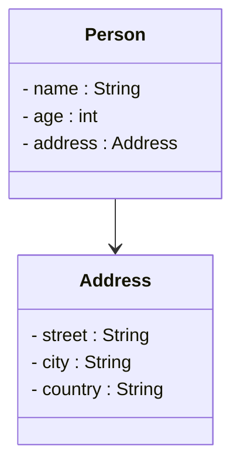
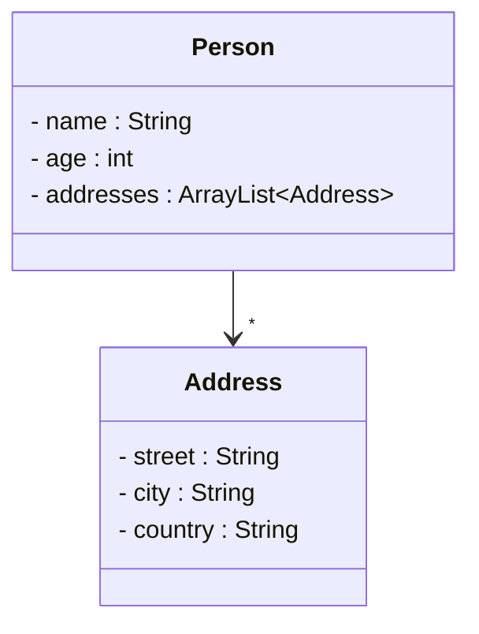

# One-to-many relationships in UML

Let's take a quick reminder of the previous session. A relationship between two objects was expressed in UML as follows:

Here, the Person class has an attribute `address`, which is an instance of the Address class. The relationship is also expressed in UML, by the arrow between the two classes.

The Person references _one_ Address.

## Referencing many

What if we need to reference many Addresses? In programming, we can do this by using an ArrayList of Addresses. So, that would be an obvious choice, update the attribute on the Person class to be an ArrayList of Addresses. Here:

## Clarifying the UML

Now, at a glance, the arrow is the same as before, but clearly, the relationship is different. Now referencing many Addresses, rather than one. Let's clarify this in UML. We do that, by adding "multiplicity" to the relationship.

We have options:
- `1` means exactly one
- `*` means many, i.e. anything more than one

Generally for class diagrams, we leave out the multiplicity, when it is `1`. In other types of diagrams, we must be more explicit.

The multiplicity is added to the _end_ of the relationship arrow, at the arrow head. So, we update the UML as follows:

Notice the little star `*` next to the arrow head. Now, the `Person` clearly references many `Address`es, expressed through both the attribute name and type, and the multiplicity on the relationship line.