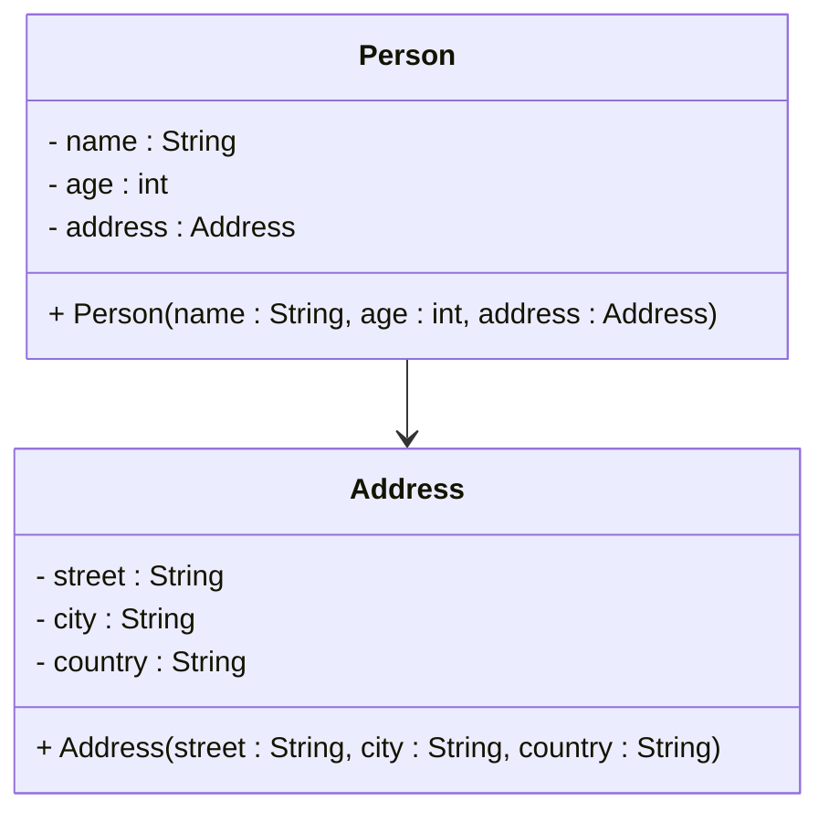
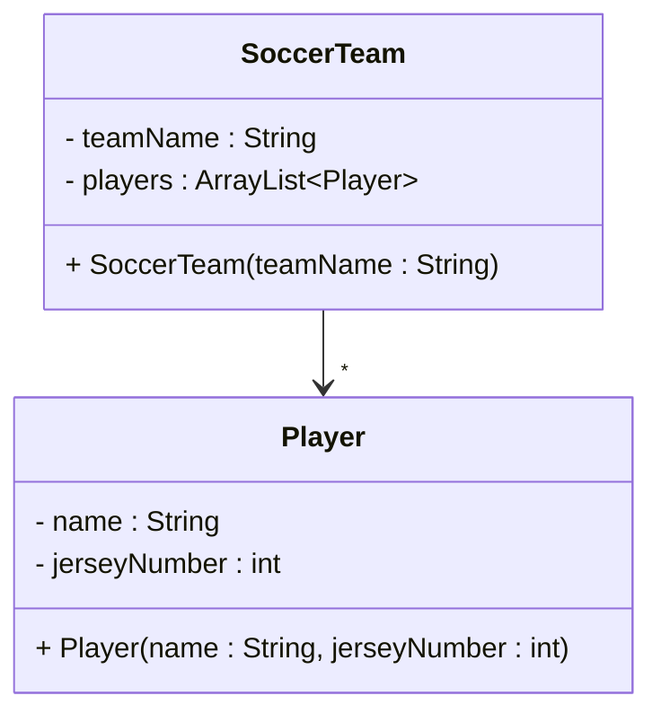

# One to many - Association

For a quick recap, the association means that one object knows about another object. Or now multiple other objects of the same type. This is expressed through a field variable. Example:

## Referencing one
First, a quick recap of referencing one.

### Code, referencing one
Here is the code for a `Person` class, with an `Address` object as a field variable.

```java{4}
public class Person {
    private String name;
    private int age;
    private Address address;
    
    public Person(String name, int age, Address address) {
        this.name = name;
        this.age = age;
        this.address = address;
    }
}

public class Address {
    private String street;
    private String city;
    private String country;
    
    public Address(String street, String city, String country) {
        this.street = street;
        this.city = city;
        this.country = country;
    }
}
```

### UML, referencing one

And the UML. Notice the arrow type and direction. Plus the field variable of type `Address` in the `Person` class.



### Conceptual meaning
For the association, the child object (in this case the `Address`) is _not_ part of the parent object (in this case the `Person`). It is a separate object, that the parent object knows about. Other objects can also know about the same child object. So, there is no strong ownership.

## Referencing many

Now, we want to look at the association, but referencing many. A player can sometimes play for multiple teams. For example a local team, and a national team. So, two teams can reference the same player. That sounds like an association.

### Code, referencing many

As seen on a previous page, here is the `SoccerTeam` class, with an ArrayList of `Player` objects.\
I could add methods to the `SoccerTeam` class to add players to the team, and get the players on the team. That is less relevant for the example.	

```java{3}
public class SoccerTeam {
    private String teamName;
    private ArrayList<Player> players;
    
    public SoccerTeam(String teamName) {
        this.teamName = teamName;
        this.players = new ArrayList<>();
    }
}

public class Player {
    private String name;
    private int jerseyNumber;
    
    public Player(String name, int jerseyNumber) {
        this.name = name;
        this.jerseyNumber = jerseyNumber;
    }
}
```

### UML, referencing many

We use the association arrow again, and we add a star, `*`, at the arrow head. This indicates the SoccerTeam references many Players. We do not add a multiplicity on the start of the relationships, as we do not care how many teams a player plays for. In UML _Class diagrams_, we generally only add multiplicity on the end of the relationships, by the arrow head.



### Conceptual meaning
For the association, the child object (in this case the `Player`) is _not_ part of the parent object (in this case the `SoccerTeam`). It is a separate object, that the parent object knows about. Other objects can also know about the same child object. So, there is no strong ownership.