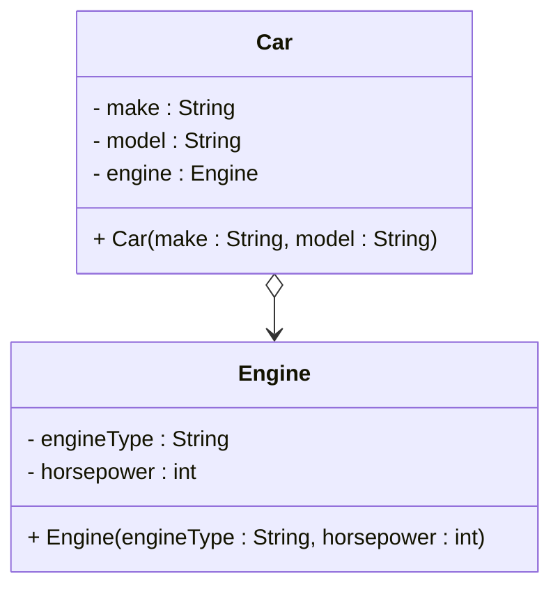
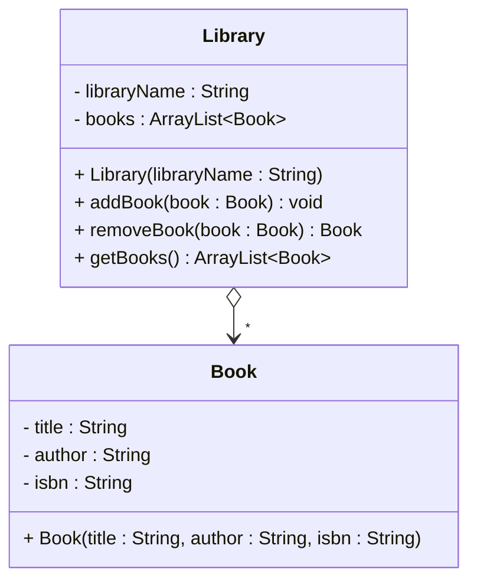

# One to many - Aggregation

We will first recap the aggregation for referencing one. And then "upgrade" it to referencing many.\
For a quick recap, aggregation means that one object has another object as a component, but the child object can exist independently. This is expressed through a field variable with ownership methods. Example:

## Referencing one

First, how does it look aggregating one other object?

### Code, referencing one

Here we have a `Car` class, with an `Engine` object as a component. The `Engine` object is a component of the `Car` object, but it can exist independently. Only one engine per car. And one car per engine at a time. So, it is an aggregation.\
As has been mentioned before, in actual code, an aggregation is difficult to actually enforce. 

```java
public class Car {
    private String make;
    private String model;
    private Engine engine;
    
    public Car(String make, String model) {
        this.make = make;
        this.model = model;
        this.engine = null;
    }
    
    public void installEngine(Engine engine) {
        this.engine = engine;
    }
// other methods left out for brevity
}

public class Engine {
    private String engineType;
    private int horsepower;
    
    public Engine(String engineType, int horsepower) {
        this.engineType = engineType;
        this.horsepower = horsepower;
    }
}
```

### UML, referencing one

And the UML:



Notice we don't put a `1` on the relationship line. This is because we are aggregating one object, not many, and so we conventionally leave out the multiplicity.

### Conceptual meaning
For aggregation, the child object (in this case the `Engine`) is a component of the parent object (in this case the `Car`), but it can exist independently. The parent object has "weak" ownership, and optionally methods to manage the relationship. Other objects (cars) should not be able to reference the same engine.

## Referencing many

Now, we want to look at the aggregation, but referencing many. A library can have many books, and books can be transferred between libraries. Only one library at a time has a specific physical copy of a specific book. That sounds like an aggregation.

### Code, referencing many

Here is the `Library` class, with an ArrayList of `Book` objects.

```java
public class Library {
    private String libraryName;
    private ArrayList<Book> books;
    
    public Library(String libraryName) {
        this.libraryName = libraryName;
        this.books = new ArrayList<>();
    }
    
    public void addBook(Book book) {
        books.add(book);
    }
    // other methods left out for brevity
}

public class Book {
    private String title;
    private String author;
    private String isbn;
    
    public Book(String title, String author, String isbn) {
        this.title = title;
        this.author = author;
        this.isbn = isbn;
    }
}
```

Glancing at the code, it looks very much like an association. And again, an aggregation is difficult to actually enforce. 

### UML, referencing many

We use the aggregation arrow (empty diamond), and we add a star at the arrow head. This indicates the Library aggregates many Books.



### Conceptual meaning
For aggregation, the child objects (in this case the `Book` objects) are components of the parent object (in this case the `Library`), but they can exist independently. The parent object has ownership methods to manage the relationships. Only one library at a time has a specific physical copy of a specific book, but that ownership can be transferred to another library. So, the ownship is stronger than association, but weaker than composition.

## Conclusion

We have seen how to express the aggregation, referencing one and many. We have also seen the conceptual meaning of the aggregation.

Now, we will look at the composition.