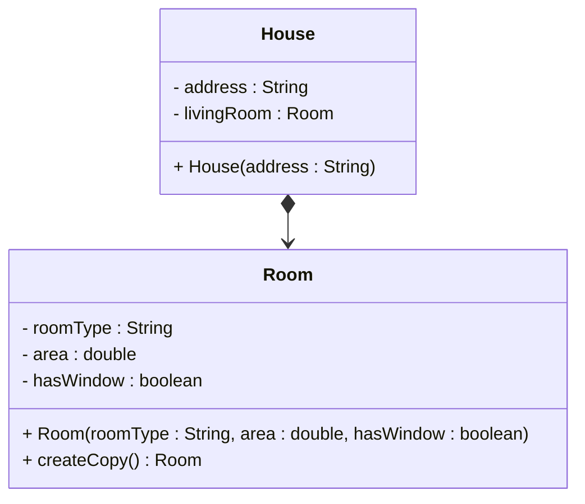
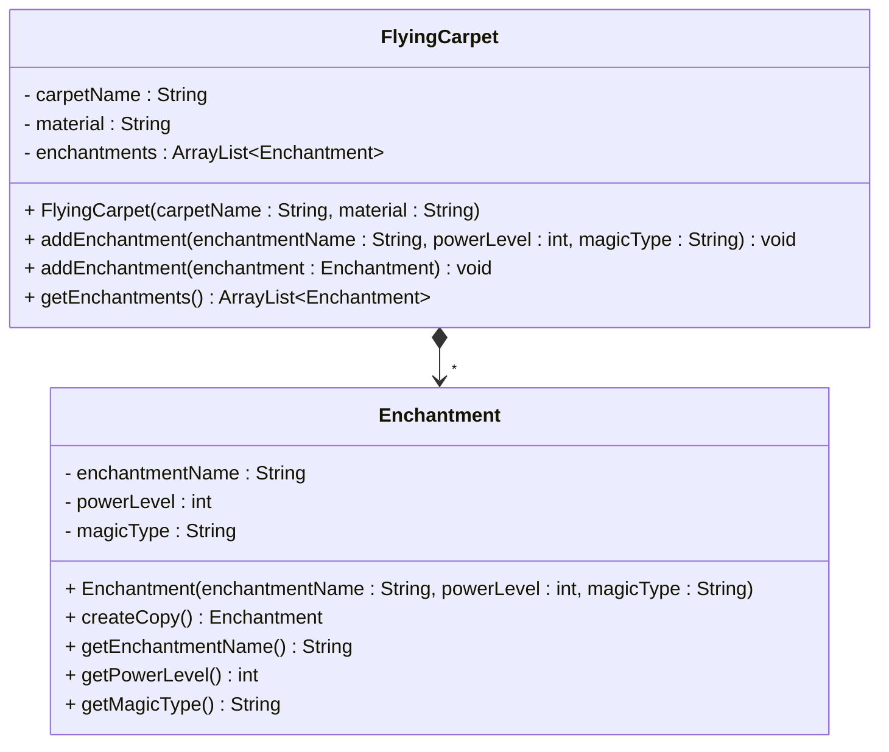

# One to many - Composition

For a quick recap, composition means that one object has another object as an integral part, and the child object cannot exist independently. Nor can the child object be referenced by other objects. This is expressed through a field variable with "exclusive ownership". Example:

## Referencing one

First, how does it look composing _one_ other object?

### Code, referencing one

Here we have a `House` class, with a `Room` object as a component. Yeah, the house has only a single room, it's a boring house. The `Room` object is an integral part of the `House` object, and it cannot exist independently. The room is created internally by the house.

```java
public class House {
    private String address;
    private Room livingRoom;
    
    public House(String address) {
        this.address = address;
        this.livingRoom = new Room("Living Room", 300.0, true);
    }
    
    public Room getLivingRoom() {
        return livingRoom.createCopy(); // Return a copy
    }
    // other methods left out for brevity
}

public class Room {
    private String roomType;
    private double area;
    private boolean hasWindow;
    
    public Room(String roomType, double area, boolean hasWindow) {
        this.roomType = roomType;
        this.area = area;
        this.hasWindow = hasWindow;
    }
    
    public Room createCopy() {
        return new Room(this.roomType, this.area, this.hasWindow);
    }
}
```

Either the `Room` (child) has some kind of copy method, or the `House` (parent) will just instantiate a new Room object.

### UML, referencing one

And the UML. For composition the arrow start is a _filled_ diamond:



Notice we don't put a `1` on the relationship line. This is because we are composing one object, not many, and so we conventionally leave out the multiplicity.

### Conceptual meaning
For composition, the child object (in this case the `Room`) is an integral part of the parent object (in this case the `House`), and it cannot exist independently. The parent object has exclusive ownership, and the child object is created internally. No other objects can reference the same child object. So, there is strong ownership.

## Referencing many

Now, we want to look at the composition, but referencing many. A flying carpet can have many enchantments, and these enchantments are integral parts of the carpet. The enchantments cannot exist independently of the carpet. You can imagine the enchantment is read from a scroll, but once it takes effect, it is bound to the carpet. Or.. somethign like that. Either way, it sounds like a composition.

### Code, referencing many

Here is the `FlyingCarpet` class, with an ArrayList of `Enchantment` objects. We'll show two different approaches for adding enchantments:

```java{13-16,19-24,28-30}
public class FlyingCarpet {
    private String carpetName;
    private String material;
    private ArrayList<Enchantment> enchantments;
    
    public FlyingCarpet(String carpetName, String material) {
        this.carpetName = carpetName;
        this.material = material;
        this.enchantments = new ArrayList<>();
    }
    
    // Method 1: Add enchantment by providing details (creates internally)
    public void addEnchantment(String enchantmentName, int powerLevel, String magicType) {
        Enchantment newEnchantment = new Enchantment(enchantmentName, powerLevel, magicType);
        this.enchantments.add(newEnchantment);
    }
    
    // Method 2: Add enchantment by providing object (creates copy internally)
    public void addEnchantment(Enchantment enchantment) {
        Enchantment copy = new Enchantment(enchantment.getEnchantmentName(), 
                                         enchantment.getPowerLevel(), 
                                         enchantment.getMagicType());
        this.enchantments.add(copy);
    }

    // Method 3: Add enchantment by providing object, uses a copy method internally
    public void addEnchantment(Enchantment enchantment) {
        this.enchantments.add(enchantment.createCopy());
    }
    // other methods left out for brevity
}

public class Enchantment {
    private String enchantmentName;
    private int powerLevel;
    private String magicType;
    
    public Enchantment(String enchantmentName, int powerLevel, String magicType) {
        this.enchantmentName = enchantmentName;
        this.powerLevel = powerLevel;
        this.magicType = magicType;
    }
    
    public Enchantment createCopy() {
        return new Enchantment(this.enchantmentName, this.powerLevel, this.magicType);
    }
    
    public String getEnchantmentName() { return enchantmentName; }
    public int getPowerLevel() { return powerLevel; }
    public String getMagicType() { return magicType; }
}
```

Glancing at the code, it looks very much like an association or aggregation. But the key difference is that enchantments are created internally and cannot exist independently of the carpet.

### UML, referencing many

We use the composition arrow (filled diamond), and we add a star at the arrow head. This indicates the FlyingCarpet composes many Enchantments.



### Conceptual meaning
For composition, the child objects (in this case the `Enchantment` objects) are integral parts of the parent object (in this case the `FlyingCarpet`), and they cannot exist independently. The parent object has exclusive ownership and creates the child objects internally. No other objects can reference the same child objects. So, the ownership is the strongest of all relationship types.

## Conclusion

We have seen how to express the composition, referencing one and many. We have also seen the conceptual meaning of the composition.

Now, we have covered all three relationship types: association, aggregation, and composition.