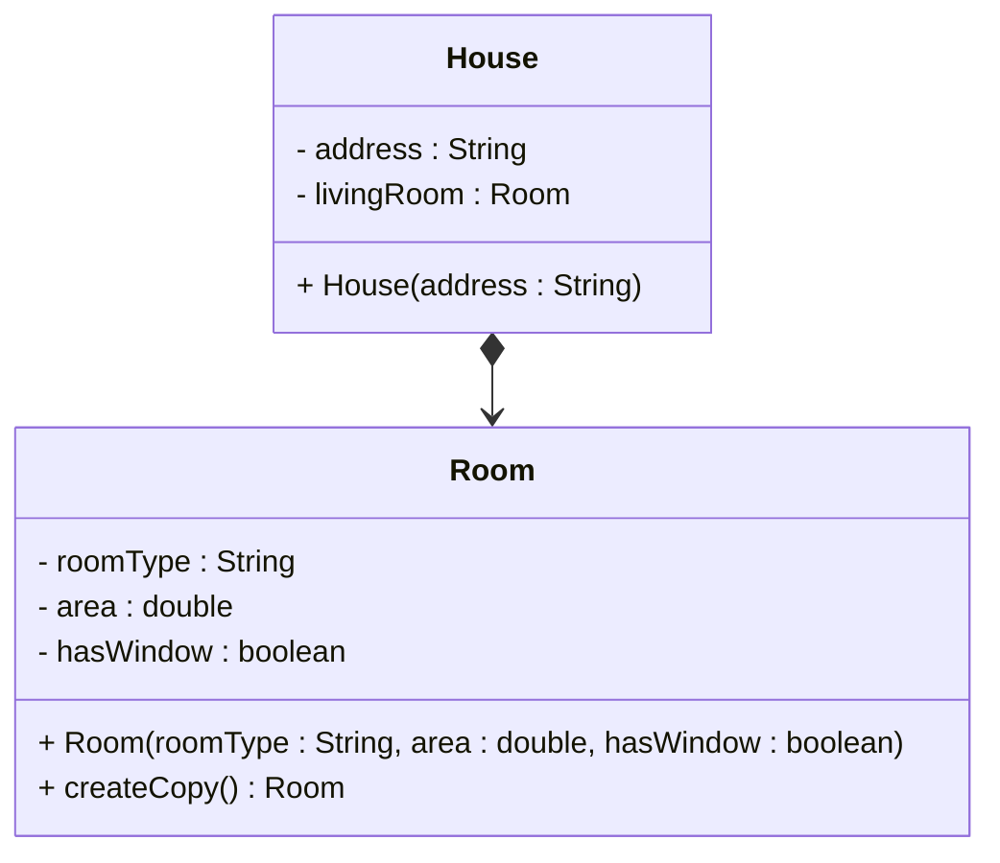
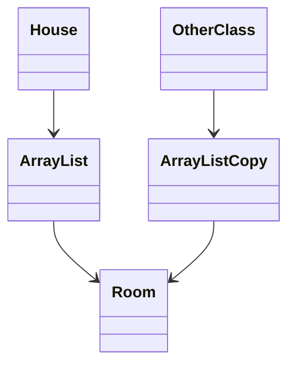
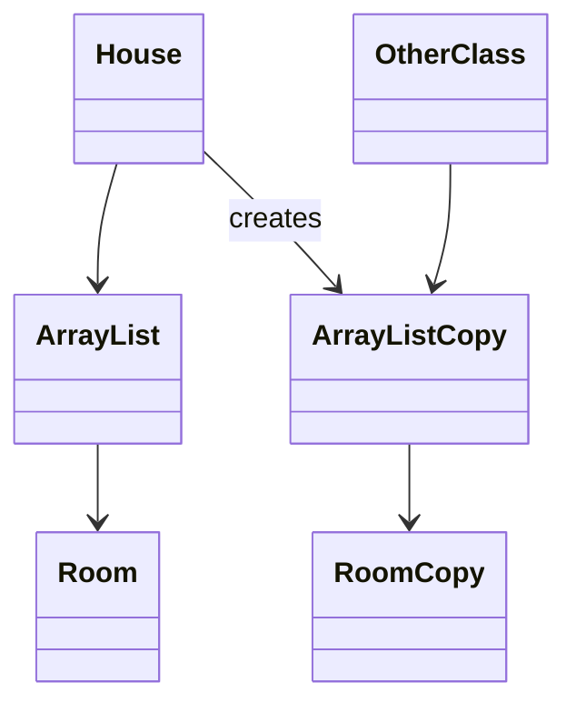
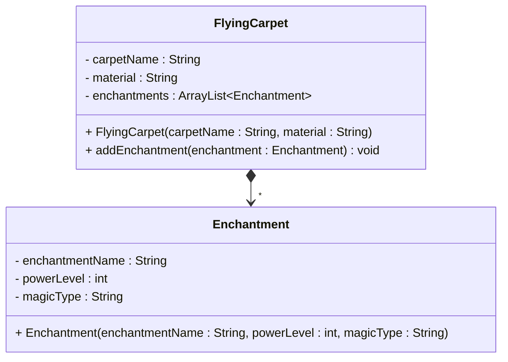

# One to many - Composition

For a quick recap, composition means that one object has another object as an integral part, and the child object cannot exist independently. Nor can the child object be referenced by other objects. This is expressed through a field variable with "exclusive ownership". 

## Referencing one

First, how does it look composing _one_ other object?

### Code, referencing one

Here we have a `House` class, with a `Room` object as a component. Yeah, the house has only a single room, it's a boring house. The `Room` object is an integral part of the `House` object, and it cannot exist independently. The room is created internally by the house.

```java{3}
public class House {
    private String address;
    private Room livingRoom;
    
    public House(String address) {
        this.address = address;
        this.livingRoom = new Room("Living Room", 300.0, true);
    }
    
    public Room getLivingRoom() {
        return livingRoom.createCopy(); // Return a copy
    }
    // other methods left out for brevity
}

public class Room {
    private String roomType;
    private double area;
    private boolean hasWindow;
    
    public Room(String roomType, double area, boolean hasWindow) {
        this.roomType = roomType;
        this.area = area;
        this.hasWindow = hasWindow;
    }
    
    public Room createCopy() {
        return new Room(this.roomType, this.area, this.hasWindow);
    }
}
```

Either the `Room` (child) has some kind of copy method, or the `House` (parent) will just instantiate a new Room object.

### UML, referencing one

And the UML. For composition the arrow start is a _filled_ diamond:



Notice we don't put a `1` on the relationship line. This is because we are composing one object, not many, and so we conventionally leave out the multiplicity.

### Conceptual meaning
For composition, the child object (in this case the `Room`) is an integral part of the parent object (in this case the `House`), and it cannot exist independently. The parent object has exclusive ownership, and the child object is created internally. No other objects can reference the same child object. So, there is strong ownership.

## Referencing many

Now, we want to look at the composition, but referencing many. A flying carpet can have many enchantments, and these enchantments are integral parts of the carpet. The enchantments cannot exist independently of the carpet. You can imagine the enchantment is read from a scroll, but once it takes effect, it is bound to the carpet. Or.. something like that. Either way, it sounds like a composition. Because I say so.

### Code, referencing many

Here is the `FlyingCarpet` class, with an ArrayList of `Enchantment` objects. We'll show three different approaches for adding enchantments:

```java{4,13-16,19-24,27-29}
public class FlyingCarpet {
    private String carpetName;
    private String material;
    private ArrayList<Enchantment> enchantments;
    
    public FlyingCarpet(String carpetName, String material) {
        this.carpetName = carpetName;
        this.material = material;
        this.enchantments = new ArrayList<>();
    }
    
    // Method 1: Add enchantment by providing details (creates internally)
    public void addEnchantment(String enchantmentName, int powerLevel, String magicType) {
        Enchantment newEnchantment = new Enchantment(enchantmentName, powerLevel, magicType);
        this.enchantments.add(newEnchantment);
    }
    
    // Method 2: Add enchantment by providing object (creates copy internally)
    public void addEnchantment(Enchantment enchantment) {
        Enchantment copy = new Enchantment(enchantment.getEnchantmentName(), 
                                         enchantment.getPowerLevel(), 
                                         enchantment.getMagicType());
        this.enchantments.add(copy);
    }

    // Method 3: Add enchantment by providing object, uses a copy method internally
    public void addEnchantment(Enchantment enchantment) {
        this.enchantments.add(enchantment.createCopy());
    }
    // other methods left out for brevity
}

public class Enchantment {
    private String enchantmentName;
    private int powerLevel;
    private String magicType;
    
    public Enchantment(String enchantmentName, int powerLevel, String magicType) {
        this.enchantmentName = enchantmentName;
        this.powerLevel = powerLevel;
        this.magicType = magicType;
    }
    
    public Enchantment createCopy() {
        return new Enchantment(this.enchantmentName, this.powerLevel, this.magicType);
    }
    // other methods left out for brevity
}
```

Notice that the above `FlyingCarpet` class has three different methods for adding enchantments. Two of them actually has the exact same signature, methods 2 and 3. This is not allowed in Java, when overloading methods, each must have a distinct signature, even though they share names. But I include it here to show different approaches.

I hope the difference in code between composition and the other two methods is clear. 

### Code, returning the composed children
Sometimes we do want to let the outside world get access to the composed children, e.g. `Room` objects. But, we must maintain the strict ownership.\
Previously, you have seen returning a copy of the child object.\
Now, we have a list, which complicates things.\
Step one would be to return a copy of the list, like so:

```java{12}
public class House {
    private String address;
    private ArrayList<Room> rooms;
    
    public House(String address) {
        this.address = address;
        this.rooms = new ArrayList<>();
    }

    public ArrayList<Room> getRooms() {
        // Create a copy of the list
        return new ArrayList<>(rooms);
    }
}
```

The above code creates _a new ArrayList_, and passes in the internal list, `rooms`, as a parameter.
This will correctly create a copy of the list, with the same elements.\
But is that enough? 

>NO!

The House has a reference to an ArrayList. And the ArrayList has references to multiple Room objects. The new ArrayList has references to the same Room objects.
I try to illustrate here:



So, in the end, the `OtherClass` still knows about the same Room objects as the House. Not just copies, but the actual same objects.

And why is this a problem? Say the `Room` class has a method to change the data of that room, like `paintRoom(String color)`. If the `OtherClass` calls this method, it will change the data of the Room object, which is not what we want.

What more do we need then? How do we fix this. Essentially, we want this:



So, the code must be updated to create a new list, _and_ create copies of the Room objects. Here is a `getRooms` method that does this:

```java
public ArrayList<Room> getRooms() {
    ArrayList<Room> copy = new ArrayList<>();
    for (Room room : rooms) {
        copy.add(room.createCopy());
    }
    return copy;
}
```

And what if the `Room` class has a reference to some composed object, like a `Window` object? Then we need to create a copy of the `Window` object as well. . Here, the copy-method or copy-constructor is good, because then the class itself knows how to copy itself. Rather than you extracting data, and just creating a new object with the normal constructor. Have you then copied the internal parts correctly? **COPY** COPY Copy copy <sub>copy</sub>, all the way down.


### UML, referencing many

We use the composition arrow (filled diamond), and we add a star at the arrow head. This indicates the FlyingCarpet composes many Enchantments. Some methods are left out for brevity.



### Conceptual meaning
For composition, the child objects (in this case the `Enchantment` objects) are integral parts of the parent object (in this case the `FlyingCarpet`), and they cannot exist independently. The parent object has exclusive ownership and creates the child objects internally (or copies). No other objects can reference the same child objects. So, the ownership is the strongest of all relationship types.

And yes, all the copy stuff to enforce the strong ownership, it can be a bit challenging.