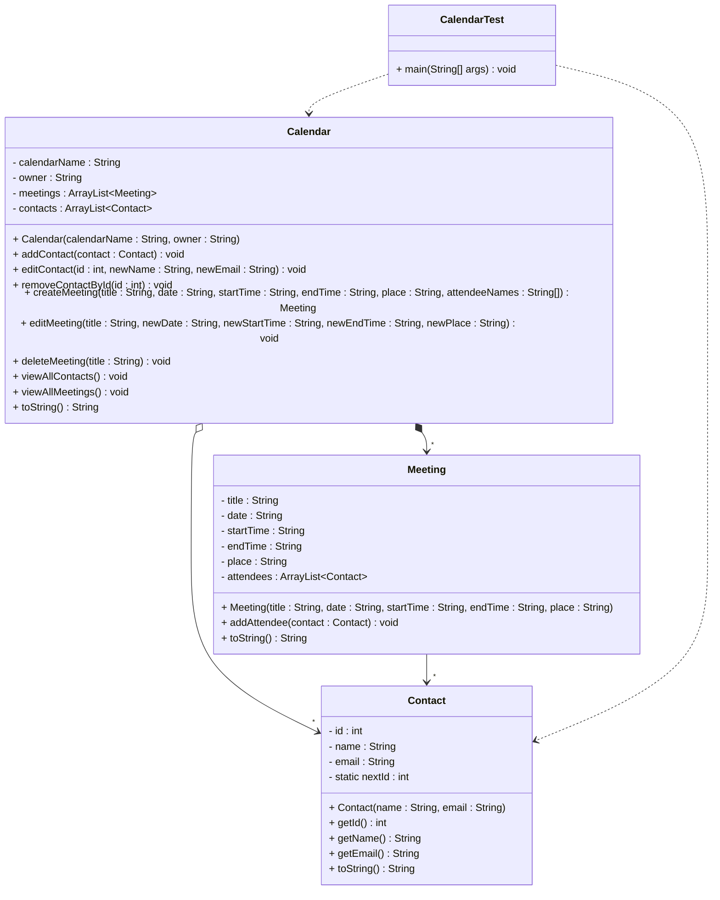

# Implementation Exercise - Calendar Management System

Now it is time to actually do some coding.

## Exercise 10.0: Calendar with Meetings and Contacts

Create a system where a Calendar can have multiple Meetings, and each Meeting can have multiple Contacts as attendees. The Calendar also maintains a list of all Contacts. Implement the classes. In the `CalendarTest` class, create a main method which creates various objects and calls various methods on these objects. You should include print outs, these can either be directly in the main method, or you can include them in the various methods.

### Requriements

1. The Calendar class is created initially in the main method.
2. A new contact can be added to the calendar, with relevant information.
3. A contact can be edited by ID, with relevant information.
4. A contact can be removed by ID.
5. A meeting can be created with relevant information.
6. A meeting can be edited by title (or id? Up to you), with relevant information.
7. A meeting can be deleted by title.
8. The calendar can view all contacts.
9. The calendar can view all meetings.
10. The calendar can view all information, including the contacts and meetings.

You are allowed to add further details (e.g., additional methods or fields) as needed to make your implementation work properly. You will at least need various getters and setters.

For the meeting, you can either have a date and a time, or a single variable for the date and time. Example: `2024-01-15 09:00` or `2024-01-15`.

### UML Diagram



### Further details

1. **Calendar Class**:
   - Contains calendar name, owner, a list of meetings, and a list of contacts
   - Methods to 
      - add contact to calendar
      - edit contact by ID (update name and email)
      - remove contact by ID
      - create meeting with title, date, start/end time, place, and attendee names (finds contacts by name from contact list)
      - edit meeting by title (update date, start time, end time, and place)
      - delete meeting by title (or id?)
      - view all contacts (displays formatted list)
      - view all meetings (displays formatted list. See if you can figure out sorting the list by start time and date)
      - get calendar information (toString), should also include information from the child objects. Format this nicely.

 2. **Meeting Class**:
    - Contains title, date, start time, end time, place, and a list of attendees
    - Methods to add attendee (only if not already present) and get meeting information

2. **Contact Class**:
   - Contains ID (automatically generated), name, and email
   - Methods to get ID, get name, get email, and get contact information
   - ID is automatically assigned using a static counter

In the contact class, you must have a static `nextId`, which for each new contact, will be incremented by 1. The `id` field is then set to this value. This way, each new Contact will have a unique ID.

3. **CalendarTest Class**:
   - Contains main method to keep the menu running until the user wants to exit
   - Initially creates one instance of the Calendar class


### Implementation Notes

- Use `ArrayList` for the collections
- Implement proper constructors and getter methods
- Add meaningful print statements to show what happens during execution of the program
- Create an interactive menu system with infinite loop for user interaction
- Implement menu options for adding/removing contacts, creating/removing meetings, viewing data, and exiting
- Demonstrate adding/removing contacts, creating meetings by selecting attendees from contact list, managing attendees, and retrieving meetings
- Include proper error handling for missing contacts or meetings
- Implement automatic ID generation for contacts using a static counter
- Prevent duplicate attendees in meetings (check if attendee already exists before adding)

### Sorting Meetings by Date and Time

For the `viewAllMeetings()` method, you need to sort meetings by their date and start time. Since the date is stored as a String in the format "yyyy-MM-dd" (e.g. "2024-01-15") and start time as "HH:mm" (e.g. "09:00"), you can sort them chronologically by just using basic string comparison:

**Date Format: "yyyy-MM-dd"**
- Example: "2024-01-15", "2024-01-16", "2024-02-01"
- This format allows string comparison to work correctly for chronological sorting

**Time Format: "HH:mm"**
- Example: "09:00", "14:30", "08:00"
- This format also sorts chronologically when compared as strings

**Implementation Approach:**
1. Create a copy of the meetings list to avoid modifying the original
2. Use `Collections.sort()` with a custom comparator
3. First compare dates, then start times if dates are equal
4. Display the sorted meetings

**Example Comparator:**
```java
Collections.sort(sortedMeetings, (m1, m2) -> {
    int dateComparison = m1.getDate().compareTo(m2.getDate());
    if (dateComparison == 0) {
        return m1.getStartTime().compareTo(m2.getStartTime());
    }
    return dateComparison;
});
```

This ensures meetings are displayed in chronological order by date first, then by time within the same date.

### Example Output

Your program should produce output similar to:
```
=== Calendar Management System ===

Welcome to Work Calendar!
Owner: John Smith

=== MAIN MENU ===
1. Add new contact
2. View all contacts
3. Remove contact
4. Create new meeting
5. View all meetings
6. Remove meeting
7. View calendar status
8. Exit
Please select an option (1-8): 1

=== ADD NEW CONTACT ===
Enter contact name: Alice Johnson
Enter email: alice.johnson@company.com
Enter phone number: 555-0101
Enter department: Engineering
Contact added successfully!
Current contacts: 1

Press Enter to continue...

=== MAIN MENU ===
1. Add new contact
2. View all contacts
3. Remove contact
4. Create new meeting
5. View all meetings
6. Remove meeting
7. View calendar status
8. Exit
Please select an option (1-8): 4

=== CREATE NEW MEETING ===
Enter meeting title: Project Planning
Enter date (YYYY-MM-DD): 2024-01-15
Enter start time (HH:MM): 09:00
Enter end time (HH:MM): 10:30
Enter meeting place: Conference Room A
Enter attendee names (comma-separated): Alice Johnson
Meeting 'Project Planning' created successfully!
Current meetings: 1

Press Enter to continue...

=== MAIN MENU ===
1. Add new contact
2. View all contacts
3. Remove contact
4. Create new meeting
5. View all meetings
6. Remove meeting
7. View calendar status
8. Exit
Please select an option (1-8): 7

=== CALENDAR STATUS ===
Calendar: Work Calendar (Owner: John Smith)
Meetings: 1
- Project Planning (2024-01-15, 09:00 - 10:30) at Conference Room A - 1 attendees
  * Alice Johnson (ID: 1, alice.johnson@company.com, 555-0101, Engineering)

Contacts: 1
- Alice Johnson (ID: 1, alice.johnson@company.com, 555-0101, Engineering)

Press Enter to continue...

=== MAIN MENU ===
1. Add new contact
2. View all contacts
3. Remove contact
4. Create new meeting
5. View all meetings
6. Remove meeting
7. View calendar status
8. Exit
Please select an option (1-8): 8

Thank you for using Calendar Management System!
Goodbye!
```