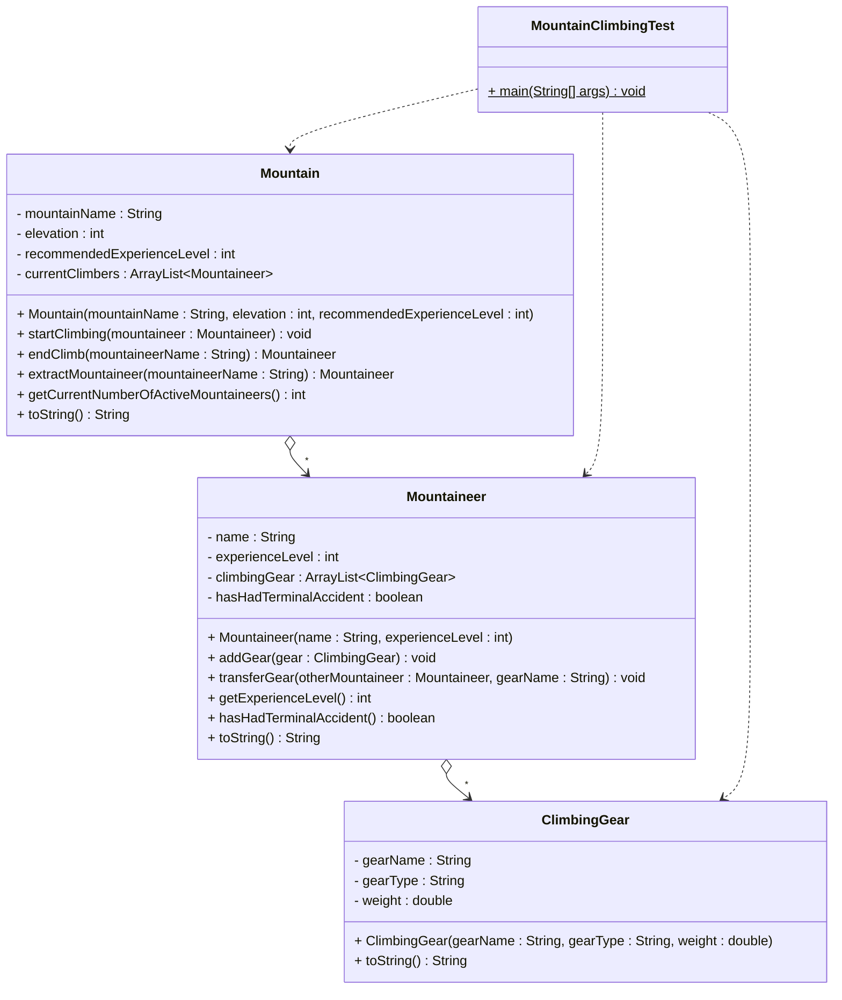

# Implementation Exercise - Mountain Climbing System

In this exercise we will implement a system where a Mountain can have multiple Mountaineers, and each Mountaineer can have multiple pieces of ClimbingGear.

## Exercise 11.0: Mountain with Mountaineers and Climbing Gear

Create a system where a Mountain can have multiple Mountaineers, and each Mountaineer can have multiple pieces of ClimbingGear. Implement the classes. In the `MountainClimbingTest` class, create a main method which creates various objects and calls various methods on these objects. You should include print outs, these can either be directly in the main method, or you can include them in the various methods.

**Implementation Tip:** The easiest approach to implementing this system is to start with the simplest class and work your way up to the more complex ones. Implement the classes in this order: ClimbingGear first, then Mountaineer, then Mountain. This way, each class can use the previously implemented classes as dependencies. You are allowed to add further details (e.g., additional methods or fields) as needed to make your implementation work properly.

### UML Diagram




### Requirements

1. **Mountain Class**:
   - Contains mountain name, elevation, recommended experience level, and a list of current climbers
     - Methods to 
       - start climbing (checks experience level and helmet, and print out warnings if necessary)
       - end climbing by name (prints error if terminated), 
       - extract mountaineer (any status)
       - get active mountaineer count (exluding terminated mountaineers)
       - and get mountain information, should also include information from the child objects. Format this nicely.
   

2. **Mountaineer Class**:
   - Contains name, experience level, climbing gear list, and terminal accident status
   - Methods to add gear, transfer gear to another mountaineer, get experience level, check accident status, and get mountaineer information

3. **ClimbingGear Class**:
   - Contains gear name, type, and weight
   - Method to get gear information

4. **MountainClimbingTest Class**:
   - Contains main method for testing
   - Create instances of all classes
   - Demonstrate the relationships with various print statements

### Example Main Method

Here's an example of how your main method might look:

```java
public class MountainClimbingTest {
    public static void main(String[] args) {
        System.out.println("=== Mountain Climbing System Test ===\n");
        
        // Create mountain
        Mountain everest = new Mountain("Mount Everest", 8848, 7);
        System.out.println(everest);
        System.out.println("Current active mountaineers on mountain: " + everest.getCurrentNumberOfActiveMountaineers());
        System.out.println();
        
        // Create mountaineers
        Mountaineer alice = new Mountaineer("Alice", 8);
        Mountaineer bob = new Mountaineer("Bob", 6);
        
        // Create climbing gear
        ClimbingGear rope = new ClimbingGear("Rope", "Safety", 2.5);
        ClimbingGear carabiner = new ClimbingGear("Carabiner", "Safety", 0.2);
        ClimbingGear helmet = new ClimbingGear("Helmet", "Safety", 0.8);
        
        // Start climbing
        System.out.println("Starting climb: Alice (Level 8)");
        everest.startClimbing(alice);
        System.out.println("Current active mountaineers on mountain: " + everest.getCurrentNumberOfActiveMountaineers());
        System.out.println();
        
        // Add gear to Alice
        System.out.println("Adding gear to Alice: " + rope);
        alice.addGear(rope);
        System.out.println("Gear " + rope + " added to Alice's collection");
        System.out.println("Alice's gear count: " + alice.getGearCount());
        System.out.println();
        
        // Add more gear to Alice
        System.out.println("Adding gear to Alice: " + carabiner);
        alice.addGear(carabiner);
        System.out.println("Gear " + carabiner + " added to Alice's collection");
        System.out.println("Alice's gear count: " + alice.getGearCount());
        System.out.println();
        
        // Bob starts climbing
        System.out.println("Starting climb: Bob (Level 6)");
        everest.startClimbing(bob);
        System.out.println("Current active mountaineers on mountain: " + everest.getCurrentNumberOfActiveMountaineers());
        System.out.println();
        
        // Transfer gear from Alice to Bob
        System.out.println("Transferring gear from Alice to Bob: Rope");
        alice.transferGear(bob, "Rope");
        System.out.println("Gear Rope transferred from Alice to Bob");
        System.out.println("Alice's gear count: " + alice.getGearCount());
        System.out.println("Bob's gear count: " + bob.getGearCount());
        System.out.println();
        
        // Alice has an accident
        System.out.println("Alice has had a terminal accident");
        alice.setTerminalAccident(true);
        System.out.println("Alice's accident status: " + alice.hasHadTerminalAccident());
        System.out.println();
        
        // Try to end Alice's climb (should show error)
        System.out.println("Ending climb: Alice");
        everest.endClimb("Alice");
        System.out.println("Current active mountaineers on mountain: " + everest.getCurrentNumberOfActiveMountaineers());
        System.out.println();
        
        // Extract Alice (terminated mountaineer)
        System.out.println("Extracting mountaineer: Alice");
        Mountaineer extractedAlice = everest.extractMountaineer("Alice");
        System.out.println("Mountaineer Alice extracted from Mount Everest (terminated)");
        System.out.println("Current active mountaineers on mountain: " + everest.getCurrentNumberOfActiveMountaineers());
        System.out.println();
        
        // Final status
        System.out.println("=== Final Status ===");
        System.out.println(everest);
        System.out.println();
        System.out.println(extractedAlice + " (extracted from mountain - terminated)");
    }
}
```

### Implementation Notes

- Use `ArrayList` for the collections
- Implement proper constructors and getter methods
- Add meaningful print statements to show the relationships
- Demonstrate starting/ending climbing by name, adding gear, transferring gear between mountaineers, and handling terminal accidents
- Show how objects can exist independently

### Example Output

Your program should produce output similar to:
```
=== Mountain Climbing System Test ===

Mountain: Mount Everest (8848m) - Recommended Experience Level: 7
Current active mountaineers on mountain: 0

Starting climb: Alice (Level 8)
Warning: Alice does not have a helmet - climbing without proper safety equipment
Mountaineer Alice started climbing Mount Everest
Current active mountaineers on mountain: 1

Adding gear to Alice: Rope (Safety, 2.5kg)
Gear Rope added to Alice's collection
Alice's gear count: 1

Adding gear to Alice: Carabiner (Safety, 0.2kg)
Gear Carabiner added to Alice's collection
Alice's gear count: 2

Starting climb: Bob (Level 6)
Warning: Bob's experience level (6) is below the recommended level (7) for Mount Everest
Warning: Bob does not have a helmet - climbing without proper safety equipment
Mountaineer Bob started climbing Mount Everest
Current active mountaineers on mountain: 2

=== Mountain Status ===
Mount Everest (8848m) - Recommended Experience Level: 7 - has 2 current climber(s)
- Alice (Level 8) carrying 2 piece(s) of gear
  * Rope (Safety, 2.5kg)
  * Carabiner (Safety, 0.2kg)
- Bob (Level 6) carrying 0 piece(s) of gear

Transferring gear from Alice to Bob: Rope
Gear Rope transferred from Alice to Bob
Alice's gear count: 1
Bob's gear count: 1

Alice has had a terminal accident
Alice's accident status: true

Ending climb: Alice
Error: Cannot end climb for Alice - mountaineer has had a terminal accident
Current active mountaineers on mountain: 1

Extracting mountaineer: Alice
Mountaineer Alice extracted from Mount Everest (terminated)
Current active mountaineers on mountain: 1

=== Final Status ===
Mount Everest (8848m) - Recommended Experience Level: 7 - has 1 current climber(s)
- Bob (Level 6) carrying 1 piece(s) of gear
  * Rope (Safety, 2.5kg)

Alice (extracted from mountain - terminated) carrying 1 piece(s) of gear
  * Carabiner (Safety, 0.2kg)
```

### Key Learning Points

1. **Aggregation Relationships**: Both Mountain-Mountaineer and Mountaineer-ClimbingGear are aggregations
2. **Independent Existence**: Mountaineers and gear can exist without being part of any mountain
3. **Collection Management**: Using ArrayList to manage one-to-many relationships
4. **Object Lifecycle**: Objects can be added and removed from collections
5. **Testing**: Creating a test class to demonstrate the system functionality

