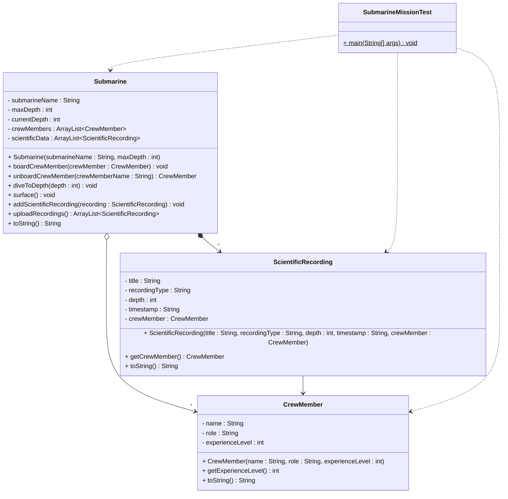

# Implementation Exercise - Submarine Scientific Mission

This exercise will be about implementing a system where a Submarine can have multiple Crew Members, and each Crew Member can make multiple Scientific Recordings. It is described "simple", but you can expand it with more details if you want to. For example, making it run in a loop, so you can move the submarine to different locations, recording scientific data at different depths, adding or removing crew members, etc.

## Exercise 12.0: Submarine with Crew Members and Scientific Recordings

Create a system where a Submarine can have multiple Crew Members, and each Crew Member can make multiple Scientific Recordings. The recording is stored in the Submarine's records, but we keep track of the crew member who made the recording.\
In the `SubmarineMissionTest` class, create a main method which creates various objects and calls various methods on these objects. You should include print outs, these can either be directly in the main method, or you can include them in the various methods.

Optionally, you can make the program keep running until the user wants to exit. You could add a `moveToLocation()` method on the Submarine class, which would simulate moving the submarine to a specific depth or location. The method should check if the depth is within the submarine's maximum depth, and if not, print a warning message.

You may add further details (e.g., additional methods or fields) as needed to make your implementation work properly.


### UML Diagram



### Requirements

1. **Submarine Class**:
- Contains submarine name, maximum depth, current depth, a list of crew members, and a list of scientific data
- Methods to 
  - board crew member (checks if submarine is at surface)
  - unboard crew member by name (returns the crew member, check the submarine is at surface)
  - dive to specific depth (checks against maximum depth and prints warnings)
  - surface (returns to depth 0)
  - add scientific recording to the submarine's data collection
  - upload recordings to mother-ship (returns copied data to enforce composition)
  - get submarine information (toString), should also include information from the child objects. Format this nicely.

1. **CrewMember Class**:
   - Contains name, role, and experience level
   - Methods to get experience level and get crew member information

2. **ScientificRecording Class**:
   - Contains title, recording type, depth where recorded, and timestamp
   - Method to get recording information

3. **SubmarineMissionTest Class**:
   - Contains main method for testing
   - Create instances of all classes
   - Call various methods to exercise the system

### Example Main Method

Here's an example of how your main method might look:

```java
public class SubmarineMissionTest {
    public static void main(String[] args) {
        System.out.println("=== Submarine Scientific Mission Test ===\n");
        
        // Create submarine
        Submarine nautilus = new Submarine("Nautilus", 1000);
        System.out.println(nautilus);
        System.out.println("Current crew members: " + nautilus.getCrewMembers().size());
        System.out.println();
        
        // Create crew members
        CrewMember captain = new CrewMember("Captain Smith", "Captain", 15);
        CrewMember scientist = new CrewMember("Dr. Johnson", "Marine Biologist", 12);
        CrewMember engineer = new CrewMember("Engineer Brown", "Engineer", 8);
        
        // Create scientific recordings
        ScientificRecording fishSurvey = new ScientificRecording("Deep Sea Fish Survey", "Biological", 200, "2024-01-15 10:30");
        ScientificRecording waterSample = new ScientificRecording("Water Quality Analysis", "Chemical", 150, "2024-01-15 11:45");
        ScientificRecording temperatureLog = new ScientificRecording("Temperature Profile", "Physical", 300, "2024-01-15 12:15");
        
        // Add crew members to submarine
        System.out.println("Adding crew member: " + captain);
        nautilus.addCrewMember(captain);
        System.out.println("Captain Smith added to Nautilus");
        System.out.println("Current crew members: " + nautilus.getCrewMembers().size());
        System.out.println();
        
        System.out.println("Adding crew member: " + scientist);
        nautilus.addCrewMember(scientist);
        System.out.println("Dr. Johnson added to Nautilus");
        System.out.println("Current crew members: " + nautilus.getCrewMembers().size());
        System.out.println();
        
        // Dive to shallow depth
        System.out.println("Diving to depth: 100 meters");
        nautilus.diveToDepth(100);
        System.out.println("Current depth: " + nautilus.getCurrentDepth() + " meters");
        System.out.println();
        
        // Add recordings to submarine's scientific data collection
        System.out.println("Adding recording to submarine data: " + fishSurvey);
        nautilus.addScientificRecording(fishSurvey);
        System.out.println("Recording added to submarine's scientific data collection");
        System.out.println("Submarine's scientific data count: " + nautilus.getScientificData().size());
        System.out.println();
        
        System.out.println("Adding recording to submarine data: " + waterSample);
        nautilus.addScientificRecording(waterSample);
        System.out.println("Recording added to submarine's scientific data collection");
        System.out.println("Submarine's scientific data count: " + nautilus.getScientificData().size());
        System.out.println();
        
        // Add engineer
        System.out.println("Adding crew member: " + engineer);
        nautilus.addCrewMember(engineer);
        System.out.println("Engineer Brown added to Nautilus");
        System.out.println("Current crew members: " + nautilus.getCrewMembers().size());
        System.out.println();
        
        // Dive to deeper depth
        System.out.println("Diving to depth: 500 meters");
        nautilus.diveToDepth(500);
        System.out.println("Current depth: " + nautilus.getCurrentDepth() + " meters");
        System.out.println();
        
        // Add recording to submarine's scientific data collection
        System.out.println("Adding recording to submarine data: " + temperatureLog);
        nautilus.addScientificRecording(temperatureLog);
        System.out.println("Recording added to submarine's scientific data collection");
        System.out.println("Submarine's scientific data count: " + nautilus.getScientificData().size());
        System.out.println();
        
        // Check if submarine has specific recordings in its data collection
        System.out.println("Does submarine have 'Deep Sea Fish Survey'? " + nautilus.hasScientificRecording("Deep Sea Fish Survey"));
        System.out.println("Does submarine have 'Water Quality Analysis'? " + nautilus.hasScientificRecording("Water Quality Analysis"));
        System.out.println("Does submarine have 'Temperature Profile'? " + nautilus.hasScientificRecording("Temperature Profile"));
        System.out.println();
        
        // Surface
        System.out.println("Surfacing submarine");
        nautilus.surface();
        System.out.println("Current depth: " + nautilus.getCurrentDepth() + " meters");
        System.out.println();
        
        // Remove crew member
        System.out.println("Removing crew member: Engineer Brown");
        CrewMember removedEngineer = nautilus.removeCrewMember("Engineer Brown");
        System.out.println("Engineer Brown removed from Nautilus");
        System.out.println("Current crew members: " + nautilus.getCrewMembers().size());
        System.out.println();
        
        // Final status
        System.out.println("=== Final Mission Status ===");
        System.out.println(nautilus);
        System.out.println();
        System.out.println("Scientific Data Collection:");
        for (ScientificRecording recording : nautilus.getScientificData()) {
            System.out.println("  * " + recording);
        }
        System.out.println();
        System.out.println(removedEngineer + " (removed from submarine)");
    }
}
```

### Implementation Notes

- Implement proper constructors and getter methods
- Add meaningful print statements to show what is happening
- Demonstrate diving/surfacing, adding/removing crew members, adding recordings to submarine's data collection, and checking for specific recordings
- Show how objects can exist independently
- Include depth safety checks and warnings

### Example Output

Your program should produce output similar to:
```
=== Submarine Scientific Mission Test ===

Submarine: Nautilus - Max Depth: 1000m - Current Depth: 0m
Current crew members: 0

Adding crew member: Captain Smith (Captain, Level 15)
Captain Smith added to Nautilus
Current crew members: 1

Adding crew member: Dr. Johnson (Marine Biologist, Level 12)
Dr. Johnson added to Nautilus
Current crew members: 2

Diving to depth: 100 meters
Diving to 100 meters
Current depth: 100 meters

Adding recording to submarine data: Deep Sea Fish Survey (Biological, 200m, 2024-01-15 10:30)
Recording added to submarine's scientific data collection
Submarine's scientific data count: 1

Adding recording to submarine data: Water Quality Analysis (Chemical, 150m, 2024-01-15 11:45)
Recording added to submarine's scientific data collection
Submarine's scientific data count: 2

Adding crew member: Engineer Brown (Engineer, Level 8)
Engineer Brown added to Nautilus
Current crew members: 3

Diving to depth: 500 meters
Diving to 500 meters
Current depth: 500 meters

Adding recording to submarine data: Temperature Profile (Physical, 300m, 2024-01-15 12:15)
Recording added to submarine's scientific data collection
Submarine's scientific data count: 3

Does submarine have 'Deep Sea Fish Survey'? true
Does submarine have 'Water Quality Analysis'? true
Does submarine have 'Temperature Profile'? true

Surfacing submarine
Surfacing to 0 meters
Current depth: 0 meters

Removing crew member: Engineer Brown
Engineer Brown removed from Nautilus
Current crew members: 2

=== Final Mission Status ===
Submarine: Nautilus - Max Depth: 1000m - Current Depth: 0m
Crew Members: 2
- Captain Smith (Captain, Level 15)
- Dr. Johnson (Marine Biologist, Level 12)

Scientific Data Collection:
  * Deep Sea Fish Survey (Biological, 200m, 2024-01-15 10:30)
  * Water Quality Analysis (Chemical, 150m, 2024-01-15 11:45)
  * Temperature Profile (Physical, 300m, 2024-01-15 12:15)

Engineer Brown (Engineer, Level 8) (removed from submarine)
```

### Key Learning Points

1. **Aggregation Relationships**: Both Submarine-CrewMember and CrewMember-ScientificRecording are aggregations
2. **Independent Existence**: Crew members and recordings can exist without being part of any submarine
3. **Collection Management**: Using ArrayList to manage one-to-many relationships
4. **Object Lifecycle**: Objects can be added and removed from collections
5. **Safety Checks**: Implementing depth limits and surface requirements for crew operations
6. **Data Transfer**: Transferring recordings between crew members
7. **Testing**: Creating a test class to demonstrate the system functionality
