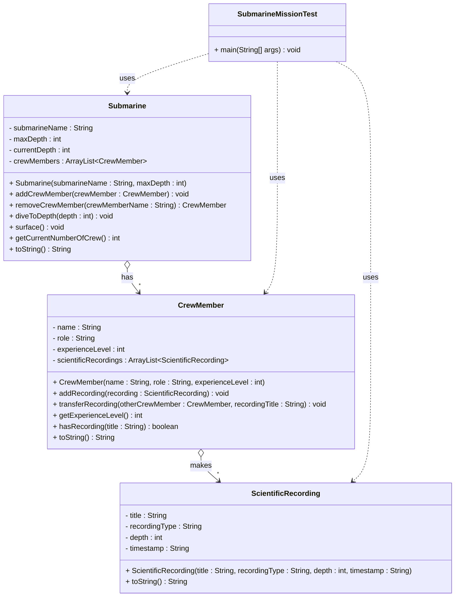

# Implementation Exercise - Submarine Scientific Mission

Now it is time to actually do some coding.

## Exercise 11.0: Submarine with Crew Members and Scientific Recordings

Create a system where a Submarine can have multiple Crew Members, and each Crew Member can make multiple Scientific Recordings. Implement the classes. In the `SubmarineMissionTest` class, create a main method which creates various objects and calls various methods on these objects. You should include print outs, these can either be directly in the main method, or you can include them in the various methods.

**Implementation Tip:** The easiest approach to implementing this system is to start with the simplest class and work your way up to the more complex ones. Implement the classes in this order: ScientificRecording first, then CrewMember, then Submarine. This way, each class can use the previously implemented classes as dependencies. You are allowed to add further details (e.g., additional methods or fields) as needed to make your implementation work properly.

### UML Diagram



### Requirements

1. **Submarine Class**:
   - Contains submarine name, maximum depth, current depth, and a list of crew members
   - Methods to 
    - add crew member (checks if submarine is at surface)
    - remove crew member by name (returns the crew member)
    - dive to specific depth (checks against maximum depth and prints warnings)
    - surface (returns to depth 0)
    - get current number of crew members
    - and get submarine information, should also include information from the child objects. Format this nicely.

2. **CrewMember Class**:
   - Contains name, role, experience level, and a list of scientific recordings
   - Methods to add recording, transfer recording to another crew member, get experience level, check if has specific recording, and get crew member information
   - Relationship with ScientificRecording: Aggregation (recordings can exist independently)

3. **ScientificRecording Class**:
   - Contains title, recording type, depth where recorded, and timestamp
   - Method to get recording information

4. **SubmarineMissionTest Class**:
   - Contains main method for testing
   - Create instances of all classes
   - Demonstrate the relationships with various print statements

### Example Main Method

Here's an example of how your main method might look:

```java
public class SubmarineMissionTest {
    public static void main(String[] args) {
        System.out.println("=== Submarine Scientific Mission Test ===\n");
        
        // Create submarine
        Submarine nautilus = new Submarine("Nautilus", 1000);
        System.out.println(nautilus);
        System.out.println("Current crew members: " + nautilus.getCurrentNumberOfCrew());
        System.out.println();
        
        // Create crew members
        CrewMember captain = new CrewMember("Captain Smith", "Captain", 15);
        CrewMember scientist = new CrewMember("Dr. Johnson", "Marine Biologist", 12);
        CrewMember engineer = new CrewMember("Engineer Brown", "Engineer", 8);
        
        // Create scientific recordings
        ScientificRecording fishSurvey = new ScientificRecording("Deep Sea Fish Survey", "Biological", 200, "2024-01-15 10:30");
        ScientificRecording waterSample = new ScientificRecording("Water Quality Analysis", "Chemical", 150, "2024-01-15 11:45");
        ScientificRecording temperatureLog = new ScientificRecording("Temperature Profile", "Physical", 300, "2024-01-15 12:15");
        
        // Add crew members to submarine
        System.out.println("Adding crew member: " + captain);
        nautilus.addCrewMember(captain);
        System.out.println("Captain Smith added to Nautilus");
        System.out.println("Current crew members: " + nautilus.getCurrentNumberOfCrew());
        System.out.println();
        
        System.out.println("Adding crew member: " + scientist);
        nautilus.addCrewMember(scientist);
        System.out.println("Dr. Johnson added to Nautilus");
        System.out.println("Current crew members: " + nautilus.getCurrentNumberOfCrew());
        System.out.println();
        
        // Dive to shallow depth
        System.out.println("Diving to depth: 100 meters");
        nautilus.diveToDepth(100);
        System.out.println("Current depth: " + nautilus.getCurrentDepth() + " meters");
        System.out.println();
        
        // Add recordings to scientist
        System.out.println("Adding recording to Dr. Johnson: " + fishSurvey);
        scientist.addRecording(fishSurvey);
        System.out.println("Recording added to Dr. Johnson's collection");
        System.out.println("Dr. Johnson's recording count: " + scientist.getRecordingCount());
        System.out.println();
        
        System.out.println("Adding recording to Dr. Johnson: " + waterSample);
        scientist.addRecording(waterSample);
        System.out.println("Recording added to Dr. Johnson's collection");
        System.out.println("Dr. Johnson's recording count: " + scientist.getRecordingCount());
        System.out.println();
        
        // Add engineer
        System.out.println("Adding crew member: " + engineer);
        nautilus.addCrewMember(engineer);
        System.out.println("Engineer Brown added to Nautilus");
        System.out.println("Current crew members: " + nautilus.getCurrentNumberOfCrew());
        System.out.println();
        
        // Dive to deeper depth
        System.out.println("Diving to depth: 500 meters");
        nautilus.diveToDepth(500);
        System.out.println("Current depth: " + nautilus.getCurrentDepth() + " meters");
        System.out.println();
        
        // Add recording to engineer
        System.out.println("Adding recording to Engineer Brown: " + temperatureLog);
        engineer.addRecording(temperatureLog);
        System.out.println("Recording added to Engineer Brown's collection");
        System.out.println("Engineer Brown's recording count: " + engineer.getRecordingCount());
        System.out.println();
        
        // Transfer recording between crew members
        System.out.println("Transferring recording from Dr. Johnson to Engineer Brown: Water Quality Analysis");
        scientist.transferRecording(engineer, "Water Quality Analysis");
        System.out.println("Recording transferred from Dr. Johnson to Engineer Brown");
        System.out.println("Dr. Johnson's recording count: " + scientist.getRecordingCount());
        System.out.println("Engineer Brown's recording count: " + engineer.getRecordingCount());
        System.out.println();
        
        // Check if crew member has specific recording
        System.out.println("Does Dr. Johnson have 'Deep Sea Fish Survey'? " + scientist.hasRecording("Deep Sea Fish Survey"));
        System.out.println("Does Engineer Brown have 'Water Quality Analysis'? " + engineer.hasRecording("Water Quality Analysis"));
        System.out.println();
        
        // Surface
        System.out.println("Surfacing submarine");
        nautilus.surface();
        System.out.println("Current depth: " + nautilus.getCurrentDepth() + " meters");
        System.out.println();
        
        // Remove crew member
        System.out.println("Removing crew member: Engineer Brown");
        CrewMember removedEngineer = nautilus.removeCrewMember("Engineer Brown");
        System.out.println("Engineer Brown removed from Nautilus");
        System.out.println("Current crew members: " + nautilus.getCurrentNumberOfCrew());
        System.out.println();
        
        // Final status
        System.out.println("=== Final Mission Status ===");
        System.out.println(nautilus);
        System.out.println();
        System.out.println(removedEngineer + " (removed from submarine)");
    }
}
```

### Implementation Notes

- Use `ArrayList` for the collections
- Implement proper constructors and getter methods
- Add meaningful print statements to show the relationships
- Demonstrate diving/surfacing, adding/removing crew members, adding recordings, and transferring recordings between crew members
- Show how objects can exist independently
- Include depth safety checks and warnings

### Example Output

Your program should produce output similar to:
```
=== Submarine Scientific Mission Test ===

Submarine: Nautilus - Max Depth: 1000m - Current Depth: 0m
Current crew members: 0

Adding crew member: Captain Smith (Captain, Level 15)
Captain Smith added to Nautilus
Current crew members: 1

Adding crew member: Dr. Johnson (Marine Biologist, Level 12)
Dr. Johnson added to Nautilus
Current crew members: 2

Diving to depth: 100 meters
Diving to 100 meters
Current depth: 100 meters

Adding recording to Dr. Johnson: Deep Sea Fish Survey (Biological, 200m, 2024-01-15 10:30)
Recording added to Dr. Johnson's collection
Dr. Johnson's recording count: 1

Adding recording to Dr. Johnson: Water Quality Analysis (Chemical, 150m, 2024-01-15 11:45)
Recording added to Dr. Johnson's collection
Dr. Johnson's recording count: 2

Adding crew member: Engineer Brown (Engineer, Level 8)
Engineer Brown added to Nautilus
Current crew members: 3

Diving to depth: 500 meters
Diving to 500 meters
Current depth: 500 meters

Adding recording to Engineer Brown: Temperature Profile (Physical, 300m, 2024-01-15 12:15)
Recording added to Engineer Brown's collection
Engineer Brown's recording count: 1

Transferring recording from Dr. Johnson to Engineer Brown: Water Quality Analysis
Recording transferred from Dr. Johnson to Engineer Brown
Dr. Johnson's recording count: 1
Engineer Brown's recording count: 2

Does Dr. Johnson have 'Deep Sea Fish Survey'? true
Does Engineer Brown have 'Water Quality Analysis'? true

Surfacing submarine
Surfacing to 0 meters
Current depth: 0 meters

Removing crew member: Engineer Brown
Engineer Brown removed from Nautilus
Current crew members: 2

=== Final Mission Status ===
Submarine: Nautilus - Max Depth: 1000m - Current Depth: 0m
Crew Members: 2
- Captain Smith (Captain, Level 15) - 0 recordings
- Dr. Johnson (Marine Biologist, Level 12) - 1 recordings
  * Deep Sea Fish Survey (Biological, 200m, 2024-01-15 10:30)

Engineer Brown (Engineer, Level 8) - 2 recordings (removed from submarine)
  * Temperature Profile (Physical, 300m, 2024-01-15 12:15)
  * Water Quality Analysis (Chemical, 150m, 2024-01-15 11:45)
```

### Key Learning Points

1. **Aggregation Relationships**: Both Submarine-CrewMember and CrewMember-ScientificRecording are aggregations
2. **Independent Existence**: Crew members and recordings can exist without being part of any submarine
3. **Collection Management**: Using ArrayList to manage one-to-many relationships
4. **Object Lifecycle**: Objects can be added and removed from collections
5. **Safety Checks**: Implementing depth limits and surface requirements for crew operations
6. **Data Transfer**: Transferring recordings between crew members
7. **Testing**: Creating a test class to demonstrate the system functionality
