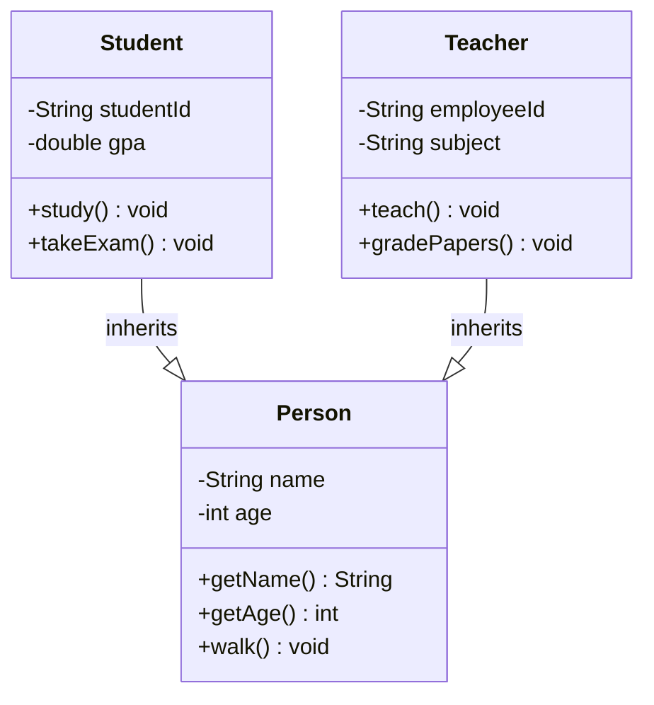
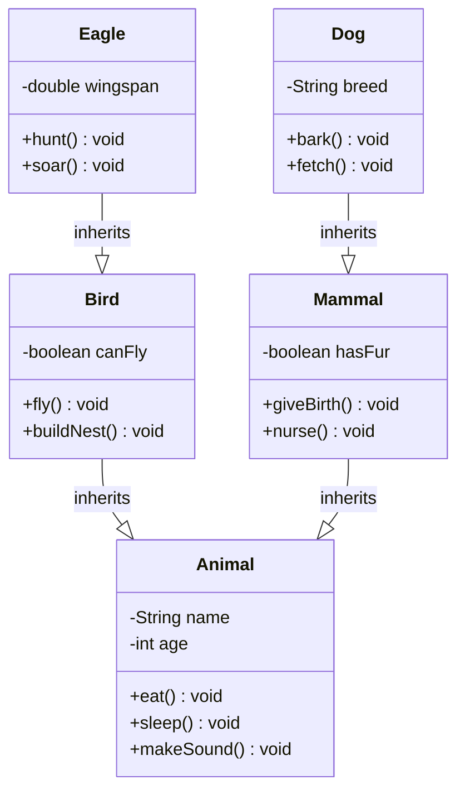
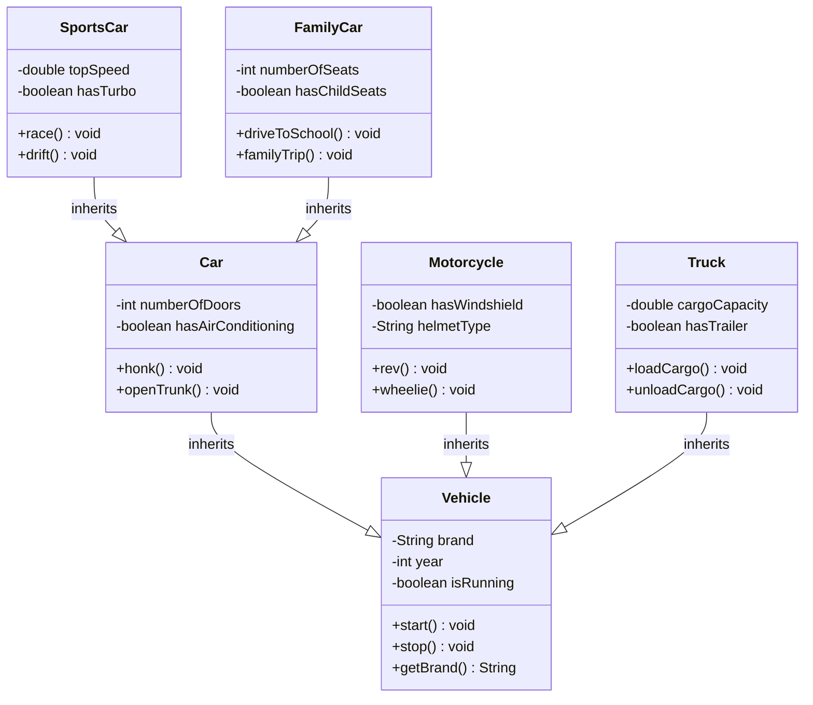
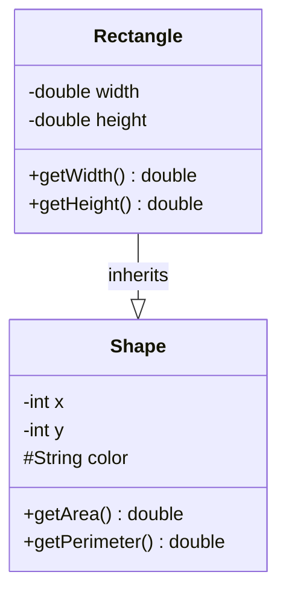
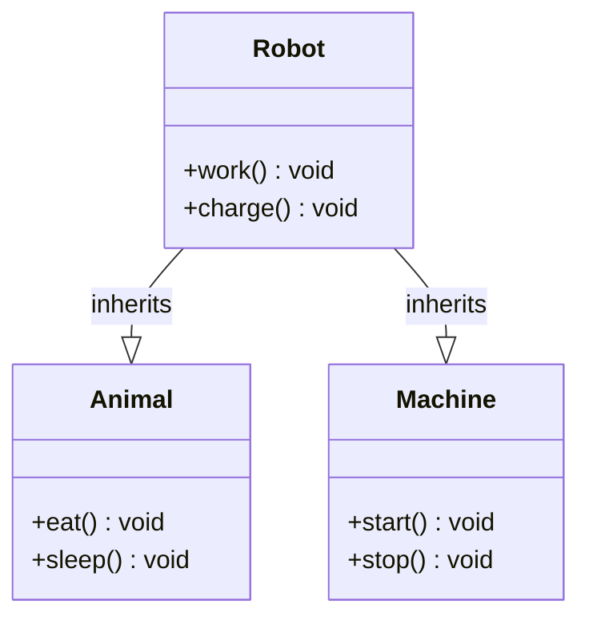

# UML Representation of Inheritance

## Inheritance Arrow in UML

In UML (Unified Modeling Language), inheritance is represented using a **hollow triangle arrow** pointing from the child class to the parent class.

## Basic Inheritance Arrow

```
Child Class ──▷ Parent Class
```

The arrow points **from child to parent**, indicating that the child inherits from the parent.

## Simple Example



## Multiple Levels of Inheritance

Inheritance can have multiple levels, creating a hierarchy:



## Inheritance Hierarchy Example

Here's a more complex example showing multiple levels:



## UML Notation Details

### Arrow Style
- **Hollow triangle** (not filled)
- Points from **child to parent**
- Line connects the classes

### Visibility Modifiers
In UML, you can show the visibility of inherited members:



**Legend:**
- `-` = private
- `#` = protected  
- `+` = public

## Multiple Inheritance

**Note**: Java does **not support multiple inheritance** for classes, but UML can represent it:



*This is not possible in Java, but Java supports multiple inheritance through interfaces.*

## Abstract Classes in UML

Abstract classes are shown with **italicized names**:

```mermaid
classDiagram
    class <<abstract>> Shape {
        -int x
        -int y
        +getArea()* double
        +getPerimeter()* double
        +draw() void
    }
    
    class Rectangle {
        -double width
        -double height
        +getArea() double
        +getPerimeter() double
    }
    
    class Circle {
        -double radius
        +getArea() double
        +getPerimeter() double
    }
    
    Rectangle --|> Shape : inherits
    Circle --|> Shape : inherits
```

**Notation:**
- `<<abstract>>` stereotype
- `*` after method name indicates abstract method
- Italicized class name

## Key Points

1. **Arrow Direction**: Always points from child to parent
2. **Arrow Style**: Hollow triangle, not filled
3. **Multiple Levels**: Can have many levels of inheritance
4. **Visibility**: Can show inherited members with visibility modifiers
5. **Abstract Classes**: Shown with special notation
6. **Java Limitation**: No multiple inheritance for classes

## Common Mistakes

### ❌ Wrong Arrow Direction
```
Person ──▷ Student  // Wrong! Should be Student ──▷ Person
```

### ❌ Wrong Arrow Style
```
Student ──▶ Person  // Wrong! Should be hollow triangle
```

### ✅ Correct Notation
```
Student ──▷ Person  // Correct!
```
