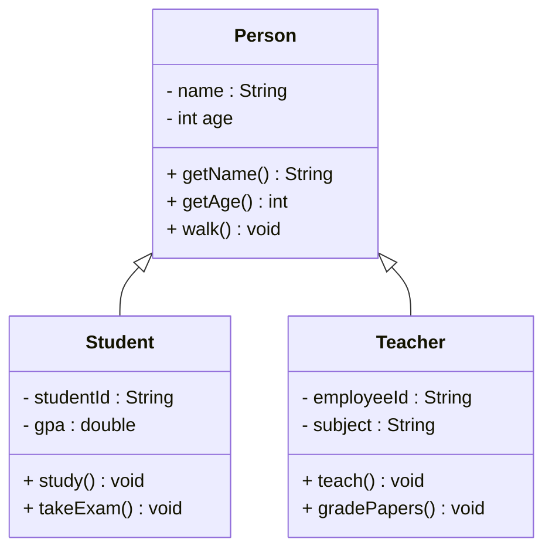
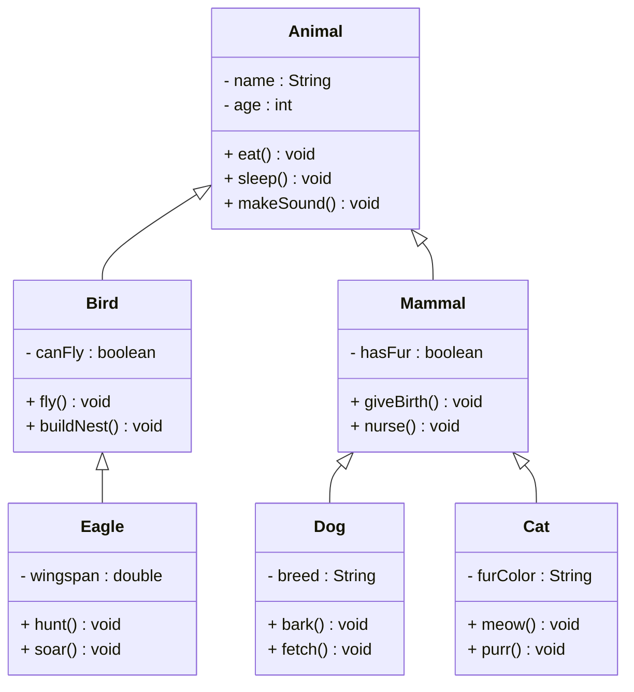
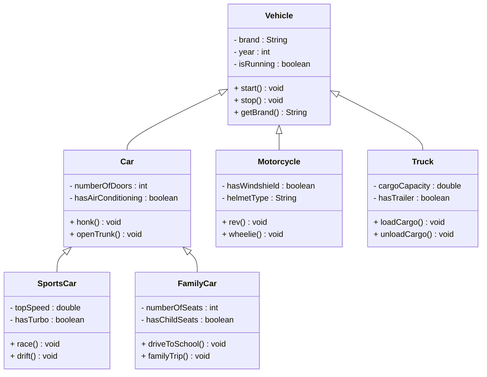
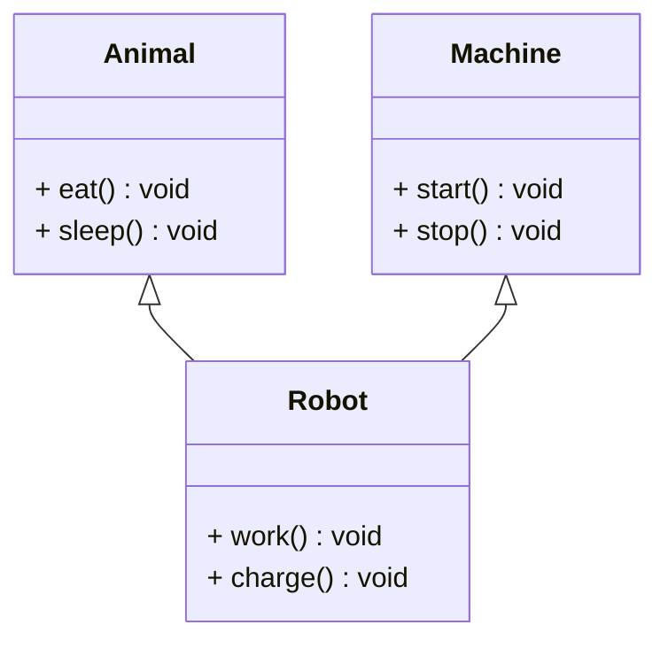

# UML Representation of Inheritance

In UML (Unified Modeling Language), inheritance is represented using a **hollow triangle arrow** pointing from the child class to the parent class.

## Basic Inheritance Arrow

```
Child Class ──▷ Parent Class
```

The arrow points **from child to parent**, indicating that the child inherits from the parent. It will also be apparent in the code, that the child knows about the parent. But the parent does not know about the child. All relationship arrows so far have followed this pattern. A class knows about another, but not vice versa.

## Simple Example

Here is the Person, Student, Teacher example again in UML. Notice the arrows



This means that when you implement this, the Student class will have the following methods:
- `getName()` from the Person class
- `getAge()` from the Person class
- `walk()` from the Person class
- `study()` from the Student class
- `takeExam()` from the Student class

## Multiple Levels of Inheritance

Inheritance can have multiple levels, creating a hierarchy:



## Inheritance Hierarchy Example

Here's a more complex example showing multiple levels:



Again, a any class will inherit the methods from all it's super classes. So, for example, the SportsCar class will have the following methods:
- `start()` from the Vehicle class
- `stop()` from the Vehicle class
- `getBrand()` from the Vehicle class
- `honk()` from the Car class
- `openTrunk()` from the Car class
- `race()` from the SportsCar class
- `drift()` from the SportsCar class

## UML Notation Details

### Arrow Style
- **Hollow triangle** (not filled)
- Points from **child to parent**
- Line connects the classes

## Multiple Inheritance

**Note**: Java does **not support multiple inheritance** for classes, but UML can represent it:



### ***This is not possible in Java!!***\
Other languages may allow it, though. 


## Key Points

1. **Arrow Direction**: Always points from child to parent
2. **Arrow Style**: Hollow triangle, not filled
3. **Multiple Levels**: Can have many levels of inheritance
4. **Java Limitation**: No multiple inheritance for classes

## Common Mistakes

### ❌ Wrong Arrow Direction
```
Person ──▷ Student  // Wrong! Should be Student ──▷ Person
```

### ❌ Wrong Arrow Style
```
Student ──▶ Person  // Wrong! Should be hollow triangle
```

### ✅ Correct Notation
```
Student ──▷ Person  // Correct!
```
