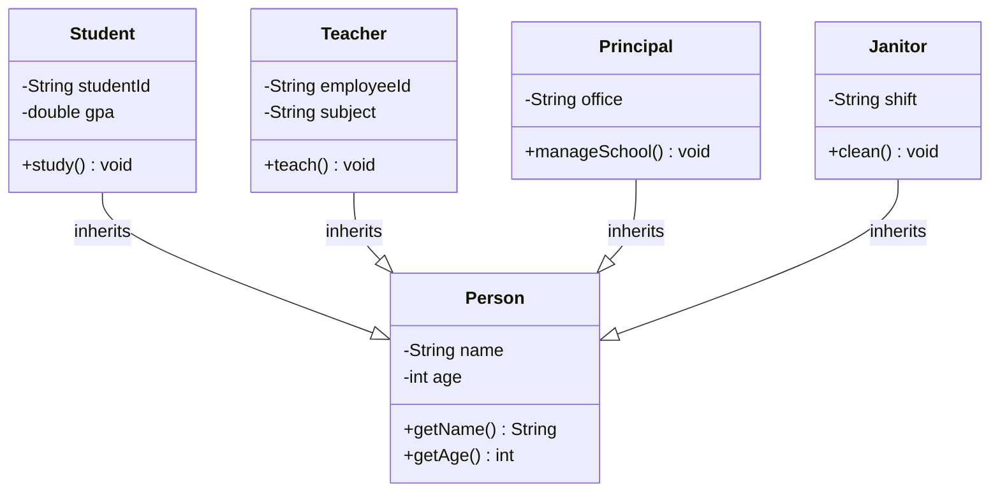
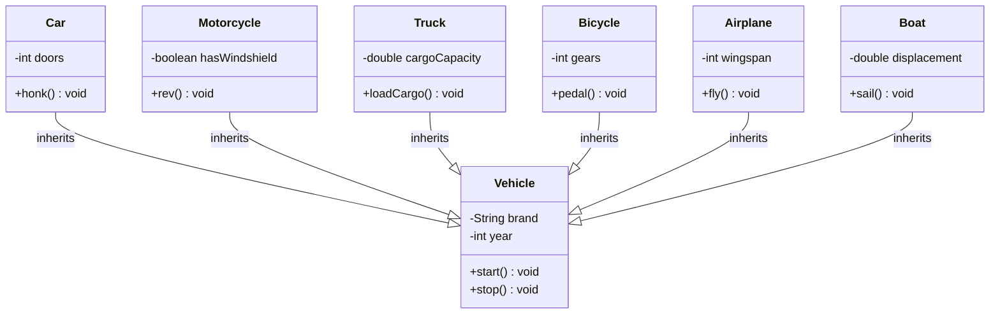
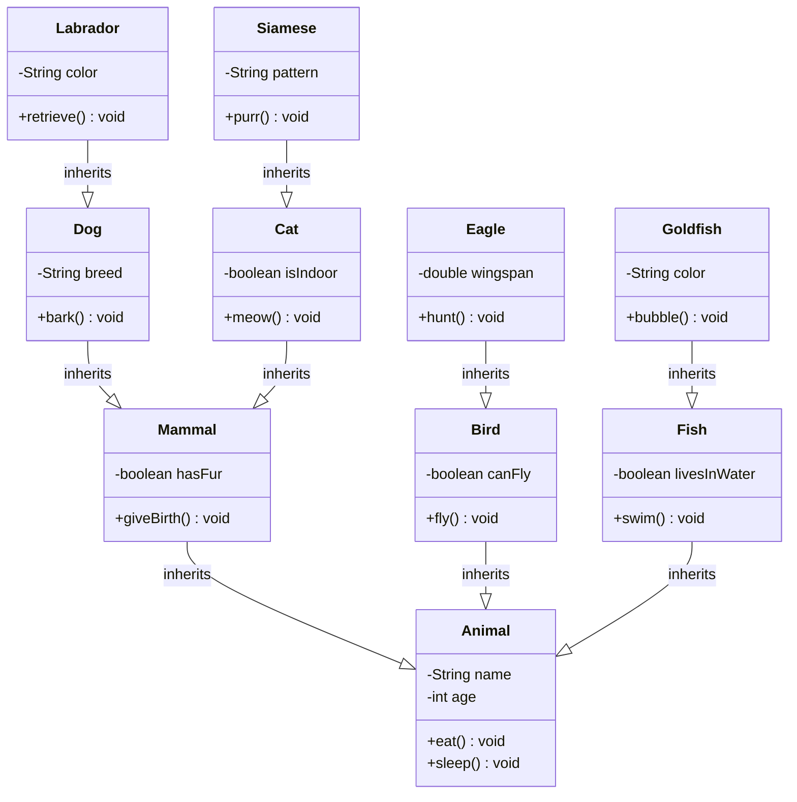
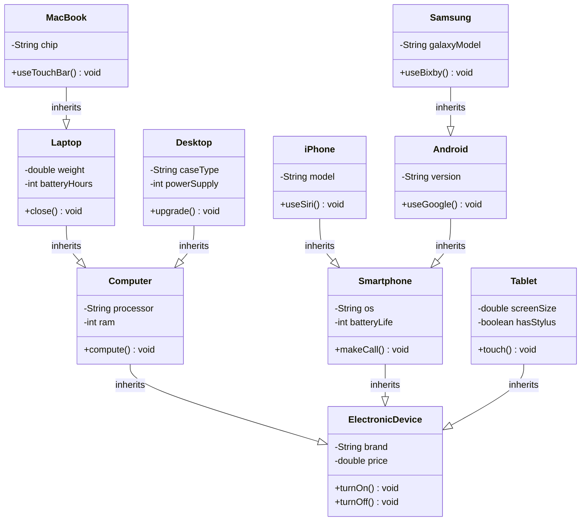
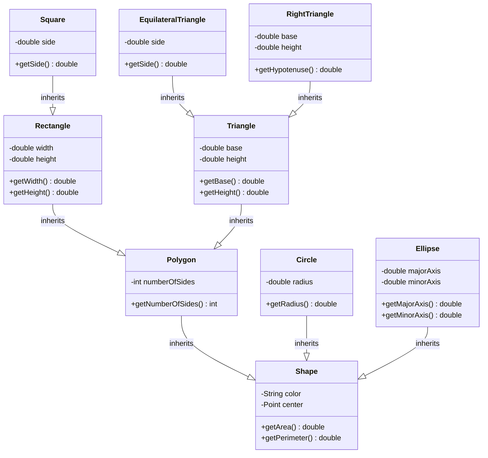

# Inheritance Hierarchy Exercises

## Exercise 1: School System

Given the following nouns, create an inheritance hierarchy:

**Nouns:**
- Person
- Student
- Teacher
- Principal
- Janitor
- Course
- Classroom

**Task:**
1. Identify which nouns represent classes that could be in an inheritance relationship
2. Create a hierarchy showing the "is a" relationships
3. Draw the UML diagram using Mermaid

**Hint:** Think about who "is a" person in this system.

---

## Exercise 2: Transportation

Given the following nouns, create an inheritance hierarchy:

**Nouns:**
- Vehicle
- Car
- Motorcycle
- Truck
- Bicycle
- Airplane
- Boat
- Engine
- Wheel

**Task:**
1. Identify which nouns represent classes that could be in an inheritance relationship
2. Create a hierarchy showing the "is a" relationships
3. Draw the UML diagram using Mermaid

**Hint:** Focus on the "is a" relationship. Not all nouns will be in the inheritance hierarchy.

---

## Exercise 3: Animals

Given the following nouns, create an inheritance hierarchy:

**Nouns:**
- Animal
- Dog
- Cat
- Bird
- Fish
- Mammal
- Reptile
- Eagle
- Goldfish
- Labrador
- Siamese

**Task:**
1. Identify which nouns represent classes that could be in an inheritance relationship
2. Create a hierarchy showing the "is a" relationships
3. Draw the UML diagram using Mermaid

**Hint:** Consider multiple levels of inheritance. Some animals are more specific types of other animals.

---

## Exercise 4: Electronics

Given the following nouns, create an inheritance hierarchy:

**Nouns:**
- ElectronicDevice
- Computer
- Smartphone
- Tablet
- Laptop
- Desktop
- iPhone
- Android
- Samsung
- MacBook
- Processor
- Screen

**Task:**
1. Identify which nouns represent classes that could be in an inheritance relationship
2. Create a hierarchy showing the "is a" relationships
3. Draw the UML diagram using Mermaid

**Hint:** Think about different levels of specificity. Some devices are more general, others are very specific.

---

## Exercise 5: Shapes

Given the following nouns, create an inheritance hierarchy:

**Nouns:**
- Shape
- Rectangle
- Circle
- Triangle
- Square
- Polygon
- EquilateralTriangle
- RightTriangle
- Ellipse
- Color
- Point

**Task:**
1. Identify which nouns represent classes that could be in an inheritance relationship
2. Create a hierarchy showing the "is a" relationships
3. Draw the UML diagram using Mermaid

**Hint:** Consider that some shapes are special cases of other shapes (e.g., a square is a special rectangle).

---

## Solutions

### Exercise 1 Solution:

### Exercise 2 Solution:

### Exercise 3 Solution:

### Exercise 4 Solution:

### Exercise 5 Solution:

