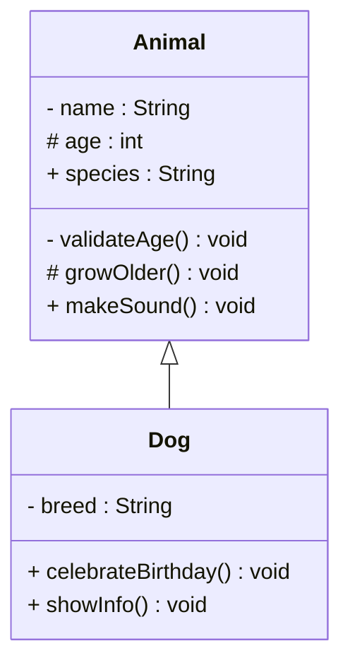
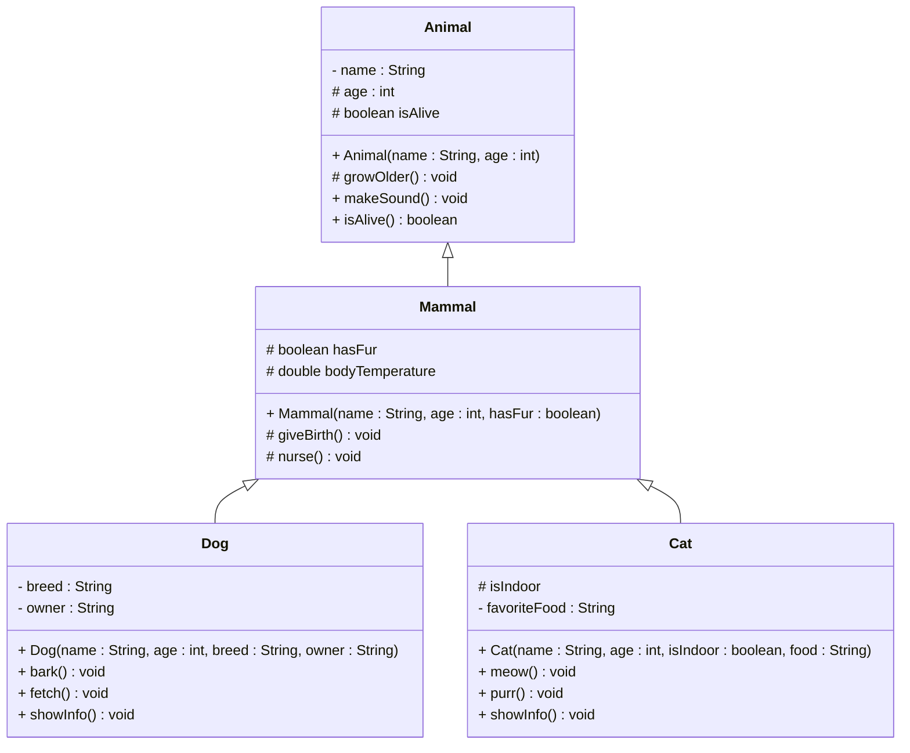

# Protected Members in UML

## UML Visibility Notation

In UML class diagrams, visibility is shown using symbols before the member name:

| Symbol | Visibility | Description |
|--------|------------|-------------|
| `-` | private | Only accessible within the same class |
| `#` | protected | Accessible within the same class, package, and subclasses |
| `+` | public | Accessible everywhere |
| `~` | package | Accessible within the same package (default in Java) |

## Basic Protected Members Example

Notice how the `age` field is protected, and the `growOlder()` method is protected. They are accessible to the `Dog` class, because it is a subclass of the `Animal` class.

**Explanation:**
- `- String name` - private field, not accessible to Dog
- `# int age` - protected field, accessible to Dog
- `+ String species` - public field, accessible everywhere
- `- validateAge()` - private method, not accessible to Dog
- `# growOlder()` - protected method, accessible to Dog
- `+ makeSound()` - public method, accessible everywhere

## Multiple Levels of Inheritance with Protected

A protected field can be accessed by a Subclass, or a "sub-sub-class", etc. For example, the `age` field is protected in the `Animal` class, and is accessible to the `Dog` class, which is a subclass of the `Animal` class.

**Protected Members Access:**
- **Dog** can access: `age`, `isAlive`, `growOlder()`, `hasFur`, `bodyTemperature`, `giveBirth()`, `nurse()`
- **Cat** can access: `age`, `isAlive`, `growOlder()`, `hasFur`, `bodyTemperature`, `giveBirth()`, `nurse()`
- **Dog** cannot access: `name` (private in Animal)
- **Cat** cannot access: `name` (private in Animal)

## Summary

In UML, protected members are shown with the `#` symbol:

1. **`# fieldName`** - protected field
2. **`# methodName()`** - protected method
3. **Accessible to subclasses** in the inheritance hierarchy
4. **Can be overridden** by subclasses
5. **Maintains encapsulation** while allowing inheritance

Understanding how to represent protected members in UML helps you design clear inheritance hierarchies and communicate the intended access levels to other developers.