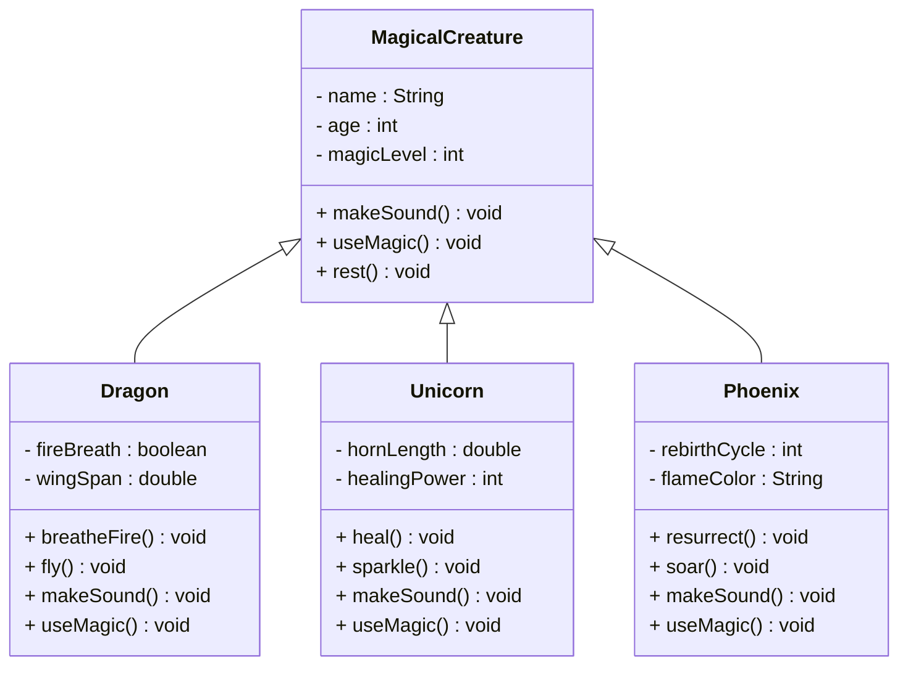

# Fun Inheritance Exercise Ideas

Now it is time for some exercises about inheritance.

## Exercise Instructions

For each diagram above, implement the classes with:

1. **Constructors** that initialize the specific properties
2. **Method overriding** where appropriate (e.g., different attack methods)
3. **Additional methods** that showcase the unique abilities of each class
4. **toString() methods** to display creature/hero information. Also here, you may provide `toString()` methods in each class, so that a subclass can use its superclass's `toString()` method.

## 10.0 Magical Creature Zoo

Create a hierarchy of magical creatures where each has unique abilities.\
Each class goes into its own file.\
Notice some methods are overridden, and provide a more specialized implementation in the subclasses.\
The methods should just print out a message to the console.

Create a main method that creates instances of the different magical creatures, and calls their methods.

