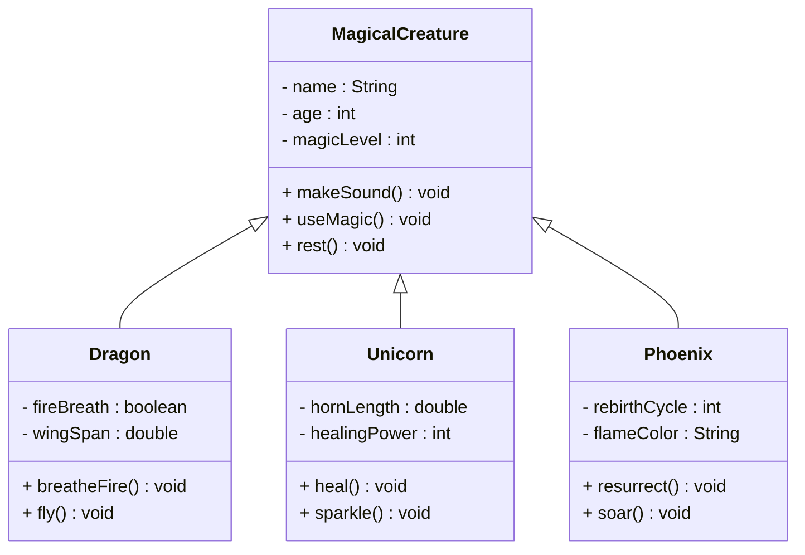
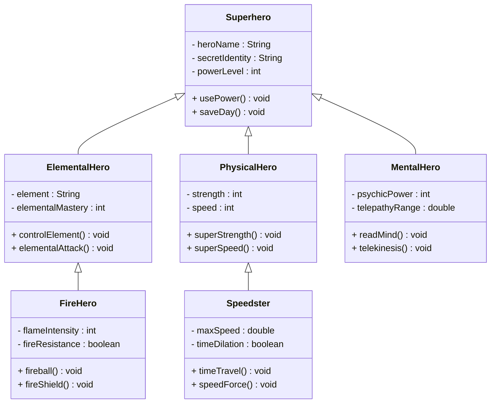
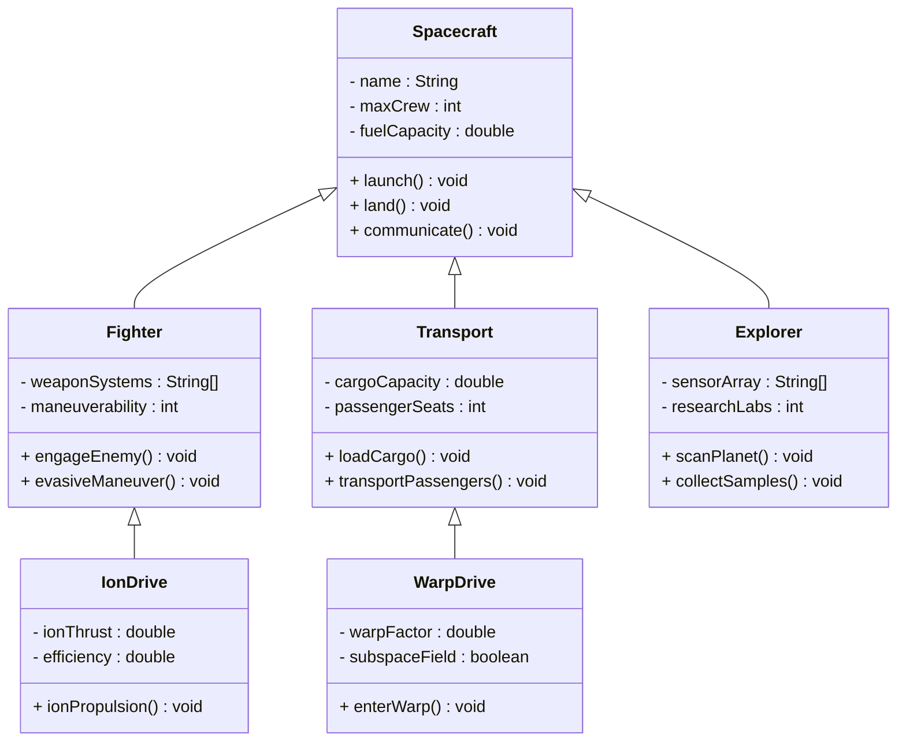
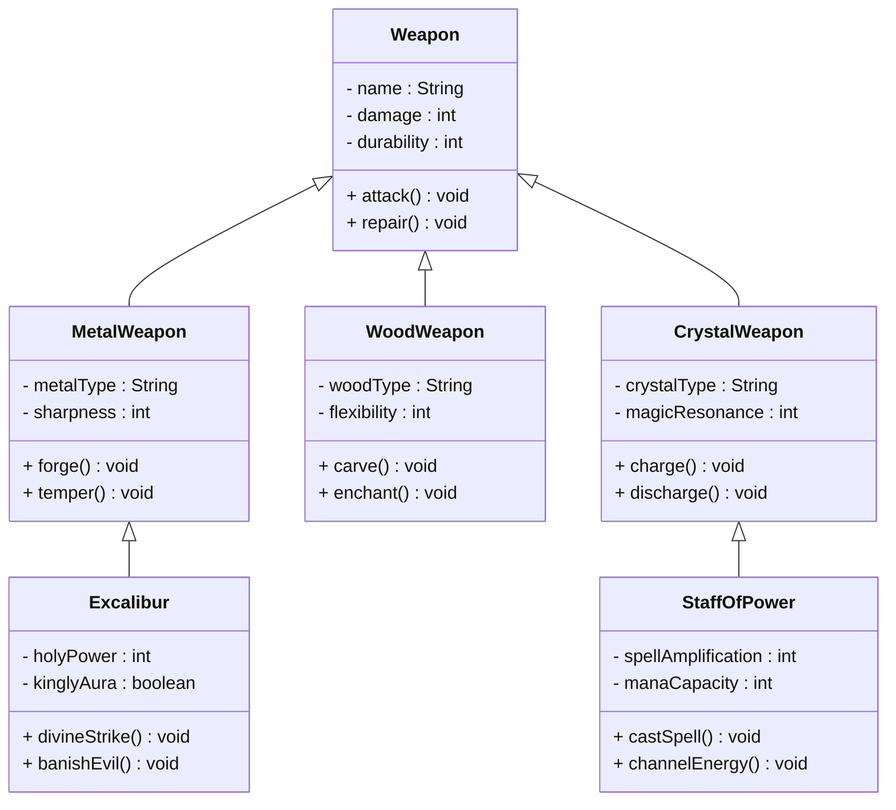
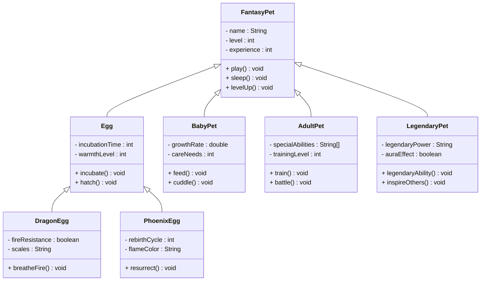

# Fun Inheritance Exercise Ideas

## 1. Magical Creature Zoo

Create a hierarchy of magical creatures where each has unique abilities:

## 2. Superhero Team Builder

Design a superhero inheritance system with different power types:

## 6. Space Vehicle Fleet

Build spacecraft classes with different propulsion systems:

## 7. Mythical Weapon Forge

Create a weapon crafting system with magical properties:

## 9. Fantasy Pet Evolution

Build a pet system with evolution stages:

## Exercise Instructions

For each diagram above, implement the classes with:

1. **Constructors** that initialize the specific properties
2. **Method overriding** where appropriate (e.g., different attack methods)
3. **Polymorphism** - create arrays of the base class and call methods
4. **Additional methods** that showcase the unique abilities of each class
5. **toString() methods** to display creature/hero/vehicle/weapon/pet information

### Bonus Challenges:
- Add **interaction methods** between different types
- Implement **battle systems** or **evolution mechanics**
- Create **factory methods** to generate random instances
- Add **validation** for power levels, damage, etc.
- Implement **special abilities** that can only be used under certain conditions
