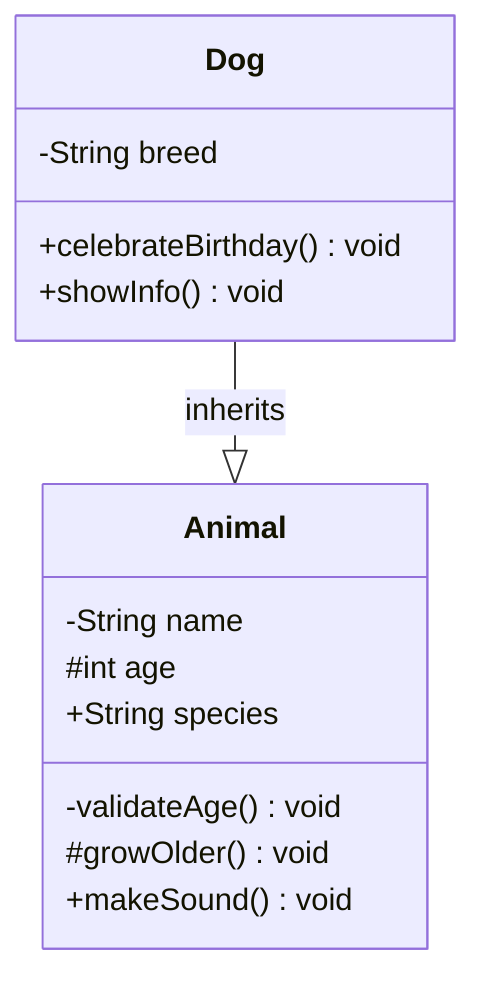
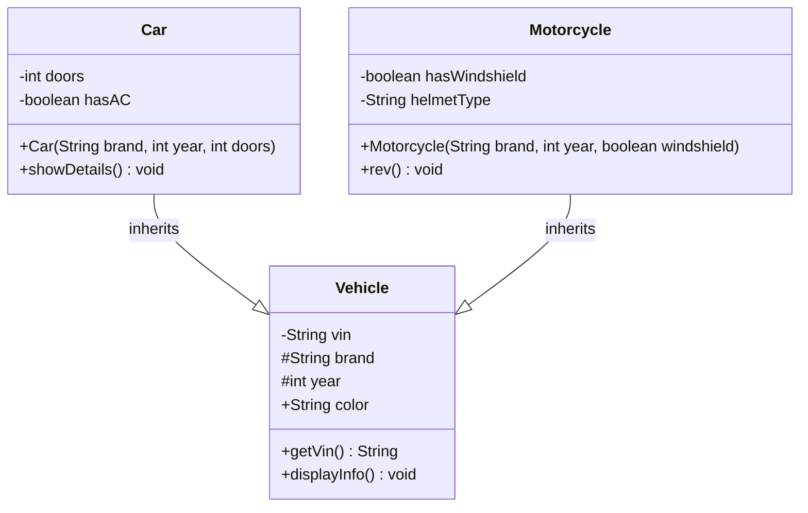
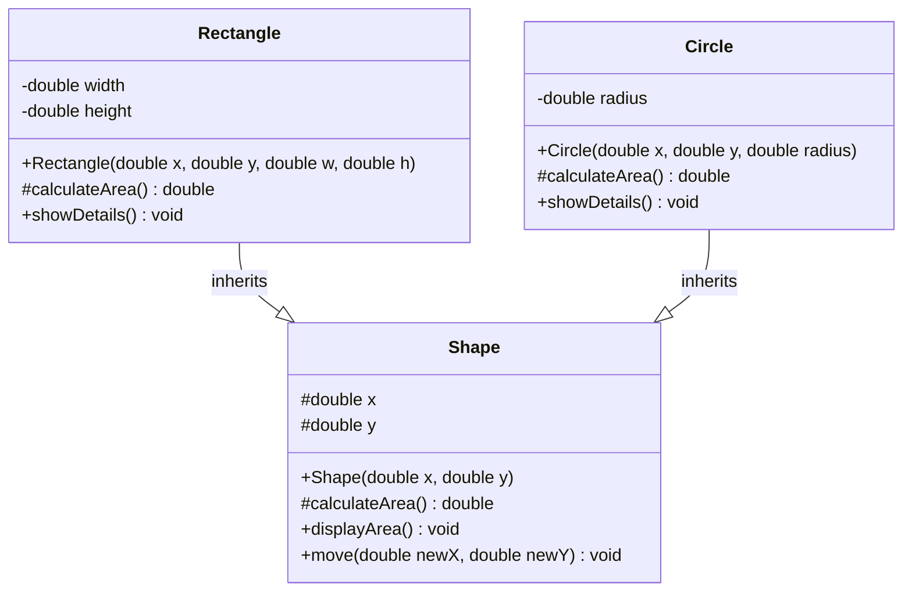
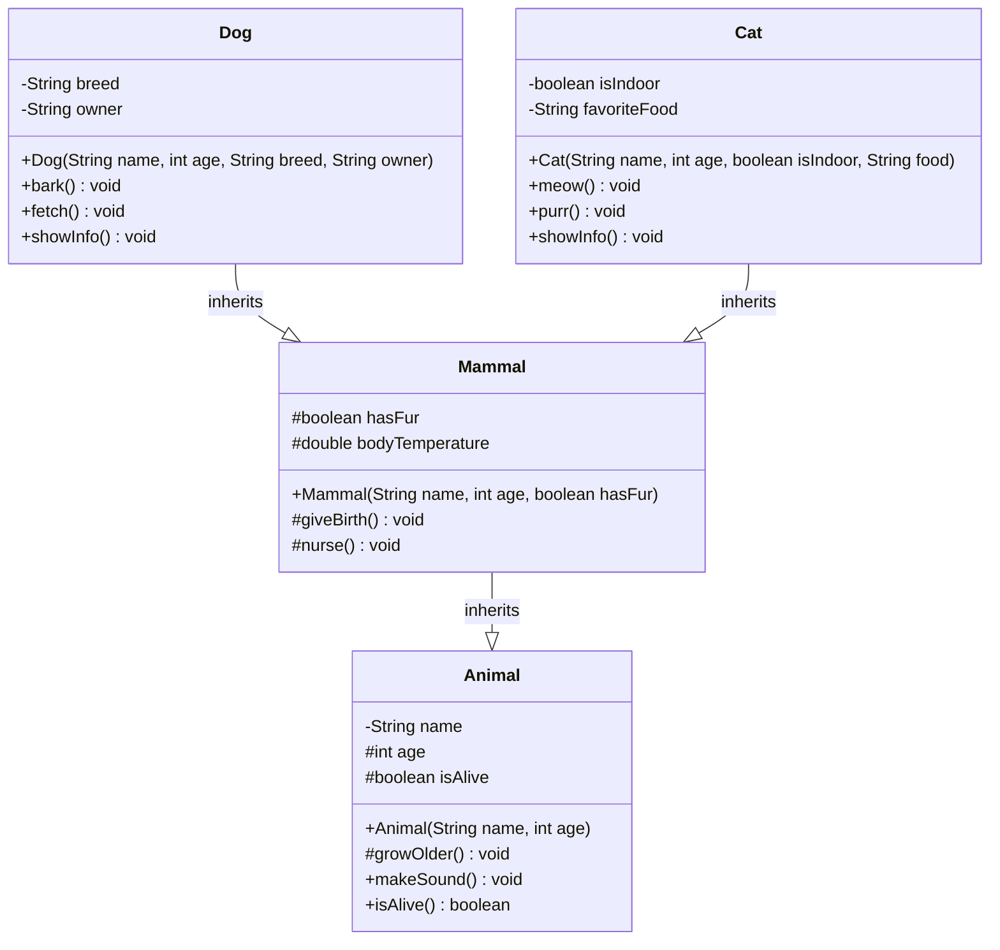
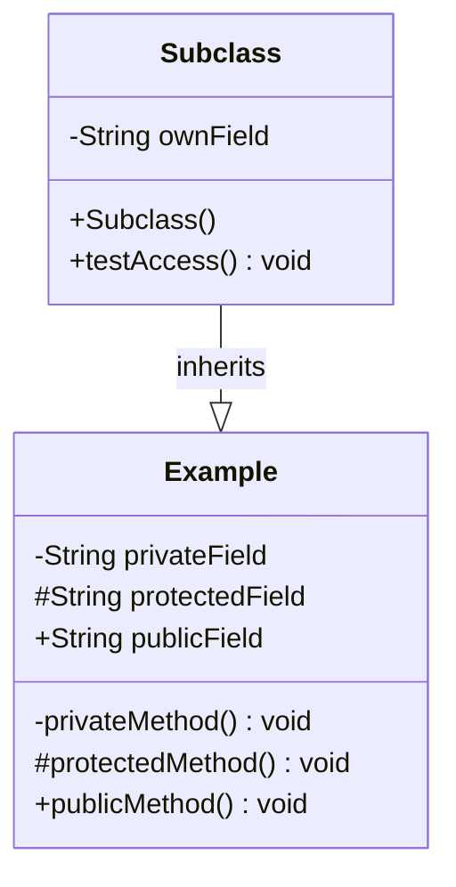

# Protected Members in UML

## UML Visibility Notation

In UML class diagrams, visibility is shown using symbols before the member name:

| Symbol | Visibility | Description |
|--------|------------|-------------|
| `-` | private | Only accessible within the same class |
| `#` | protected | Accessible within the same class, package, and subclasses |
| `+` | public | Accessible everywhere |
| `~` | package | Accessible within the same package (default in Java) |

## Basic Protected Members Example



**Explanation:**
- `-String name` - private field, not accessible to Dog
- `#int age` - protected field, accessible to Dog
- `+String species` - public field, accessible everywhere
- `-validateAge()` - private method, not accessible to Dog
- `#growOlder()` - protected method, accessible to Dog
- `+makeSound()` - public method, accessible everywhere

## Protected Fields in Inheritance



**Protected Fields:**
- `#String brand` - accessible to Car and Motorcycle
- `#int year` - accessible to Car and Motorcycle

**Private Fields:**
- `-String vin` - not accessible to Car and Motorcycle

## Protected Methods in Inheritance



**Protected Methods:**
- `#calculateArea()` - can be overridden by Rectangle and Circle
- `#double x, y` - accessible to Rectangle and Circle

## Multiple Levels of Inheritance with Protected



**Protected Members Access:**
- **Dog** can access: `age`, `isAlive`, `growOlder()`, `hasFur`, `bodyTemperature`, `giveBirth()`, `nurse()`
- **Cat** can access: `age`, `isAlive`, `growOlder()`, `hasFur`, `bodyTemperature`, `giveBirth()`, `nurse()`
- **Dog** cannot access: `name` (private in Animal)
- **Cat** cannot access: `name` (private in Animal)

## Abstract Classes with Protected Members

```mermaid
classDiagram
    class <<abstract>> Game {
        #String playerName
        #int score
        #int level
        +Game(String playerName)
        #initialize()* void
        #playGame()* void
        #endGame() void
        +play() void
        +getScore() int
    }
    
    class Chess {
        -String board
        -boolean isWhiteTurn
        +Chess(String playerName)
        #initialize() void
        #playGame() void
        #endGame() void
        +makeMove() void
    }
    
    class TicTacToe {
        -char[][] board
        -char currentPlayer
        +TicTacToe(String playerName)
        #initialize() void
        #playGame() void
        #endGame() void
        +placeMark() void
    }
    
    Chess --|> Game : inherits
    TicTacToe --|> Game : inherits
```

**Protected Abstract Methods:**
- `#initialize()*` - must be implemented by subclasses
- `#playGame()*` - must be implemented by subclasses
- `#endGame()` - can be overridden by subclasses

**Protected Fields:**
- `#String playerName` - accessible to Chess and TicTacToe
- `#int score` - accessible to Chess and TicTacToe
- `#int level` - accessible to Chess and TicTacToe

## Protected vs Private vs Public Comparison



**Access from Subclass:**
- ✅ `#protectedField` - accessible
- ✅ `#protectedMethod()` - accessible
- ✅ `+publicField` - accessible
- ✅ `+publicMethod()` - accessible
- ❌ `-privateField` - not accessible
- ❌ `-privateMethod()` - not accessible

## Template Method Pattern with Protected

```mermaid
classDiagram
    class <<abstract>> DataProcessor {
        #String inputData
        #String outputData
        +DataProcessor(String input)
        #validateInput()* boolean
        #processData()* void
        #formatOutput() void
        +process() void
        +getOutput() String
    }
    
    class TextProcessor {
        -String encoding
        +TextProcessor(String input, String encoding)
        #validateInput() boolean
        #processData() void
        #formatOutput() void
        +getWordCount() int
    }
    
    class ImageProcessor {
        -String format
        -int quality
        +ImageProcessor(String input, String format, int quality)
        #validateInput() boolean
        #processData() void
        #formatOutput() void
        +getDimensions() String
    }
    
    TextProcessor --|> DataProcessor : inherits
    ImageProcessor --|> DataProcessor : inherits
```

**Protected Template Methods:**
- `#validateInput()*` - abstract method, must be implemented
- `#processData()*` - abstract method, must be implemented
- `#formatOutput()` - concrete method, can be overridden

## Key Points for Protected in UML

### 1. **Symbol Usage**
- Always use `#` before protected members
- Place visibility symbol before the member name
- Use `*` after abstract method names

### 2. **Inheritance Access**
- Protected members are accessible to subclasses
- Protected members can be overridden
- Protected members maintain encapsulation within the inheritance hierarchy

### 3. **Common Patterns**
- **Template Method Pattern** - protected abstract methods
- **State Management** - protected fields for internal state
- **Utility Methods** - protected methods for subclasses
- **Initialization** - protected constructors or methods

### 4. **Best Practices**
- Use protected for members that subclasses need to access
- Use protected for methods that should be overridden
- Avoid protected for fields that should be encapsulated
- Use protected for internal utility methods

## Summary

In UML, protected members are shown with the `#` symbol:

1. **`#fieldName`** - protected field
2. **`#methodName()`** - protected method
3. **`#methodName()*`** - protected abstract method
4. **Accessible to subclasses** in the inheritance hierarchy
5. **Can be overridden** by subclasses
6. **Maintains encapsulation** while allowing inheritance

Understanding how to represent protected members in UML helps you design clear inheritance hierarchies and communicate the intended access levels to other developers.
