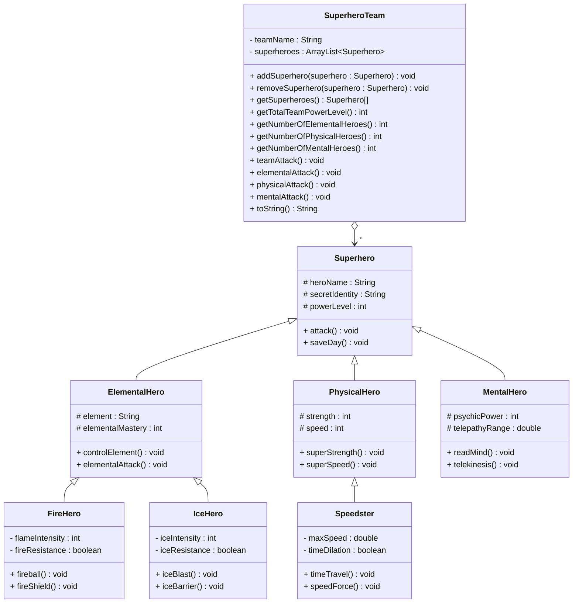

# Inheritance Practice Exercises

Time for some more exercises. And now we can include polymorphism in the exercises.

## Exercise 12.0 Superhero Team Builder

Design a superhero inheritance system with different power types.\
Each class goes into its own file.\
Notice some methods are overridden, and provide a more specialized implementation in the subclasses.\
The methods should just print out a message to the console.\
Optionally, create overridden methods in the subclasses, that print out a message to the console.

The purpose of this exercise is mainly to practice inheritance, polymorphism, and method overriding. When in doubt about how something should work, just make a decision, and implement it.

You can start small, with just the Superhero class and SuperheroTeam class. Then gradually add more subclasses.

You may add additional field variables, methods and constructors, as you see fit.



Method explanations for the `SuperheroTeam` class:

- `addSuperhero(superhero : Superhero) : void`: Adds a superhero to the team
- `removeSuperhero(superhero : Superhero) : void`: Removes a superhero from the team
- `getSuperheroes() : Superhero[]`: Returns an array of all the superheroes in the team
- `getTotalTeamPowerLevel() : int`: Returns the total power level of the team
- `getNumberOfElementalHeroes() : int`: Returns the number of elemental heroes in the team
- `getNumberOfPhysicalHeroes() : int`: Returns the number of physical heroes in the team
- `getNumberOfMentalHeroes() : int`: Returns the number of mental heroes in the team
- `teamAttack() : void`: Should call the attack method of all the superheroes in the team
- `elementalAttack() : void`: Should call the elementalAttack method of all the elemental heroes in the team
- `physicalAttack() : void`: Should call the physicalAttack method of all the physical heroes in the team
- `mentalAttack() : void`: Should call the mentalAttack method of all the mental heroes in the team
- `toString() : String`: Returns a string representation of the team

Now, make a main method that creates a `SuperheroTeam` object, adds some superheroes to it, and calls the methods to test the functionality.

```java
public class Main {
    public static void main(String[] args) {
        SuperheroTeam team = new SuperheroTeam("The Avengers");
        // ... add some superheroes to the team
        team.teamAttack();
        team.elementalAttack();
        team.physicalAttack();
        team.mentalAttack();
        System.out.println(team.toString());
    }
}
```