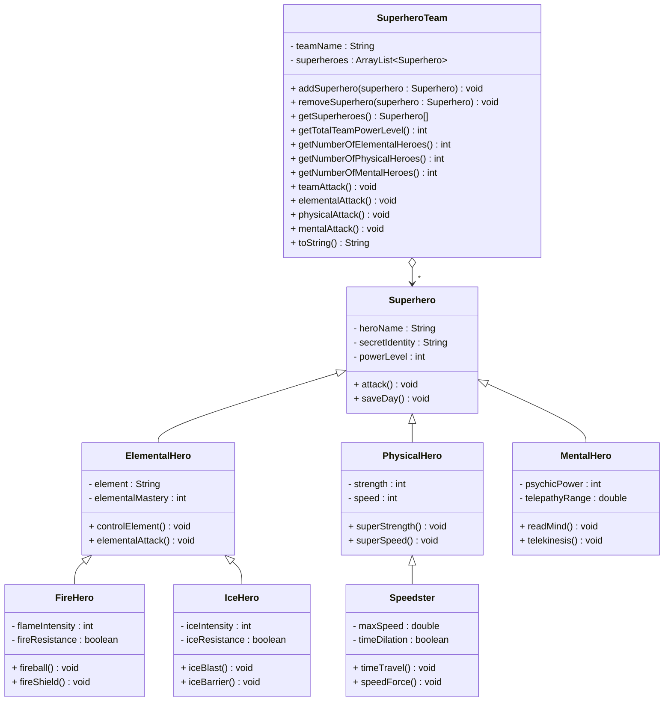
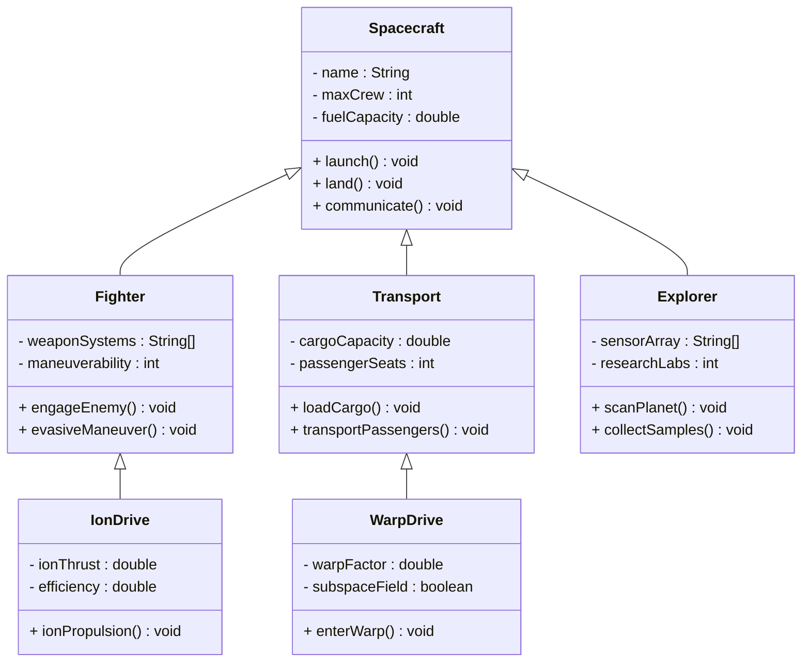
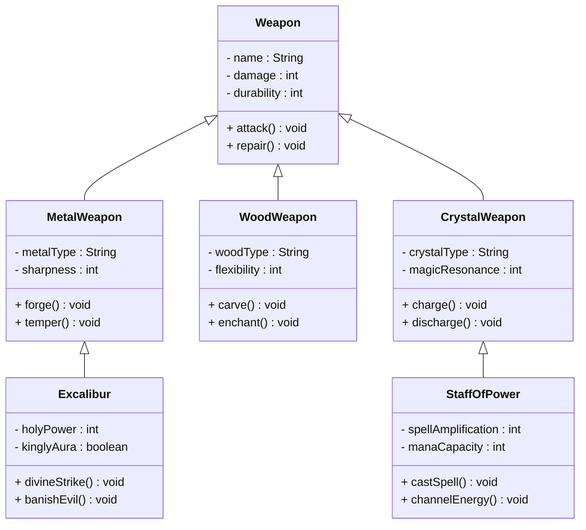
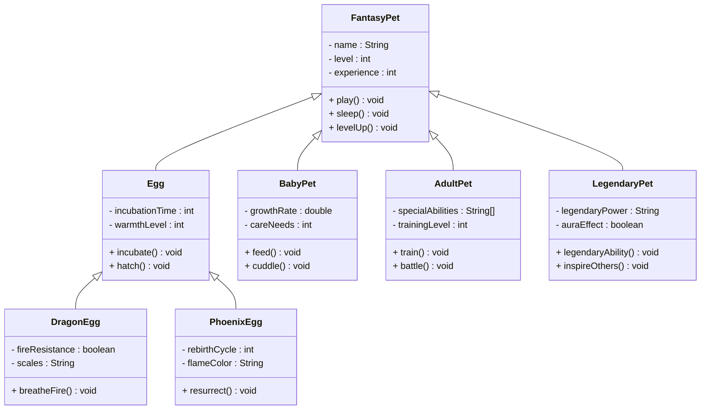

# Inheritance Practice Exercises

Time for some more exercises. And now we can include polymorphism in the exercises.

## Exercise 12.0 Superhero Team Builder

Design a superhero inheritance system with different power types.\
Each class goes into its own file.\
Notice some methods are overridden, and provide a more specialized implementation in the subclasses.\
The methods should just print out a message to the console.\
Optionally, create overridden methods in the subclasses, that print out a message to the console.

The purpose of this exercise is mainly to practice inheritance, polymorphism, and method overriding. When in doubt about how something should work, just make a decision, and implement it.

You can start small, with just the Superhero class and SuperheroTeam class. Then gradually add more subclasses.



Method explanations for the `SuperheroTeam` class:

- `addSuperhero(superhero : Superhero) : void`: Adds a superhero to the team
- `removeSuperhero(superhero : Superhero) : void`: Removes a superhero from the team
- `getSuperheroes() : Superhero[]`: Returns an array of all the superheroes in the team
- `getTotalTeamPowerLevel() : int`: Returns the total power level of the team
- `getNumberOfElementalHeroes() : int`: Returns the number of elemental heroes in the team
- `getNumberOfPhysicalHeroes() : int`: Returns the number of physical heroes in the team
- `getNumberOfMentalHeroes() : int`: Returns the number of mental heroes in the team
- `teamAttack() : void`: Should call the attack method of all the superheroes in the team
- `elementalAttack() : void`: Should call the elementalAttack method of all the elemental heroes in the team
- `physicalAttack() : void`: Should call the physicalAttack method of all the physical heroes in the team
- `mentalAttack() : void`: Should call the mentalAttack method of all the mental heroes in the team
- `toString() : String`: Returns a string representation of the team

Now, make a main method that creates a `SuperheroTeam` object, adds some superheroes to it, and calls the methods to test the functionality.

```java
public class Main {
    public static void main(String[] args) {
        SuperheroTeam team = new SuperheroTeam("The Avengers");
        // ... add some superheroes to the team
        team.teamAttack();
        team.elementalAttack();
        team.physicalAttack();
        team.mentalAttack();
        System.out.println(team.toString());
    }
}
```

## Exercise 12.1 Vehicle Hierarchy

### Task
Implement a vehicle inheritance hierarchy with the following requirements:

1. **Create a `Vehicle` class** with:
   - `brand` (String) - protected
   - `year` (int) - protected
   - `isRunning` (boolean) - private
   - Constructor that takes brand and year
   - `start()` method that sets isRunning to true
   - `stop()` method that sets isRunning to false
   - `getInfo()` method that returns brand and year

2. **Create a `Car` class** that extends `Vehicle`:
   - `numberOfDoors` (int) - private
   - Constructor that takes brand, year, and numberOfDoors
   - Override `getInfo()` to include numberOfDoors
   - `honk()` method that prints a honking message

3. **Create a `Motorcycle` class** that extends `Vehicle`:
   - `hasWindshield` (boolean) - private
   - Constructor that takes brand, year, and hasWindshield
   - Override `getInfo()` to include hasWindshield
   - `rev()` method that prints a revving message

4. **Create a `Truck` class** that extends `Vehicle`:
   - `cargoCapacity` (double) - private
   - Constructor that takes brand, year, and cargoCapacity
   - Override `getInfo()` to include cargoCapacity
   - `loadCargo()` method that prints a loading message

### Test Your Implementation
```java
public class Main {
    public static void main(String[] args) {
        Vehicle[] vehicles = {
            new Car("Toyota", 2023, 4),
            new Motorcycle("Honda", 2022, true),
            new Truck("Ford", 2021, 5000.0)
        };
        
        for (Vehicle vehicle : vehicles) {
            System.out.println(vehicle.getInfo());
            vehicle.start();
            
            // Use instanceof to call specific methods
            if (vehicle instanceof Car) {
                ((Car) vehicle).honk();
            } else if (vehicle instanceof Motorcycle) {
                ((Motorcycle) vehicle).rev();
            } else if (vehicle instanceof Truck) {
                ((Truck) vehicle).loadCargo();
            }
            
            vehicle.stop();
            System.out.println();
        }
    }
}
```

### Expected Output
```
Car: Toyota 2023, Doors: 4
Toyota is starting
Toyota is honking: Beep! Beep!
Toyota is stopping

Motorcycle: Honda 2022, Windshield: true
Honda is starting
Honda is revving: Vroom! Vroom!
Honda is stopping

Truck: Ford 2021, Cargo Capacity: 5000.0
Ford is starting
Ford is loading cargo...
Ford is stopping
```

---

## Exercise 12.2 Animal Kingdom

### Task
Implement an animal inheritance hierarchy with the following requirements:

1. **Create an `Animal` class** with:
   - `name` (String) - protected
   - `age` (int) - protected
   - `isAlive` (boolean) - private
   - Constructor that takes name and age
   - `eat()` method that prints eating message
   - `sleep()` method that prints sleeping message
   - `makeSound()` method that prints generic sound
   - `haveBirthday()` method that increments age
   - `toString()` method that returns name and age

2. **Create a `Mammal` class** that extends `Animal`:
   - `hasFur` (boolean) - private
   - Constructor that takes name, age, and hasFur
   - Override `makeSound()` to print mammal sound
   - `giveBirth()` method that prints giving birth message

3. **Create a `Bird` class** that extends `Animal`:
   - `canFly` (boolean) - private
   - Constructor that takes name, age, and canFly
   - Override `makeSound()` to print bird sound
   - `fly()` method that prints flying message

4. **Create a `Dog` class** that extends `Mammal`:
   - `breed` (String) - private
   - Constructor that takes name, age, and breed
   - Override `makeSound()` to print barking
   - `fetch()` method that prints fetching message

5. **Create a `Cat` class** that extends `Mammal`:
   - `isIndoor` (boolean) - private
   - Constructor that takes name, age, and isIndoor
   - Override `makeSound()` to print meowing
   - `climb()` method that prints climbing message

### Test Your Implementation
```java
public class Main {
    public static void main(String[] args) {
        Animal[] animals = {
            new Dog("Buddy", 3, "Golden Retriever"),
            new Cat("Whiskers", 2, true),
            new Bird("Tweety", 1, true),
            new Mammal("Generic Mammal", 5, true)
        };
        
        for (Animal animal : animals) {
            System.out.println(animal.toString());
            animal.eat();
            animal.makeSound();
            animal.sleep();
            
            // Use instanceof to call specific methods
            if (animal instanceof Dog) {
                ((Dog) animal).fetch();
            } else if (animal instanceof Cat) {
                ((Cat) animal).climb();
            } else if (animal instanceof Bird) {
                ((Bird) animal).fly();
            } else if (animal instanceof Mammal) {
                ((Mammal) animal).giveBirth();
            }
            
            animal.haveBirthday();
            System.out.println("After birthday: " + animal.toString());
            System.out.println();
        }
    }
}
```

### Expected Output
```
Dog: Buddy, Age: 3
Buddy is eating
Buddy barks: Woof! Woof!
Buddy is sleeping
Buddy is fetching the ball
After birthday: Dog: Buddy, Age: 4

Cat: Whiskers, Age: 2
Whiskers is eating
Whiskers meows: Meow! Meow!
Whiskers is sleeping
Whiskers is climbing the tree
After birthday: Cat: Whiskers, Age: 3

Bird: Tweety, Age: 1
Tweety is eating
Tweety chirps: Tweet! Tweet!
Tweety is sleeping
Tweety is flying high
After birthday: Bird: Tweety, Age: 2

Mammal: Generic Mammal, Age: 5
Generic Mammal is eating
Generic Mammal makes mammal sound
Generic Mammal is sleeping
Generic Mammal is giving birth
After birthday: Mammal: Generic Mammal, Age: 6
```

---

## Exercise 12.3 Shape Calculator

### Task
Implement a shape inheritance hierarchy with the following requirements:

1. **Create an abstract `Shape` class** with:
   - `x`, `y` (double) - protected coordinates
   - Constructor that takes x and y coordinates
   - Abstract `getArea()` method
   - Abstract `getPerimeter()` method
   - `move(double newX, double newY)` method
   - `getPosition()` method that returns coordinates
   - `toString()` method that returns position and area

2. **Create a `Rectangle` class** that extends `Shape`:
   - `width`, `height` (double) - private
   - Constructor that takes x, y, width, and height
   - Implement `getArea()` method
   - Implement `getPerimeter()` method
   - `getDimensions()` method that returns width and height

3. **Create a `Circle` class** that extends `Shape`:
   - `radius` (double) - private
   - Constructor that takes x, y, and radius
   - Implement `getArea()` method
   - Implement `getPerimeter()` method
   - `getRadius()` method that returns radius

4. **Create a `Triangle` class** that extends `Shape`:
   - `base`, `height` (double) - private
   - Constructor that takes x, y, base, and height
   - Implement `getArea()` method
   - Implement `getPerimeter()` method (assume equilateral triangle)
   - `getDimensions()` method that returns base and height

### Test Your Implementation
```java
public class Main {
    public static void main(String[] args) {
        Shape[] shapes = {
            new Rectangle(0, 0, 5, 3),
            new Circle(0, 0, 2),
            new Triangle(0, 0, 4, 6),
            new Rectangle(10, 10, 2, 8)
        };
        
        System.out.println("=== Shape Information ===");
        for (Shape shape : shapes) {
            System.out.println(shape.toString());
            
            // Use instanceof to call specific methods
            if (shape instanceof Rectangle) {
                Rectangle rect = (Rectangle) shape;
                System.out.println("Dimensions: " + rect.getDimensions());
            } else if (shape instanceof Circle) {
                Circle circle = (Circle) shape;
                System.out.println("Radius: " + circle.getRadius());
            } else if (shape instanceof Triangle) {
                Triangle triangle = (Triangle) shape;
                System.out.println("Dimensions: " + triangle.getDimensions());
            }
            
            System.out.println("Perimeter: " + shape.getPerimeter());
            System.out.println();
        }
        
        // Test moving shapes
        System.out.println("=== Moving Shapes ===");
        shapes[0].move(5, 5);
        shapes[1].move(10, 10);
        
        System.out.println("Rectangle new position: " + shapes[0].getPosition());
        System.out.println("Circle new position: " + shapes[1].getPosition());
    }
}
```

### Expected Output
```
=== Shape Information ===
Shape at (0.0, 0.0) has area: 15.0
Dimensions: 5.0 x 3.0
Perimeter: 16.0

Shape at (0.0, 0.0) has area: 12.566370614359172
Radius: 2.0
Perimeter: 12.566370614359172

Shape at (0.0, 0.0) has area: 12.0
Dimensions: base: 4.0, height: 6.0
Perimeter: 12.0

Shape at (10.0, 10.0) has area: 16.0
Dimensions: 2.0 x 8.0
Perimeter: 20.0

=== Moving Shapes ===
Rectangle new position: (5.0, 5.0)
Circle new position: (10.0, 10.0)
```


## Exercise 12.4 Space Vehicle Fleet

Build spacecraft classes with different propulsion systems:



## Exercise 12.5 Mythical Weapon Forge

Create a weapon crafting system with magical properties:



## Exercise 12.6 Fantasy Pet Evolution

Build a pet system with evolution stages:



## Tips for Success

1. **Start with the parent class** and work your way down
2. **Use `@Override` annotation** for overridden methods
3. **Make sure constructors call `super()`** properly
4. **Use appropriate access modifiers** (protected for fields that subclasses need)
5. **Test each class individually** before testing the full hierarchy
6. **Use `instanceof` and casting** to call subclass-specific methods
7. **Follow the "is a" relationship** - make sure inheritance makes sense

## Bonus Challenges

1. **Add more subclasses** to each hierarchy
2. **Implement additional methods** like `equals()` and `hashCode()`
3. **Add validation** to constructors and methods
4. **Create a GUI** to display the shapes
5. **Add serialization** to save and load objects
6. **Implement the `Comparable` interface** to sort shapes by area

These exercises will help you practice inheritance, polymorphism, method overriding, and the proper use of access modifiers in Java.
