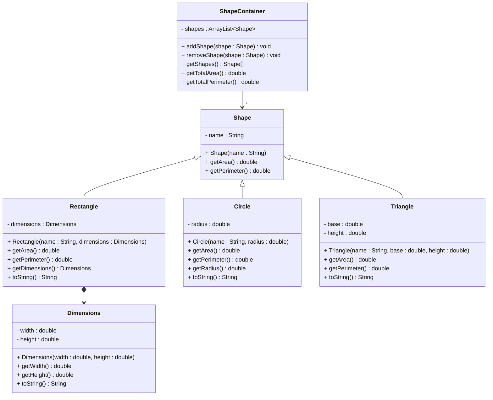

# Exercise - Shape Calculator



### Task
Implement a shape inheritance hierarchy with the following requirements (not necessarily in this order):

1. **Create a `Shape` class** with:
   - `name` (String) - private
   - Constructor that takes name
   - `getArea()` method that returns 0.0 (to be overridden)
   - `getPerimeter()` method that returns 0.0 (to be overridden)

2. **Create a `Dimensions` class** with:
   - `width`, `height` (double) - private
   - Constructor that takes width and height
   - `getWidth()` method that returns width
   - `getHeight()` method that returns height
   - `toString()` method that returns "width x height"

3. **Create a `Rectangle` class** that extends `Shape`:
   - `dimensions` (Dimensions) - private
   - Constructor that takes name and a Dimensions object. The `name` parameter should be passed to the `Shape` constructor.
   - Override `getArea()` method (dimensions.getWidth() × dimensions.getHeight())
   - Override `getPerimeter()` method (2 × (dimensions.getWidth() + dimensions.getHeight()))
   - `getDimensions()` method that returns the Dimensions object
   - Override `toString()` method to return shape name and dimensions

4. **Create a `Circle` class** that extends `Shape`:
   - `radius` (double) - private
   - Constructor that takes name and radius. The `name` parameter should be passed to the `Shape` constructor.
   - Override `getArea()` method (π × radius²)
   - Override `getPerimeter()` method (2 × π × radius)
   - `getRadius()` method that returns radius
   - Override `toString()` method to return shape name and radius

5. **Create a `Triangle` class** that extends `Shape`:
   - `base`, `height` (double) - private
   - Constructor that takes name, base, and height. The `name` parameter should be passed to the `Shape` constructor.
   - Override `getArea()` method (0.5 × base × height)
   - Override `getPerimeter()` method (assume equilateral triangle: 3 × base)
   - Override `toString()` method to return shape name and dimensions

6. **Create a `ShapeContainer` class** to manage shapes:
   - `shapes` (ArrayList<Shape>) - private
   - `addShape(Shape shape)` method to add a shape
   - `removeShape(Shape shape)` method to remove a shape
   - `getShapes()` method that returns array of shapes
   - `getTotalArea()` method that calculates total area of all shapes
   - `getTotalPerimeter()` method that calculates total perimeter of all shapes

### Test Your Implementation

Here is an example of what your main method could look like:

```java
public class Main {
    public static void main(String[] args) {
        // Create a shape container
        ShapeContainer container = new ShapeContainer();
        
        // Add different shapes
        container.addShape(new Rectangle("Rectangle 1", new Dimensions(5, 3)));
        container.addShape(new Circle("Circle 1", 2));
        container.addShape(new Triangle("Triangle 1", 4, 6));
        container.addShape(new Rectangle("Rectangle 2", new Dimensions(2, 8)));
        
        System.out.println("=== Shape Information ===");
        Shape[] shapes = container.getShapes();
        for (Shape shape : shapes) {
            System.out.println(shape.toString());
            System.out.println("Area: " + shape.getArea());
            System.out.println("Perimeter: " + shape.getPerimeter());
            
            // Use instanceof to call specific methods
            if (shape instanceof Rectangle) {
                Rectangle rect = (Rectangle) shape;
                System.out.println("Dimensions: " + rect.getDimensions().toString());
            } else if (shape instanceof Circle) {
                Circle circle = (Circle) shape;
                System.out.println("Radius: " + circle.getRadius());
            }
            System.out.println();
        }
        
        // Test container methods
        System.out.println("=== Container Statistics ===");
        System.out.println("Total Area: " + container.getTotalArea());
        System.out.println("Total Perimeter: " + container.getTotalPerimeter());
        System.out.println("Number of shapes: " + container.getShapes().length);
    }
}
```

### Expected Output
```
=== Shape Information ===
Rectangle 1: 5.0 x 3.0
Area: 15.0
Perimeter: 16.0
Dimensions: 5.0 x 3.0

Circle 1: radius 2.0
Area: 12.566370614359172
Perimeter: 12.566370614359172
Radius: 2.0

Triangle 1: base 4.0, height 6.0
Area: 12.0
Perimeter: 12.0

Rectangle 2: 2.0 x 8.0
Area: 16.0
Perimeter: 20.0
Dimensions: 2.0 x 8.0

=== Container Statistics ===
Total Area: 55.56637061435917
Total Perimeter: 60.56637061435917
Number of shapes: 4
```
