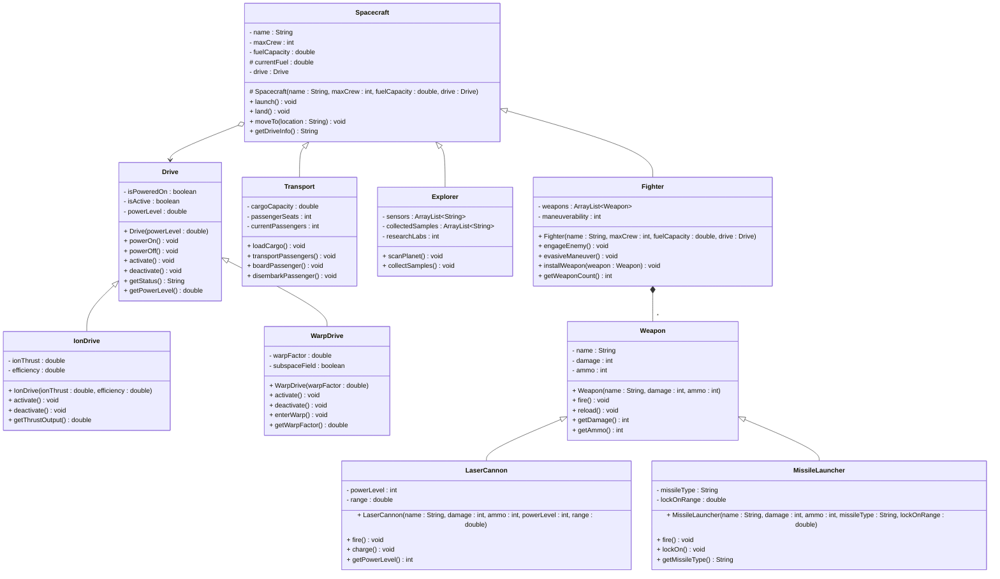

# Exercise - Space Vehicle Fleet

Build spacecraft classes with different propulsion systems using composition and inheritance.

This exercise is intended to be open, so you ca follow the below description, or deviate from it, as you wish. You may create additional classes, or you may add to the existing classes.

Generally, methods should just print to the console, what is happening. And some methods may then need to call multiple other methods, to perform their task.

You may also introduce a `Fleet` class, which contains an ArrayList of Spacecraft objects.



## Task

Implement a space vehicle fleet system with the following requirements:

### 1. **Create a `Drive` class** with:
   - `isPoweredOn` (boolean) - private
   - `isActive` (boolean) - private  
   - `powerLevel` (double) - private
   - Constructor that takes powerLevel
   - `powerOn()` method that sets isPoweredOn to true
   - `powerOff()` method that sets isPoweredOn to false
   - `activate()` method that sets isActive to true (only if powered on)
   - `deactivate()` method that sets isActive to false
   - `getStatus()` method that returns current drive status
   - `getPowerLevel()` method that returns power level

### 2. **Create an `IonDrive` class** that extends `Drive`:
   - `ionThrust` (double) - private
   - `efficiency` (double) - private
   - Constructor that takes ionThrust and efficiency
   - Override `activate()` method to print ion drive activation
   - Override `deactivate()` method to print ion drive deactivation
   - `getThrustOutput()` method that returns thrust calculation

### 3. **Create a `WarpDrive` class** that extends `Drive`:
   - `warpFactor` (double) - private
   - `subspaceField` (boolean) - private
   - Constructor that takes warpFactor
   - Override `activate()` method to print warp drive activation
   - Override `deactivate()` method to print warp drive deactivation
   - `enterWarp()` method that prints warp entry
   - `getWarpFactor()` method that returns warp factor

### 4. **Create a `Spacecraft` class** with:
   - `name` (String) - private
   - `maxCrew` (int) - private
   - `fuelCapacity` (double) - private
   - `drive` (Drive) - private
   - Protected constructor that takes name, maxCrew, fuelCapacity, and drive
   - `launch()` method that prints launch sequence
   - `land()` method that prints landing sequence
   - `moveTo(String location)` method that:
     - Powers on the drive
     - Activates the drive
     - Prints "Flying to [location]..."
     - Prints "Breaking for approach to [location]..."
     - Deactivates the drive
     - Powers off the drive
     - Prints "Arrived at [location]"
   - `getDriveInfo()` method that returns drive status

### 5. **Create a `Weapon` class** with:
   - `name` (String) - private
   - `damage` (int) - private
   - `ammo` (int) - private
   - Constructor that takes name, damage, and ammo
   - `fire()` method that prints firing message and decreases ammo
   - `reload()` method that prints reloading message and resets ammo
   - `getDamage()` method that returns damage
   - `getAmmo()` method that returns ammo

### 6. **Create a `LaserCannon` class** that extends `Weapon`:
   - `powerLevel` (int) - private
   - `range` (double) - private
   - Constructor that takes name, damage, ammo, powerLevel, and range
   - Override `fire()` method to print laser cannon firing
   - `charge()` method that prints charging message
   - `getPowerLevel()` method that returns power level

### 7. **Create a `MissileLauncher` class** that extends `Weapon`:
   - `missileType` (String) - private
   - `lockOnRange` (double) - private
   - Constructor that takes name, damage, ammo, missileType, and lockOnRange
   - Override `fire()` method to print missile launching
   - `lockOn()` method that prints lock-on message
   - `getMissileType()` method that returns missile type

### 8. **Create specialized spacecraft classes**:
   - `Fighter` extends `Spacecraft` with weapons ArrayList and maneuverability
   - `Transport` extends `Spacecraft` with cargo capacity and passenger seats
   - `Explorer` extends `Spacecraft` with sensor arrays and research labs

### Test Your Implementation
```java
public class Main {
    public static void main(String[] args) {
        // Create different drives
        IonDrive ionDrive = new IonDrive(1000.0, 0.85);
        WarpDrive warpDrive = new WarpDrive(5.0);
        
        // Create weapons
        LaserCannon laser1 = new LaserCannon("Photon Cannon", 100, 50, 85, 1000.0);
        MissileLauncher missile1 = new MissileLauncher("Quantum Torpedo", 200, 20, "Quantum", 500.0);
        LaserCannon laser2 = new LaserCannon("Pulse Laser", 75, 100, 60, 800.0);
        
        // Create spacecraft with different drives
        Fighter fighter = new Fighter("USS Defiant", 50, 1000.0, ionDrive);
        Transport transport = new Transport("USS Enterprise", 200, 5000.0, warpDrive);
        Explorer explorer = new Explorer("USS Voyager", 150, 3000.0, ionDrive);
        
        // Install weapons on fighter
        fighter.installWeapon(laser1);
        fighter.installWeapon(missile1);
        fighter.installWeapon(laser2);
        
        // Test spacecraft operations
        Spacecraft[] fleet = {fighter, transport, explorer};
        
        for (Spacecraft ship : fleet) {
            System.out.println("=== " + ship.getName() + " ===");
            ship.launch();
            ship.moveTo("Alpha Centauri");
            System.out.println("Drive Status: " + ship.getDriveInfo());
            
            // Test fighter-specific operations
            if (ship instanceof Fighter) {
                Fighter f = (Fighter) ship;
                System.out.println("Weapon Count: " + f.getWeaponCount());
                f.engageEnemy();
            }
            
            ship.land();
            System.out.println();
        }
    }
}
```

### Expected Output
```
=== USS Defiant ===
USS Defiant launching into space!
Drive powered on
Ion Drive activated - Thrust: 1000.0, Efficiency: 85%
Flying to Alpha Centauri...
Breaking for approach to Alpha Centauri...
Ion Drive deactivated
Drive powered off
Arrived at Alpha Centauri
Drive Status: Ion Drive - Inactive, Power Level: 100.0
USS Defiant landing safely

=== USS Enterprise ===
USS Enterprise launching into space!
Drive powered on
Warp Drive activated - Warp Factor: 5.0
Flying to Alpha Centauri...
Breaking for approach to Alpha Centauri...
Warp Drive deactivated
Drive powered off
Arrived at Alpha Centauri
Drive Status: Warp Drive - Inactive, Power Level: 100.0
USS Enterprise landing safely

=== USS Voyager ===
USS Voyager launching into space!
Drive powered on
Nuclear Drive activated - Reactor Temp: 2000.0°C, Fuel Rods: 12
Flying to Alpha Centauri...
Breaking for approach to Alpha Centauri...
Nuclear Drive deactivated
Drive powered off
Arrived at Alpha Centauri
Drive Status: Nuclear Drive - Inactive, Power Level: 100.0
USS Voyager landing safely
```
