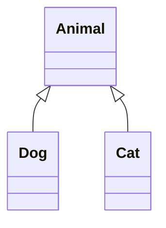

# Polymorphism Recap

## What is Polymorphism in Java?

**Polymorphism** is a fundamental principle of object-oriented programming. The word comes from Greek and means "many forms." In Java, polymorphism allows objects of different types to be treated as objects of a common type, while each object behaves differently based on its actual type.

## Key Concepts

### 1. **Reference Type vs Object Type**

Assume this object hierarchy:


We can then treat Dog and Cat as Animal objects, because they are both subclasses of Animal.\
And in code, we call the variable declaration type the "reference type", or "variable type", and the actual type of the object the "object type".

```java
Animal animal = new Dog("Buddy");
// Reference type: Animal
// Object type: Dog
```

### 2. **Method Resolution**
The method that gets called depends on the **object type** (here, `Dog`), not the reference type:

```java
Animal animal = new Dog("Buddy");
animal.makeSound();  // Calls Dog's makeSound(), not Animal's
```

### 3. **Access Limitations**
You can only call methods that are available in the reference type (here, `Animal`):

```java
Animal animal = new Dog("Buddy");
animal.makeSound();  // ✅ OK - makeSound() is in Animal
// animal.fetch();   // ❌ ERROR - fetch() is not in Animal
```

## Short Example

Here's a simple example to refresh your memory:

```java
class Animal {
    protected String name;
    
    public Animal(String name) {
        this.name = name;
    }
    
    public void makeSound() {
        System.out.println(name + " makes a sound");
    }
}

class Dog extends Animal {
    public Dog(String name) {
        super(name);
    }
    
    @Override
    public void makeSound() {
        System.out.println(name + " barks: Woof! Woof!");
    }
    
    public void fetch() {
        System.out.println(name + " is fetching the ball");
    }
}

class Cat extends Animal {
    public Cat(String name) {
        super(name);
    }
    
    @Override
    public void makeSound() {
        System.out.println(name + " meows: Meow! Meow!");
    }
    
    public void climb() {
        System.out.println(name + " is climbing the tree");
    }
}
```

## Polymorphism in Action

And here is an example of a main method, that creates objects of different types, and calls the `makeSound` method on them.

```java
public class Main {
    public static void main(String[] args) {
        // Create objects of different types
        Animal animal1 = new Dog("Buddy");
        Animal animal2 = new Cat("Whiskers");
        Animal animal3 = new Animal("Generic Animal");
        
        // Polymorphism: same method call, different behaviors
        animal1.makeSound();  // "Buddy barks: Woof! Woof!"
        animal2.makeSound();  // "Whiskers meows: Meow! Meow!"
        animal3.makeSound();  // "Generic Animal makes a sound"
        
        // All animals can make sounds (inherited method)
        // But each makes a different sound based on its actual type
    }
}
```

## Why Polymorphism Matters

Polymorphism is powerful because it allows you to:

1. **Write flexible code** - One method can work with many different types
2. **Add new types easily** - Without changing existing code
3. **Maintain consistency** - All objects respond to the same interface
4. **Enable code reuse** - Write once, use with many different objects
