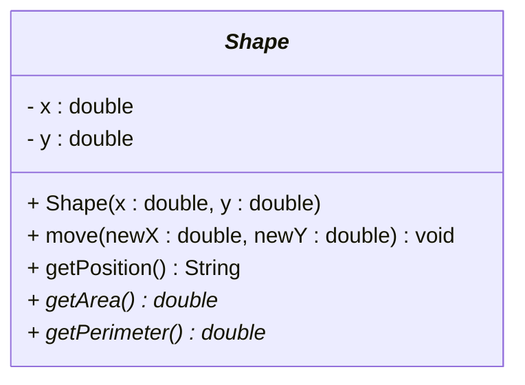
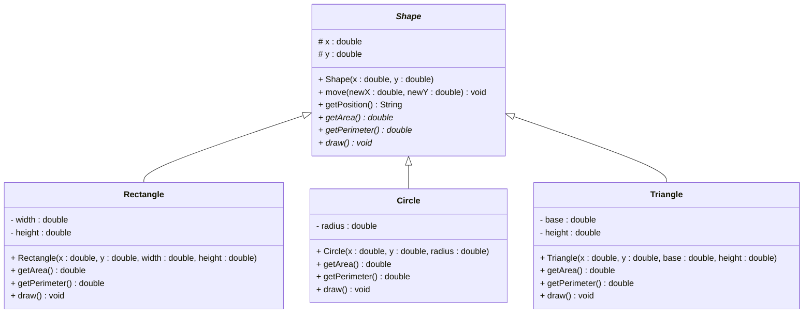

# Abstract in UML

## Representing Abstract Classes in UML

UML (Unified Modeling Language) provides specific notation to represent abstract classes and methods. In UML class diagrams, both abstract methods and abstract classes are shown with _italics_.

## Basic Abstract Class Notation

Notice how the `Shape` class name is shown with _italics_, meaning it is an abstract class. And two of the methods are shown with _italics_: `getArea()` and `getPerimeter()`. That means they are abstract methods.

## Complete Abstract Class Hierarchy

Here is a more complete example of an abstract class hierarchy, with the abstract super class at the top, and the concrete subclasses at the bottom.

Notice how the subclasses also have the methods, `getArea()`, `getPerimeter()`, and `draw()`, which are abstract methods in the super class. We now show them without italics, because they are implemented in the subclasses.

### Shape Example

## Key UML Notation Rules

### 1. **Abstract Class Notation**
- Abstract class names are in italics

### 2. **Abstract Method Notation**
- Abstract method names are in italics

### 3. **Inheritance Arrows**
- Use `──▷` to show inheritance
- Abstract class is typically at the top, subclasses are below. This is convention. We do not mess with convention, this vexes Troels.
- Concrete classes inherit from abstract classes. Or abstract classes inherit from abstract classes. But at some point at the bottom, there must be a concrete class.

## Summary

UML diagrams for abstract classes help you:

- **Visualize inheritance hierarchies** clearly
- **Identify abstract methods** that must be implemented
- **Understand relationships** between classes
- **Communicate design** to other developers
- **Plan implementation** before coding
