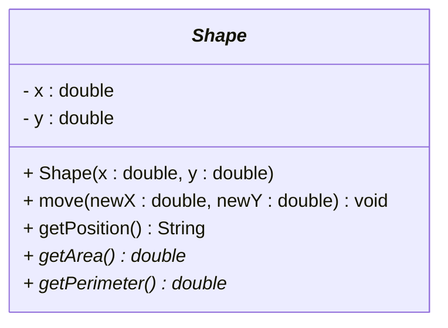

# Abstract in UML

## Representing Abstract Classes in UML

UML (Unified Modeling Language) provides specific notation to represent abstract classes and methods. In UML class diagrams, both methods and classes are shown with _italics_.\

## Basic Abstract Class Notation

### Simple Abstract Class

Notice how the `Shape` class is shown with _italics_, meaning it is an abstract class. And two of the methods are shown with _italics_: `getArea()` and `getPerimeter()`. That means they are abstract methods.



**Key Elements:**
- `<<abstract>>` - Stereotype indicating abstract class
- `*` after method name - Indicates abstract method
- Regular methods - No special notation

## Complete Abstract Class Hierarchy

### Shape Example

```mermaid
classDiagram
    class <<abstract>> Shape {
        - x : double
        - y : double
        + Shape(x : double, y : double)
        + move(newX : double, newY : double) void
        + getPosition() String
        + getArea()* double
        + getPerimeter()* double
        + draw()* void
    }
    
    class Rectangle {
        - width : double
        - height : double
        + Rectangle(x : double, y : double, width : double, height : double)
        + getArea() double
        + getPerimeter() double
        + draw() void
    }
    
    class Circle {
        - radius : double
        + Circle(x : double, y : double, radius : double)
        + getArea() double
        + getPerimeter() double
        + draw() void
    }
    
    class Triangle {
        - base : double
        - height : double
        + Triangle(x : double, y : double, base : double, height : double)
        + getArea() double
        + getPerimeter() double
        + draw() void
    }
    
    Shape <|-- Rectangle
    Shape <|-- Circle
    Shape <|-- Triangle
```

## Animal Hierarchy Example

### Abstract Animal Class

```mermaid
classDiagram
    class <<abstract>> Animal {
        - name : String
        - age : int
        + Animal(name : String, age : int)
        + sleep() void
        + makeSound()* void
        + move()* void
        + eat()* void
    }
    
    class Dog {
        - breed : String
        + Dog(name : String, age : int, breed : String)
        + makeSound() void
        + move() void
        + eat() void
        + fetch() void
    }
    
    class Cat {
        - isIndoor : boolean
        + Cat(name : String, age : int, isIndoor : boolean)
        + makeSound() void
        + move() void
        + eat() void
        + climb() void
    }
    
    class Bird {
        - canFly : boolean
        + Bird(name : String, age : int, canFly : boolean)
        + makeSound() void
        + move() void
        + eat() void
        + fly() void
    }
    
    Animal <|-- Dog
    Animal <|-- Cat
    Animal <|-- Bird
```

## Game Character System

### Complex Abstract Class

```mermaid
classDiagram
    class <<abstract>> GameCharacter {
        - name : String
        - health : int
        - level : int
        - isAlive : boolean
        + GameCharacter(name : String, health : int, level : int)
        + takeDamage(damage : int) void
        + heal(amount : int) void
        + isAlive() boolean
        + levelUp() void
        + attack()* void
        + defend()* void
        + specialAbility()* void
    }
    
    class Warrior {
        - strength : int
        - weapon : String
        + Warrior(name : String, health : int, level : int, strength : int, weapon : String)
        + attack() void
        + defend() void
        + specialAbility() void
        + equipWeapon(weapon : String) void
    }
    
    class Mage {
        - mana : int
        - spellBook : String
        + Mage(name : String, health : int, level : int, mana : int, spellBook : String)
        + attack() void
        + defend() void
        + specialAbility() void
        + castSpell(spell : String) void
    }
    
    class Archer {
        - accuracy : int
        - arrows : int
        + Archer(name : String, health : int, level : int, accuracy : int, arrows : int)
        + attack() void
        + defend() void
        + specialAbility() void
        + shootArrow() void
    }
    
    GameCharacter <|-- Warrior
    GameCharacter <|-- Mage
    GameCharacter <|-- Archer
```

## Vehicle System Example

### Abstract Vehicle with Multiple Levels

```mermaid
classDiagram
    class <<abstract>> Vehicle {
        - brand : String
        - year : int
        - isRunning : boolean
        + Vehicle(brand : String, year : int)
        + start() void
        + stop() void
        + accelerate()* void
        + brake()* void
        + getInfo() String
    }
    
    class <<abstract>> Car {
        - doors : int
        - fuelType : String
        + Car(brand : String, year : int, doors : int, fuelType : String)
        + accelerate() void
        + brake() void
        + openTrunk() void
    }
    
    class <<abstract>> Motorcycle {
        - engineSize : int
        - hasWindshield : boolean
        + Motorcycle(brand : String, year : int, engineSize : int, hasWindshield : boolean)
        + accelerate() void
        + brake() void
        + wheelie() void
    }
    
    class Sedan {
        - trunkCapacity : double
        + Sedan(brand : String, year : int, doors : int, fuelType : String, trunkCapacity : double)
        + accelerate() void
        + brake() void
        + openTrunk() void
        + cruiseControl() void
    }
    
    class SportsCar {
        - topSpeed : int
        + SportsCar(brand : String, year : int, doors : int, fuelType : String, topSpeed : int)
        + accelerate() void
        + brake() void
        + openTrunk() void
        + raceMode() void
    }
    
    class SportBike {
        - racingClass : String
        + SportBike(brand : String, year : int, engineSize : int, hasWindshield : boolean, racingClass : String)
        + accelerate() void
        + brake() void
        + wheelie() void
        + trackMode() void
    }
    
    class Cruiser {
        - comfortLevel : int
        + Cruiser(brand : String, year : int, engineSize : int, hasWindshield : boolean, comfortLevel : int)
        + accelerate() void
        + brake() void
        + wheelie() void
        + comfortMode() void
    }
    
    Vehicle <|-- Car
    Vehicle <|-- Motorcycle
    Car <|-- Sedan
    Car <|-- SportsCar
    Motorcycle <|-- SportBike
    Motorcycle <|-- Cruiser
```

## Payment System Example

### Abstract Payment Method

```mermaid
classDiagram
    class <<abstract>> PaymentMethod {
        - accountNumber : String
        - balance : double
        + PaymentMethod(accountNumber : String, balance : double)
        + hasSufficientFunds(amount : double) boolean
        + deductAmount(amount : double) void
        + processPayment(amount : double)* boolean
        + getPaymentDetails()* String
    }
    
    class CreditCard {
        - cardType : String
        - cvv : int
        - creditLimit : double
        + CreditCard(accountNumber : String, balance : double, cardType : String, cvv : int, creditLimit : double)
        + processPayment(amount : double) boolean
        + getPaymentDetails() String
        + checkCreditLimit() boolean
    }
    
    class BankAccount {
        - bankName : String
        - accountType : String
        + BankAccount(accountNumber : String, balance : double, bankName : String, accountType : String)
        + processPayment(amount : double) boolean
        + getPaymentDetails() String
        + transferTo(account : String, amount : double) boolean
    }
    
    class PayPal {
        - email : String
        - linkedBankAccount : String
        + PayPal(accountNumber : String, balance : double, email : String, linkedBankAccount : String)
        + processPayment(amount : double) boolean
        + getPaymentDetails() String
        + linkBankAccount(account : String) void
    }
    
    PaymentMethod <|-- CreditCard
    PaymentMethod <|-- BankAccount
    PaymentMethod <|-- PayPal
```

## Key UML Notation Rules

### 1. **Abstract Class Stereotype**
- Use `<<abstract>>` before the class name
- Place it above the class name in the diagram

### 2. **Abstract Method Notation**
- Use `*` after the method name
- Example: `+ getArea()* double`

### 3. **Inheritance Arrows**
- Use `<|--` to show inheritance
- Abstract class is typically at the top
- Concrete classes inherit from abstract classes

### 4. **Method Visibility**
- `+` for public methods
- `-` for private methods
- `#` for protected methods

### 5. **Method Parameters**
- Use format: `methodName(parameter : type) returnType`
- Example: `+ calculate(a : double, b : double) double`

## Best Practices for Abstract UML Diagrams

### 1. **Clear Hierarchy**
- Place abstract classes at the top
- Show clear inheritance relationships
- Group related classes together

### 2. **Complete Information**
- Show all abstract methods with `*`
- Include all concrete methods
- Display all fields and constructors

### 3. **Consistent Naming**
- Use clear, descriptive names
- Follow Java naming conventions
- Be consistent with parameter types

### 4. **Logical Grouping**
- Group related classes together
- Use spacing to separate different hierarchies
- Consider the flow of inheritance

## Summary

UML diagrams for abstract classes help you:

- **Visualize inheritance hierarchies** clearly
- **Identify abstract methods** that must be implemented
- **Understand relationships** between classes
- **Communicate design** to other developers
- **Plan implementation** before coding

The `<<abstract>>` stereotype and `*` notation make it easy to see which classes and methods are abstract, helping you understand the structure and requirements of your inheritance hierarchy.
