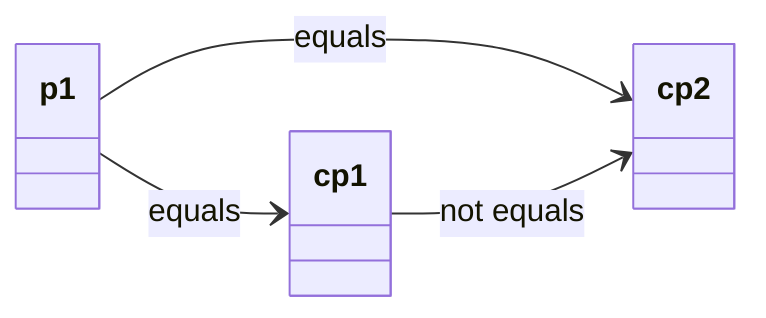

# Fixing the `equals` Method in Inheritance Hierarchies

## The Problem with `equals` in Inheritance

When working with inheritance hierarchies, implementing the `equals` method correctly becomes more complex. The main challenge is ensuring that the `equals` method works correctly when comparing objects of different types in the same hierarchy. `instanceof` is not a good way to check if two objects are of the same type, if they exist in the same hierarchy.

## Common Issues

When comparing objects we must respect both symmetry and transitivity.
- Symmetry: If `a.equals(b)` is true, then `b.equals(a)` must also be true.
- Transitivity: If `a.equals(b)` is true and `b.equals(c)` is true, then `a.equals(c)` must also be true.

If we violate either of these properties, the `equals` method will not work correctly when comparing objects of different types in the same hierarchy.

### 1. **Symmetry Violation**

Here is an example of a violation of the symmetry property. This means that if `a.equals(b)` is true, then `b.equals(a)` must also be true. But in the example below, `animal.equals(dog)` is true, but `dog.equals(animal)` is false.

The problem lies in the `equals` method in the `Animal` class. It only checks if the other object is an instance of `Animal`, and if so, it compares the name of the animal. But it does not check if the other object is a `Dog`.\
In the `Dog` class the equals method checks if the other object is a `Dog`, and if so, it compares the name and the breed of the dog.

```java{9-16,28-34}
// ❌ BAD - Violates symmetry
class Animal {
    protected String name;
    
    public Animal(String name) {
        this.name = name;
    }
    
    @Override
    public boolean equals(Object obj) {
        if (obj instanceof Animal) {
            Animal other = (Animal) obj;
            return this.name.equals(other.name);
        }
        return false;
    }
}

class Dog extends Animal {
    private String breed;
    
    public Dog(String name, String breed) {
        super(name);
        this.breed = breed;
    }
    
    @Override
    public boolean equals(Object obj) {
        if (obj instanceof Dog) {
            Dog other = (Dog) obj;
            return this.name.equals(other.name) && this.breed.equals(other.breed);
        }
        return false;
    }
}

// Problem: Symmetry is violated
Animal animal = new Animal("Buddy");
Dog dog = new Dog("Buddy", "Golden Retriever");

System.out.println(animal.equals(dog));  // true (Animal.equals)
System.out.println(dog.equals(animal));  // false (Dog.equals)
// This violates the symmetry requirement!
```

### 2. **Transitivity Violation**

Here is an example of a violation of the transitivity property. This means that

- if `a.equals(b)` is true 
- and `b.equals(c)` is true, 
- then `a.equals(c)` must also be true. 
 
But in the example below, `p1.equals(cp1)` is true, `p1.equals(cp2)` is true, but `cp1.equals(cp2)` is false.

The problem lies in the `equals` method in the `ColorPoint` class.\
It first checks if the other object is an instance of `ColorPoint`, and if so, it compares the color of the color point.\
But it does not check if the other object is a `Point`, and if so, it compares the x and y coordinates of the point.

Then, it checks if the other object is a `Point`, and if so, it compares the x and y coordinates of the point.

```java
// ❌ BAD - Violates transitivity
class Point {
    protected int x, y;
    
    public Point(int x, int y) {
        this.x = x;
        this.y = y;
    }
    
    @Override
    public boolean equals(Object obj) {
        if (obj instanceof Point) {
            Point other = (Point) obj;
            return this.x == other.x && this.y == other.y;
        }
        return false;
    }
}

class ColorPoint extends Point {
    private String color;
    
    public ColorPoint(int x, int y, String color) {
        super(x, y);
        this.color = color;
    }
    
    @Override
    public boolean equals(Object obj) {
        if (obj instanceof ColorPoint) {
            ColorPoint other = (ColorPoint) obj;
            return super.equals(other) && this.color.equals(other.color);
        }
        if (obj instanceof Point) {
            return super.equals(obj);
        }
        return false;
    }
}

// Problem: Transitivity is violated
Point p1 = new Point(1, 2);
ColorPoint cp1 = new ColorPoint(1, 2, "red");
ColorPoint cp2 = new ColorPoint(1, 2, "blue");

System.out.println(p1.equals(cp1));  // true, should be false
System.out.println(p1.equals(cp2));  // true, should be false
System.out.println(cp1.equals(cp2)); // false, correctly so
// This violates the transitivity requirement!
```

To be fair, the above violation of the transitivity property is reordered a little bit, I try to illustrate the problem here in a diagram:



But, given that `p1` equals both `cp1` and `cp2`, we have that `cp1` should also equal `cp2`, but it does not.

## The Solution: Proper `equals` Implementation

In many cases, the `instanceof` operator is not a good way to check if two objects are of the same type. This is because `dog instanceof Animal` is true, even though we are working with two different object types: `Dog` and `Animal`.

### 1. **Use `getClass()` Instead of `instanceof`**

Instead, we should use `getClass()` to check if the other object is of the same type. This is because `dog.getClass() == animal.getClass()` is false, i.e. it is more precise than `dog instanceof Animal`.

Notice the update in line 11 and line 34.

```java{11,34}
class Animal {
    protected String name;
    
    public Animal(String name) {
        this.name = name;
    }
    
    @Override
    public boolean equals(Object obj) {
        if (this == obj) return true;
        if (obj == null || getClass() != obj.getClass()) return false;
        
        Animal animal = (Animal) obj;
        return Objects.equals(name, animal.name);
    }
    
    @Override
    public int hashCode() {
        return Objects.hash(name);
    }
}

class Dog extends Animal {
    private String breed;
    
    public Dog(String name, String breed) {
        super(name);
        this.breed = breed;
    }
    
    @Override
    public boolean equals(Object obj) {
        if (this == obj) return true;
        if (obj == null || getClass() != obj.getClass()) return false;
        if (!super.equals(obj)) return false; // call to equals in the super class
        
        Dog dog = (Dog) obj;
        return Objects.equals(breed, dog.breed);
    }
    
    @Override
    public int hashCode() {
        return Objects.hash(super.hashCode(), breed);
    }
}
```

The `Objects.equals` method used in lines 14 and 38 is a helper method that checks if two objects are equal. It is a static method in the `Objects` class. It is a null-safe comparison, meaning that it will not throw a `NullPointerException` if either of the objects is `null`.


## The `equals` Method Template

Generally, many equals methods look like this:

### For Abstract Classes
```java
@Override
public boolean equals(Object obj) {
    // same object in memory
    if (this == obj) return true; 
    
    // null or different class
    if (obj == null || getClass() != obj.getClass()) return false; 
    
    // cast to the current class
    CurrentClass other = (CurrentClass) obj;
    
    // compare all fields
    return Objects.equals(field1, other.field1) &&
           Objects.equals(field2, other.field2) &&
           // ... compare all fields
}

@Override
public int hashCode() {
    return Objects.hash(field1, field2, /* ... all fields */);
}
```

And we remember to override the `hashCode` method, to ensure that equal objects produce the same hash code.

### For Concrete Classes

It could look like this:

```java
@Override
public boolean equals(Object obj) {
    if (this == obj) return true;
    if (obj == null || getClass() != obj.getClass()) return false;
    
    // check parent class equality
    if (!super.equals(obj)) return false;  
    
    // cast to the current class
    CurrentClass other = (CurrentClass) obj;
    
    // compare only the fields specific to this class
    return Objects.equals(specificField1, other.specificField1) &&
           Objects.equals(specificField2, other.specificField2);
}

@Override
public int hashCode() {
    return Objects.hash(super.hashCode(), specificField1, specificField2);
}
```

## Key Rules for `equals` in Inheritance

### 1. **Use `getClass()` Not `instanceof`**
- `getClass()` ensures exact type matching
- `instanceof` can lead to symmetry violations

### 2. **Always Call `super.equals()`**
- Ensures parent class fields are compared
- Maintains consistency across the hierarchy

### 3. **Override `hashCode()` Too**
- `equals` and `hashCode` must be consistent
- Use the same fields in both methods

### 4. **Handle `null` and Self-Reference**
- Always check for `null`
- Always check for self-reference (`this == obj`)

### 5. **Use `Objects.equals()` for Safety**
- Handles `null` values gracefully
- Prevents `NullPointerException`


## Summary

Implementing `equals` correctly in inheritance hierarchies requires:

1. **Using `getClass()` instead of `instanceof`** to ensure exact type matching
2. **Calling `super.equals()`** to check parent class fields
3. **Overriding `hashCode()`** to maintain consistency
4. **Handling edge cases** like `null` and self-reference
5. **Using `Objects.equals()`** for safe field comparison

This approach ensures that your `equals` method follows all the required properties (reflexivity, symmetry, transitivity, and consistency) while working correctly in inheritance hierarchies.
