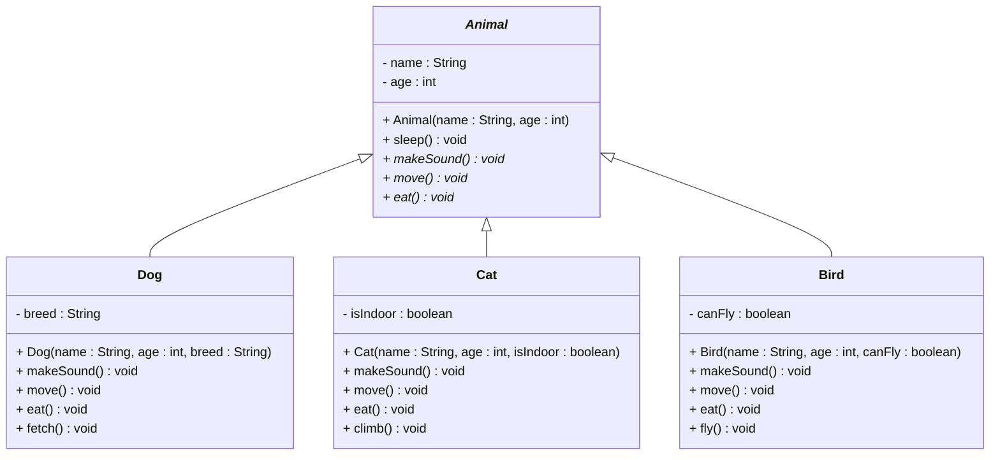
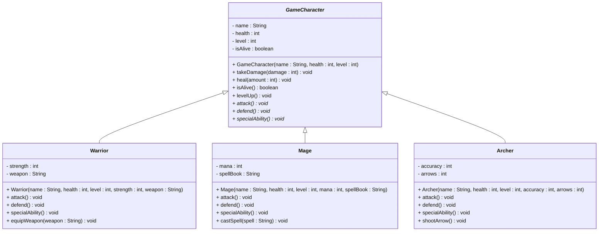
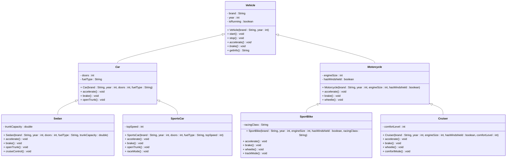
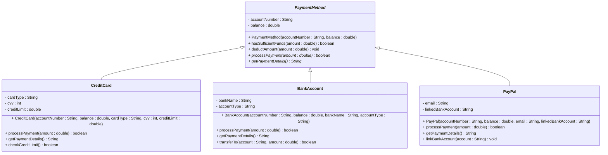

## Animal Hierarchy Example

### Abstract Animal Class

## Game Character System

### Complex Abstract Class

## Vehicle System Example

### Abstract Vehicle with Multiple Levels

## Payment System Example

### Abstract Payment Method

