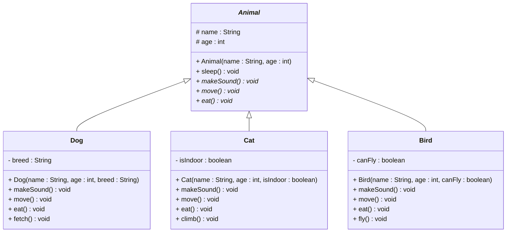

# Exercises

## Exercise 10.1: Animal Hierarchy

This this exercise, you will implement four classes in a hierarchy: `Animal`, `Dog`, `Cat`, and `Bird`.

Make the `Animal` class abstract, with relevant abstract methods.

You may add additional methods, if you think they are relevant.

The `sleep()` method provides a default implementation, which is to print out "Animal is sleeping". However, it can still be overridden in the subclasses. For example, Birds do not sleep when they are flying, instead they [sleep with half a brain at a time](https://en.wikipedia.org/wiki/Unihemispheric_slow-wave_sleep#:~:text=Their%20(%20birds%20)%20sleep%20is%20more,the%20one%20facing%20the%20direction%20of%20flight.). So, override the method in the `Bird` class. Make it alternate between sleeping with the left and right brain, whenever the method is called.

Also, implement `toString()`, `equals()`, and `hashCode()` methods in all four classes.

Make a new class called `AnimalTest`, with a `main` method, to test the `Animal` hierarchy.
