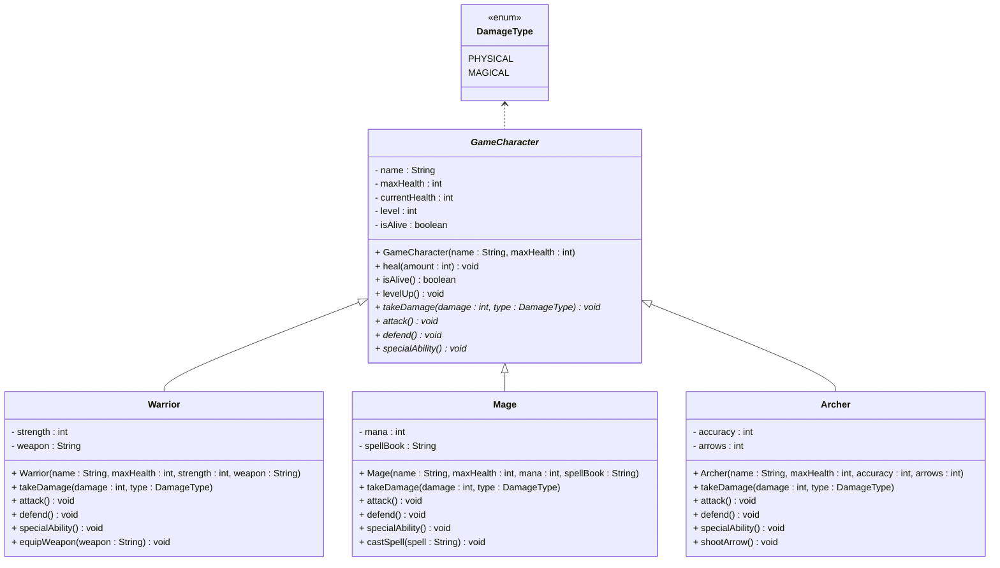

# Exercise: Game Character System

In this exercise, you will implement classes for characters in a game.

The three classes behave slightly differently, but do also have some similar methods. This is clear from the abstract methods, as well as the concrete methods on the concrete classes.

Method explanation:

- `heal(amount : int) void`: Heals the character for the given amount, up to the max health.
- `isAlive() boolean`: Returns true if the character is alive, false otherwise.
- `levelUp() void`: Increases the level of the character by 1.
- `takeDamage(damage : int, type : DamageType) void`: Takes damage of the given amount and type. 
  - If the character is already at 0 health, it cannot take any more damage.
  - The current health is reduced by the amount of damage taken.
  - Warrior: if damage type is PHYSICAL, half the damage is taken.
  - Mage: if damage type is MAGICAL, half the damage is taken.
  - Archer: Takes 1.5x damage from all types.
- `attack() void`: Print out the attack of the character.
- `defend() void`: Print out the defense of the character.
- `specialAbility() void`: Uses the special ability of the character.
  - Warrior: Prints out some kind of fancy attack message.
  - Mage: Prints out some kind of fancy spell message.
  - Archer: Prints out some kind of fancy arrow shooting message.

Extra:
- If the current health is reduced to 0 or below, the character is set to dead.
- The character is not able to attack or use its special ability if it is dead.
- The character is not able to heal if it is dead.
- The character is not able to level up if it is dead.
- The character is not able to take damage if it is dead.

You may notice some of the above constraints are enforced in all classes. Do you need to copy the code, or can you organize your code in a clever way?

The diagram below is for inspiration, but you may deviate from it, if you want to.

