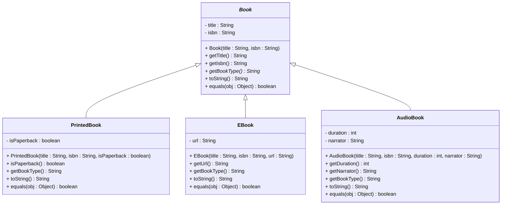

# Exercise: Book Hierarchy with Abstract Classes

## Overview

In this exercise, you'll implement a book hierarchy using abstract classes.

## The Problem

You need to create a book management system that can handle different types of books. All books share some common properties and behaviors, but each type of book has unique characteristics.

## UML Class Diagram



## Requirements

### 1. **Abstract Book Class**
Create an abstract `Book` class with:
- **Fields:**
  - `title` (String, private)
  - `isbn` (String, private)
- **Constructor:** Takes title and ISBN
- **Methods:**
  - `getTitle()` - returns the title
  - `getIsbn()` - returns the ISBN
  - `getBookType()` - **abstract method** that returns the book type
  - `toString()` - returns a string representation
  - `equals(Object obj)` - compares two books for equality

### 2. **PrintedBook Class**
Extends `Book` with:
- **Fields:**
  - `isPaperback` (boolean, private)
- **Constructor:** Takes title, ISBN, and paperback status
- **Methods:**
  - `isPaperback()` - returns true if paperback, false if hardcover
  - `getBookType()` - returns "Paperback" or "Hardcover" based on `isPaperback`
  - `toString()` - includes book type information
  - `equals(Object obj)` - compares including paperback status

### 3. **EBook Class**
Extends `Book` with:
- **Fields:**
  - `url` (String, private)
- **Constructor:** Takes title, ISBN, and URL
- **Methods:**
  - `getUrl()` - returns the download URL
  - `getBookType()` - returns "E-book"
  - `toString()` - includes URL information
  - `equals(Object obj)` - compares including URL

### 4. **AudioBook Class** (New!)
Extends `Book` with:
- **Fields:**
  - `duration` (int, private) - duration in minutes
  - `narrator` (String, private)
- **Constructor:** Takes title, ISBN, duration, and narrator
- **Methods:**
  - `getDuration()` - returns duration in minutes
  - `getNarrator()` - returns narrator name
  - `getBookType()` - returns "Audio Book"
  - `toString()` - includes duration and narrator information
  - `equals(Object obj)` - compares including duration and narrator

## Implementation Guidelines

### Abstract Method Implementation
Each subclass must implement `getBookType()`:
- **PrintedBook:** Returns "Paperback" or "Hardcover"
- **EBook:** Returns "E-book"
- **AudioBook:** Returns "Audio Book"

### toString() Method
Each class should provide a meaningful string representation:
```java
// Example for PrintedBook
"PrintedBook{title='Java Programming', isbn='978-1234567890', type='Paperback'}"

// Example for EBook
"EBook{title='Java Programming', isbn='978-1234567890', url='https://example.com/book.pdf'}"

// Example for AudioBook
"AudioBook{title='Java Programming', isbn='978-1234567890', duration=480, narrator='John Smith'}"
```

### equals() Method
Implement proper equality checking:
- Compare using `getClass()` for type safety
- Call `super.equals()` to check parent fields
- Compare subclass-specific fields

## Test Class

Create a `BookTest` class with a `main` method that:

1. **Creates an array of Book references:**
   ```java
   Book[] books = new Book[6];
   ```

2. **Instantiates different types of books:**
   ```java
   books[0] = new PrintedBook("Java Programming", "978-1234567890", true);
   books[1] = new PrintedBook("Advanced Java", "978-1234567891", false);
   books[2] = new EBook("Java Basics", "978-1234567892", "https://example.com/java.pdf");
   books[3] = new EBook("Java Patterns", "978-1234567893", "https://example.com/patterns.pdf");
   books[4] = new AudioBook("Java for Beginners", "978-1234567894", 360, "Jane Doe");
   books[5] = new AudioBook("Java Mastery", "978-1234567895", 720, "Bob Johnson");
   ```

3. **Demonstrates polymorphism:**
   ```java
   for (Book book : books) {
       System.out.println(book.toString());
       System.out.println("Book type: " + book.getBookType());
       System.out.println("---");
   }
   ```

## Expected Output

```
PrintedBook{title='Java Programming', isbn='978-1234567890', type='Paperback'}
Book type: Paperback
---
PrintedBook{title='Advanced Java', isbn='978-1234567891', type='Hardcover'}
Book type: Hardcover
---
EBook{title='Java Basics', isbn='978-1234567892', url='https://example.com/java.pdf'}
Book type: E-book
---
EBook{title='Java Patterns', isbn='978-1234567893', url='https://example.com/patterns.pdf'}
Book type: E-book
---
AudioBook{title='Java for Beginners', isbn='978-1234567894', duration=360, narrator='Jane Doe'}
Book type: Audio Book
---
AudioBook{title='Java Mastery', isbn='978-1234567895', duration=720, narrator='Bob Johnson'}
Book type: Audio Book
---
```

