# Exercise: Restaurant Food Ordering System

## Overview

In this exercise, you'll implement a restaurant food ordering system using abstract classes and inheritance. The system will handle different types of menu items with varying preparation methods, costs, and ingredient management.

## The Problem

You need to create a food ordering system for a restaurant that can handle different types of menu items. All menu items share some common properties and behaviors, but each category has unique characteristics for preparation, pricing, and ingredient management.

## UML Class Diagram

```mermaid
classDiagram
    direction LR
    class _MenuItem_ {
        - name : String
        - basePrice : double
        - preparationTime : int
        + MenuItem(name : String, basePrice : double, preparationTime : int)
        + getName() String
        + getBasePrice() double
        + getPreparationTime() int
        + prepare()* void
        + calculateCost()* double
        + getDescription() String
        + toString() String
    }
    
    class Appetizer {
        - isHot : boolean
        - servingSize : String
        + Appetizer(name : String, basePrice : double, preparationTime : int, isHot : boolean, servingSize : String)
        + isHot() boolean
        + getServingSize() String
        + prepare() void
        + calculateCost() double
        + getDescription() String
        + toString() String
    }
    
    class MainCourse {
        - proteinType : String
        - spiceLevel : int
        + MainCourse(name : String, basePrice : double, preparationTime : int, proteinType : String, spiceLevel : int)
        + getProteinType() String
        + getSpiceLevel() int
        + prepare() void
        + calculateCost() double
        + getDescription() String
        + toString() String
    }
    
    class Dessert {
        - isCold : boolean
        - sweetnessLevel : int
        + Dessert(name : String, basePrice : double, preparationTime : int, isCold : boolean, sweetnessLevel : int)
        + isCold() boolean
        + getSweetnessLevel() int
        + prepare() void
        + calculateCost() double
        + getDescription() String
        + toString() String
    }
    
    _MenuItem_ <|-- Appetizer
    _MenuItem_ <|-- MainCourse
    _MenuItem_ <|-- Dessert
```




## Requirements

### 1. **Abstract MenuItem Class**
Create an abstract `MenuItem` class with:
- **Fields:**
  - `name` (String, private)
  - `basePrice` (double, private)
  - `preparationTime` (int, private) - time in minutes
- **Constructor:** Takes name, base price, and preparation time
- **Methods:**
  - `getName()` - returns the item name
  - `getBasePrice()` - returns the base price
  - `getPreparationTime()` - returns preparation time in minutes
  - `prepare()` - **abstract method** that handles item preparation
  - `calculateCost()` - **abstract method** that calculates final cost
  - `getDescription()` - returns a description of the item
  - `toString()` - returns a string representation

### 2. **Appetizer Class**
Extends `MenuItem` with:
- **Fields:**
  - `isHot` (boolean, private) - whether the appetizer is served hot
  - `servingSize` (String, private) - "Small", "Medium", or "Large"
- **Constructor:** Takes name, base price, preparation time, hot status, and serving size
- **Methods:**
  - `isHot()` - returns true if served hot
  - `getServingSize()` - returns serving size
  - `prepare()` - prints preparation steps for appetizers
  - `calculateCost()` - adds 10% markup for hot items, 5% for cold
  - `getDescription()` - includes temperature and serving size info
  - `toString()` - includes all appetizer-specific information

### 3. **MainCourse Class**
Extends `MenuItem` with:
- **Fields:**
  - `proteinType` (String, private) - "Beef", "Chicken", "Fish", "Vegetarian"
  - `spiceLevel` (int, private) - 1-5 scale (1=mild, 5=very spicy)
- **Constructor:** Takes name, base price, preparation time, protein type, and spice level
- **Methods:**
  - `getProteinType()` - returns the protein type
  - `getSpiceLevel()` - returns spice level (1-5)
  - `prepare()` - prints preparation steps based on protein type
  - `calculateCost()` - adds markup based on protein type (Beef +15%, Fish +12%, Chicken +8%, Vegetarian +5%)
  - `getDescription()` - includes protein type and spice level
  - `toString()` - includes all main course-specific information

### 4. **Dessert Class**
Extends `MenuItem` with:
- **Fields:**
  - `isCold` (boolean, private) - whether the dessert is served cold
  - `sweetnessLevel` (int, private) - 1-5 scale (1=not sweet, 5=very sweet)
- **Constructor:** Takes name, base price, preparation time, cold status, and sweetness level
- **Methods:**
  - `isCold()` - returns true if served cold
  - `getSweetnessLevel()` - returns sweetness level (1-5)
  - `prepare()` - prints preparation steps for desserts
  - `calculateCost()` - adds 8% markup for cold desserts, 3% for room temperature
  - `getDescription()` - includes temperature and sweetness info
  - `toString()` - includes all dessert-specific information

## Implementation Guidelines

### Abstract Method Implementation
Each subclass must implement `prepare()` and `calculateCost()`:

- **Appetizer `prepare()`:** Print steps like "Preparing appetizer: [name]", "Checking serving size: [size]", "Heating/Cooling as needed"
- **MainCourse `prepare()`:** Print steps like "Preparing main course: [name]", "Cooking [proteinType]", "Adding spices (level [spiceLevel])"
- **Dessert `prepare()`:** Print steps like "Preparing dessert: [name]", "Chilling/Setting as needed", "Adding sweetness level [sweetnessLevel]"

### Cost Calculation Examples
```java
// Appetizer: basePrice + markup based on temperature
// Hot appetizer: basePrice * 1.10
// Cold appetizer: basePrice * 1.05

// MainCourse: basePrice + markup based on protein
// Beef: basePrice * 1.15
// Fish: basePrice * 1.12
// Chicken: basePrice * 1.08
// Vegetarian: basePrice * 1.05

// Dessert: basePrice + markup based on temperature
// Cold dessert: basePrice * 1.08
// Room temperature: basePrice * 1.03
```

### toString() Method Examples
```java
// Appetizer example
"Appetizer{name='Buffalo Wings', basePrice=8.99, preparationTime=15, isHot=true, servingSize='Large'}"

// MainCourse example
"MainCourse{name='Grilled Salmon', basePrice=18.99, preparationTime=25, proteinType='Fish', spiceLevel=2}"

// Dessert example
"Dessert{name='Chocolate Cake', basePrice=6.99, preparationTime=10, isCold=false, sweetnessLevel=4}"
```

## Test Class

Create a `RestaurantTest` class with a `main` method that:

1. **Creates an array of MenuItem references:**
   ```java
   MenuItem[] menu = new MenuItem[6];
   ```

2. **Instantiates different types of menu items:**
   ```java
   menu[0] = new Appetizer("Buffalo Wings", 8.99, 15, true, "Large");
   menu[1] = new Appetizer("Caesar Salad", 6.99, 10, false, "Medium");
   menu[2] = new MainCourse("Grilled Salmon", 18.99, 25, "Fish", 2);
   menu[3] = new MainCourse("Beef Steak", 24.99, 30, "Beef", 3);
   menu[4] = new Dessert("Ice Cream", 4.99, 5, true, 4);
   menu[5] = new Dessert("Chocolate Cake", 6.99, 10, false, 5);
   ```

3. **Demonstrates polymorphism:**
   ```java
   for (MenuItem item : menu) {
       System.out.println(item.toString());
       System.out.println("Description: " + item.getDescription());
       System.out.println("Final cost: $" + String.format("%.2f", item.calculateCost()));
       item.prepare();
       System.out.println("---");
   }
   ```

## Expected Output

```
Appetizer{name='Buffalo Wings', basePrice=8.99, preparationTime=15, isHot=true, servingSize='Large'}
Description: Hot appetizer, Large serving
Final cost: $9.89
Preparing appetizer: Buffalo Wings
Checking serving size: Large
Heating as needed
---
Appetizer{name='Caesar Salad', basePrice=6.99, preparationTime=10, isHot=false, servingSize='Medium'}
Description: Cold appetizer, Medium serving
Final cost: $7.34
Preparing appetizer: Caesar Salad
Checking serving size: Medium
Cooling as needed
---
MainCourse{name='Grilled Salmon', basePrice=18.99, preparationTime=25, proteinType='Fish', spiceLevel=2}
Description: Fish main course, Spice level 2
Final cost: $21.27
Preparing main course: Grilled Salmon
Cooking Fish
Adding spices (level 2)
---
MainCourse{name='Beef Steak', basePrice=24.99, preparationTime=30, proteinType='Beef', spiceLevel=3}
Description: Beef main course, Spice level 3
Final cost: $28.74
Preparing main course: Beef Steak
Cooking Beef
Adding spices (level 3)
---
Dessert{name='Ice Cream', basePrice=4.99, preparationTime=5, isCold=true, sweetnessLevel=4}
Description: Cold dessert, Sweetness level 4
Final cost: $5.39
Preparing dessert: Ice Cream
Chilling as needed
Adding sweetness level 4
---
Dessert{name='Chocolate Cake', basePrice=6.99, preparationTime=10, isCold=false, sweetnessLevel=5}
Description: Room temperature dessert, Sweetness level 5
Final cost: $7.20
Preparing dessert: Chocolate Cake
Setting as needed
Adding sweetness level 5
---
```