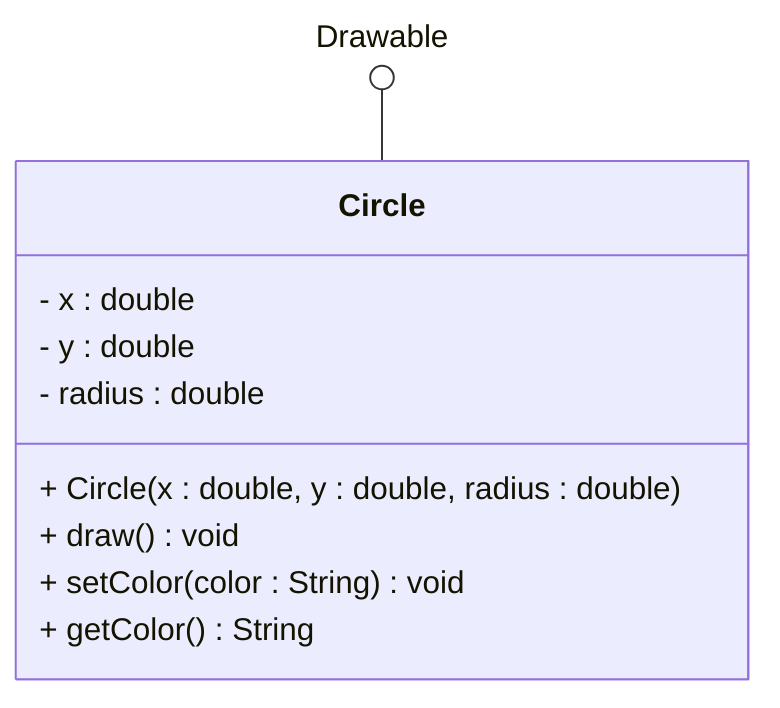
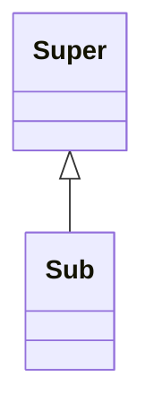
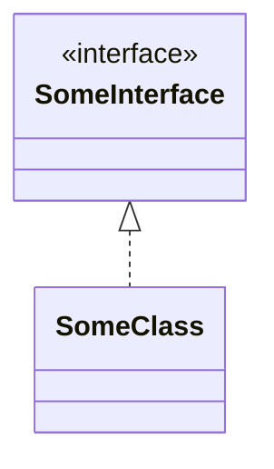

# Interfaces in UML

## Representing Interfaces in UML

UML (Unified Modeling Language) provides specific notation to represent interfaces and their relationships. In class diagrams, we can show interfaces using both the standard interface box notation and the lollipop notation.

## Basic Interface Notation

### Standard Interface Box
Interfaces are shown as rectangles with the `<<interface>>` stereotype:

Otherwise, this looks like just another class.

### Lollipop Notation
Interfaces can also be shown as circles (lollipops) connected to classes. Sometimes this simplifies the diagram, when the methods on the interface are not relevant. Or if you use an interface from the Java library, and that interface is commonly known. Then, showing the details of the interface is not necessary.

## Interface Implementation

When a class _inherits_ from another class, we use a relationship with a full drawn line, and a closed arrowhead:

For interface implementation, we use a similar relationship line, but with a dotted line instead:

## Conventions

In class diagrams, interfaces are drawn _above_ the class(es) that implement them.\
If a class associates the interface, that class is drawn above or next to the interface:

