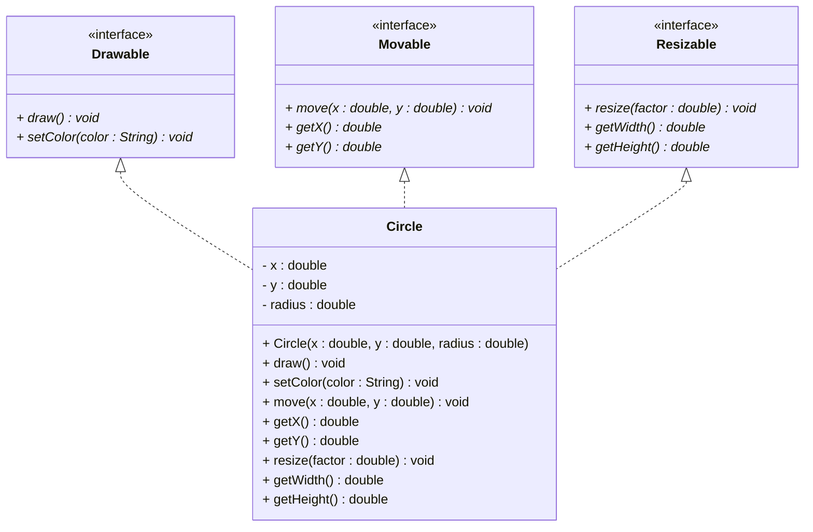

# Multiple Interface Implementation

A class can extend one class, at most.

A class can implement multiple interfaces.

```mermaid
classDiagram
    class Drawable {
        <<interface>>
        _+ draw() void_
        _+ setColor(color : String) void_
    }
    
    class Movable {
        <<interface>>
        _+ move(x : double, y : double) void_
        _+ getX() double_
        _+ getY() double_
    }
    
    class Resizable {
        <<interface>>
        _+ resize(factor : double) void_
        _+ getWidth() double_
        _+ getHeight() double_
    }
    
    class Circle {
        - x : double
        - y : double
        - radius : double
        + Circle(x : double, y : double, radius : double)
        + draw() void
        + setColor(color : String) void
        + move(x : double, y : double) void
        + getX() double
        + getY() double
        + resize(factor : double) void
        + getWidth() double
        + getHeight() double
    }
    
    Drawable <|.. Circle
    Movable <|.. Circle
    Resizable <|.. Circle
```
