# Interface Inheritance

An interface can extend another interface. As usual, this would make the sub-interface include all the methods of the parent interface.\
An interface can extend multiple interfaces.

### Interface Extending Interface

## Complex Interface Hierarchy

Interfaces generally specify what a class must/can do, or what a class _is_. So in order to collect multiple behaviours, a class can implement multiple interfaces.

### Multiple Interface Inheritance

```mermaid
classDiagram
    class Flyable {
        <<interface>>
        + fly() void
        + canFly() boolean
    }
    
    class Swimmable {
        <<interface>>
        + swim() void
        + canSwim() boolean
    }
    
    class Walkable {
        <<interface>>
        + walk() void
        + canWalk() boolean
    }
    
    class Animal {
        <<interface>>
        + eat() void
        + sleep() void
        + makeSound() void
    }
    
    class FlyingAnimal {
        <<interface>>
        + fly() void
        + canFly() boolean
        + eat() void
        + sleep() void
        + makeSound() void
        + getMaxAltitude() double
        + land() void
    }
    
    class AmphibiousAnimal {
        <<interface>>
        + fly() void
        + canFly() boolean
        + swim() void
        + canSwim() boolean
        + walk() void
        + canWalk() boolean
        + eat() void
        + sleep() void
        + makeSound() void
        + getMaxAltitude() double
        + land() void
        + getMaxDepth() double
        + surface() void
        + getMaxSpeed() double
        + run() void
        + migrate() void
        + getHabitat() String
    }
    
    Animal <|-- FlyingAnimal
    Flyable <|-- FlyingAnimal
    FlyingAnimal <|-- AmphibiousAnimal
    Swimmable <|-- AmphibiousAnimal
    Walkable <|-- AmphibiousAnimal
```

