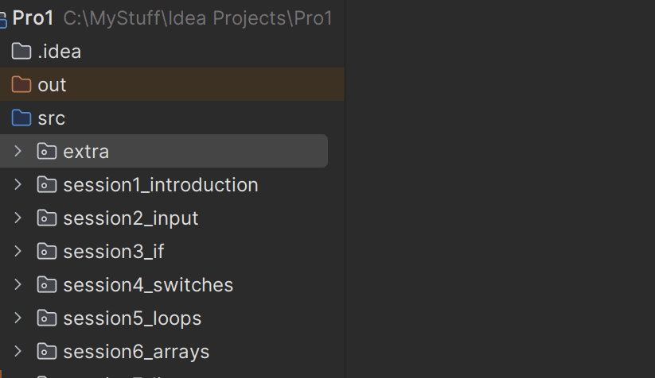

# Defining Interfaces

## Interface Declaration

Creating an interface in Java is straightforward. You have a few options:

1. Just create a class, like you have done many times before. Then change `class` to `interface`.
2. When adding a new file, IntelliJ will ask you want type you want. Here you can select "interface".





You use the `interface` keyword followed by the interface name and a body containing method signatures.

## Basic Syntax

```java
public interface InterfaceName {
    // Method signatures (no implementation)
    returnType methodName(parameters);
    
    // Constants (public static final by default)
    dataType CONSTANT_NAME = value;
}
```

## Simple Interface Example

```java
public interface Drawable {
    void draw();
    void setColor(String color);
    String getColor();
}
```

## Interface with Constants

Again, remember that all these are actually public, both the fields and the methods.

```java
public interface MathConstants {
    double PI = 3.14159;
    double E = 2.71828;
    int MAX_ITERATIONS = 1000;
    
    double calculateArea(double radius);
    double calculateCircumference(double radius);
}
```

## Interface Naming Conventions

There are a few recommendations for naming interfaces:

### 1. **Capability Interfaces** (What something can do)
```java
public interface Drawable {
    void draw();
}

public interface Movable {
    void move(int x, int y);
}

public interface Resizable {
    void resize(double factor);
}

public interface Playable {
    void play();
    void pause();
    void stop();
}
```

### 2. **Service Interfaces** (What services something provides)
```java
public interface DatabaseService {
    void save(Object data);
    Object load(String id);
    void delete(String id);
}

public interface EmailService {
    void sendEmail(String to, String subject, String body);
    void sendBulkEmail(String[] recipients, String subject, String body);
}

public interface PaymentService {
    boolean processPayment(double amount);
    String getPaymentMethod();
}
```

### 3. **Listener Interfaces** (Event handling)
```java
public interface ButtonClickListener {
    void onClick();
}

public interface MouseListener {
    void onMouseMove(int x, int y);
    void onMouseClick(int x, int y);
    void onMouseDoubleClick(int x, int y);
}

public interface KeyListener {
    void onKeyPress(char key);
    void onKeyRelease(char key);
}
```

## Interface Constants

All variables in interfaces are implicitly `public static final`:

```java
public interface GameConstants {
    // These are all public static final
    int MAX_PLAYERS = 4;
    int MIN_PLAYERS = 1;
    String GAME_VERSION = "1.0.0";
    double GRAVITY = 9.81;
    
    // Method signatures
    void startGame();
    void endGame();
    void pauseGame();
}
```


## Interface Documentation

It's important to document your interfaces clearly:

```java
/**
 * Interface for objects that can be drawn on a canvas.
 * Any class implementing this interface must provide
 * methods for drawing and color management.
 */
interface Drawable {
    /**
     * Draws the object on the current canvas.
     * The specific drawing implementation depends on
     * the concrete class.
     */
    void draw();
    
    /**
     * Sets the color of the object.
     * @param color The color name (e.g., "red", "blue", "green")
     */
    void setColor(String color);
    
    /**
     * Gets the current color of the object.
     * @return The current color name
     */
    String getColor();
}
```

## Interface Best Practices

### 1. **Keep Interfaces Focused**
```java
// Good - focused on one responsibility
interface Drawable {
    void draw();
    void setColor(String color);
}

// Bad - too many responsibilities
interface Shape {
    void draw();
    void setColor(String color);
    void saveToFile(String filename);
    void loadFromFile(String filename);
    void sendEmail(String recipient);
}
```

### 2. **Use Descriptive Names**
```java
// Good - clear and descriptive
interface PaymentProcessor {
    boolean processPayment(double amount);
}

interface EmailSender {
    void sendEmail(String to, String subject, String body);
}

// Bad - vague and unclear
interface Processor {
    boolean process(double amount);
}

interface Sender {
    void send(String to, String subject, String body);
}
```

### 3. **Group Related Methods**
```java
interface FileOperations {
    // File reading
    String readFile(String path);
    String[] readLines(String path);
    
    // File writing
    void writeFile(String path, String content);
    void writeLines(String path, String[] lines);
    
    // File management
    boolean exists(String path);
    void delete(String path);
    void rename(String oldPath, String newPath);
}
```

## Summary

Defining interfaces involves:

- **Using the `interface` keyword** to declare the interface
- **Defining method signatures** without implementation
- **Including constants** if needed (implicitly public static final)
- **Following naming conventions** for clarity
- **Documenting the interface** for other developers
- **Keeping interfaces focused** on single responsibilities

In the next article, we'll explore how classes implement these interfaces and fulfill the contracts they define.
