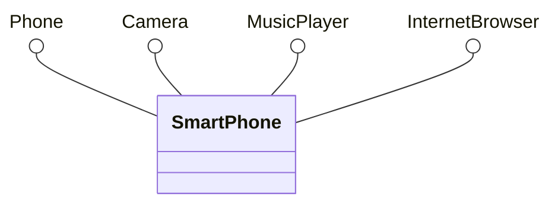

# Multiple Interfaces

## The Power of Multiple Interface Implementation

One of the key advantages of interfaces over abstract classes is that a class can implement multiple interfaces. This allows you to combine different capabilities and create flexible, modular designs.

## Basic Multiple Interface Implementation

```java{18}
interface Drawable {
    void draw();
    void setColor(String color);
}

interface Movable {
    void move(double x, double y);
    double getX();
    double getY();
}

interface Resizable {
    void resize(double factor);
    double getWidth();
    double getHeight();
}

class Circle implements Drawable, Movable, Resizable {
    private String color;
    private double x, y, radius;
    
    public Circle(double x, double y, double radius) {
        this.x = x;
        this.y = y;
        this.radius = radius;
        this.color = "black";
    }
    
    // Drawable interface methods
    @Override
    public void draw() {
        System.out.println("Drawing circle at (" + x + ", " + y + ") with radius " + radius);
    }
    
    @Override
    public void setColor(String color) {
        this.color = color;
    }
    
    // Movable interface methods
    @Override
    public void move(double x, double y) {
        this.x = x;
        this.y = y;
    }
    
    @Override
    public double getX() {
        return x;
    }
    
    @Override
    public double getY() {
        return y;
    }
    
    // Resizable interface methods
    @Override
    public void resize(double factor) {
        this.radius *= factor;
    }
    
    @Override
    public double getWidth() {
        return radius * 2;
    }
    
    @Override
    public double getHeight() {
        return radius * 2;
    }
}
```

## Polymorphism with Multiple Interfaces

You can use different interfaces to access different capabilities:



```java
public class Main {
    public static void main(String[] args) {
        Smartphone phone = new Smartphone();
        
        // Using as Phone
        Phone phoneInterface = phone;
        phoneInterface.makeCall("123-456-7890");
        phoneInterface.endCall();
        
        // Using as Camera
        Camera cameraInterface = phone;
        cameraInterface.setFlash(true);
        cameraInterface.takePhoto();
        
        // Using as MusicPlayer
        MusicPlayer musicInterface = phone;
        musicInterface.playMusic();
        musicInterface.nextSong();
        
        // Using as InternetBrowser
        InternetBrowser browserInterface = phone;
        browserInterface.openWebsite("https://example.com");
        browserInterface.refreshPage();
    }
}
```