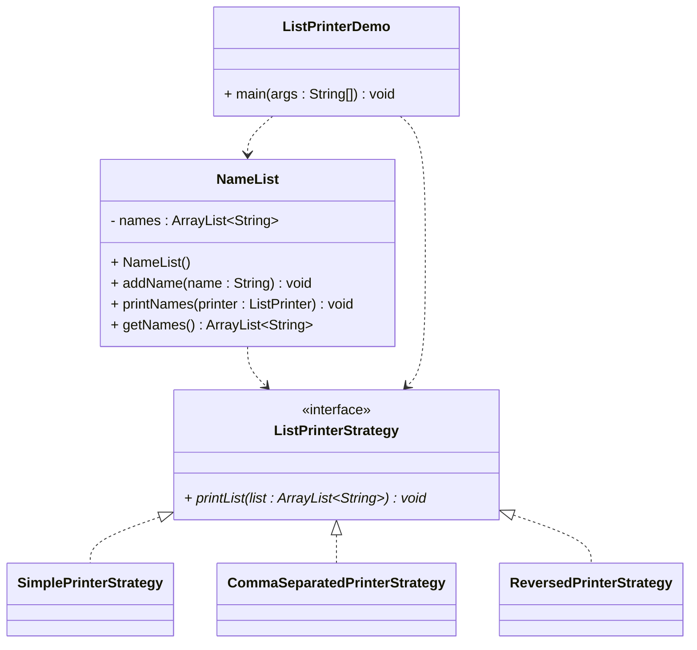

# Exercise: List Printer Interface

## Task

Create an interface that defines how to print a list of strings, then implement different printing strategies.

You will need:
* A class `NamesList` that has a list of names and a method to print using the interface
* The interface `ListPrinterStrategy`, which has a method to print a list of strings
* Different implementations of the `ListPrinterStrategy` interface, that print the list in different ways
* A main class to demonstrate the different printing strategies

Here is a diagram for inspiration:




### Requirements

1. **Create an interface** called `ListPrinterStrategy` with a method that takes an `ArrayList<String>`
2. **Create different implementations** that print the list in different ways, feel free to add more
3. **Create a `NameList` class** that has a list of names and a method to print using the interface
4. **Create a main class** to demonstrate the different printing strategies

## Interface Design

This will be your interface definition.

```java
public interface ListPrinterStrategy {
    void printList(ArrayList<String> list);
}
```


## Main Class

This is inspiration for class with the main method.

```java
import java.util.ArrayList;

public class ListPrinterDemo {
    public static void main(String[] args) {
        // Create a NameList and add some names
        NameList nameList = new NameList();
        nameList.addName("Alice");
        nameList.addName("Bob");
        nameList.addName("Charlie");
        nameList.addName("Diana");
        nameList.addName("Eve");
        
        // Create different printer implementations
        ListPrinterStrategy simplePrinter = new SimplePrinterStrategy();
        ListPrinterStrategy commaPrinter = new CommaSeparatedPrinterStrategy();
        ListPrinterStrategy reversedPrinter = new ReversedPrinterStrategy();
        
        // Demonstrate different printing strategies
        System.out.println("=== Different Ways to Print Names ===\n");
        
        System.out.println("1. Simple Printer (one per line):");
        nameList.printNames(simplePrinter);
        
        System.out.println("3. Comma Separated Printer:");
        nameList.printNames(commaPrinter);
        
        System.out.println("4. Reversed Printer:");
        nameList.printNames(reversedPrinter);
        
        // Demonstrate polymorphism
        System.out.println("=== Polymorphism Example ===");
        ArrayList<ListPrinterStrategy> printers = new ArrayList<>();
        printers.add(simplePrinter);
        printers.add(commaPrinter);
        printers.add(reversedPrinter);
        
        String[] printerNames = {
            "Simple", "Comma Separated", "Reversed"
        };
        
        for (int i = 0; i < printers.size(); i++) {
            System.out.println("\nUsing " + printerNames[i] + " Printer:");
            printers.get(i).printList(nameList.getNames());
        }
    }
}
```

The different strategy implementations should print out the list in various ways.


## Key Learning Points

### 1. **Interface Design**
- The `ListPrinterStrategy` interface defines a contract for printing lists
- All implementations must provide the `printList` method
- The interface is simple but flexible

### 2. **Strategy Pattern**
- Different printing strategies are encapsulated in separate classes
- The `NameList` class doesn't need to know about specific printing implementations
- Easy to add new printing strategies without modifying existing code

### 3. **Polymorphism**
- All printer implementations can be treated as `ListPrinterStrategy` objects
- The same method call (`printList`) produces different behaviors
- Demonstrates runtime polymorphism

### 4. **Dependency Injection**
- The `NameList.printNames()` method accepts a `ListPrinterStrategy` parameter
- This allows different printing strategies to be _injected_ at runtime (i.e. passed as a parameter to the method)
- Makes the code more flexible

### 5. **Code Reusability**
- The same `NameList` can be used with any `ListPrinterStrategy` implementation
- New printing strategies can be added without changing existing code
- Follows the Open/Closed Principle, meaning that you can add new printing strategies without changing the existing code
