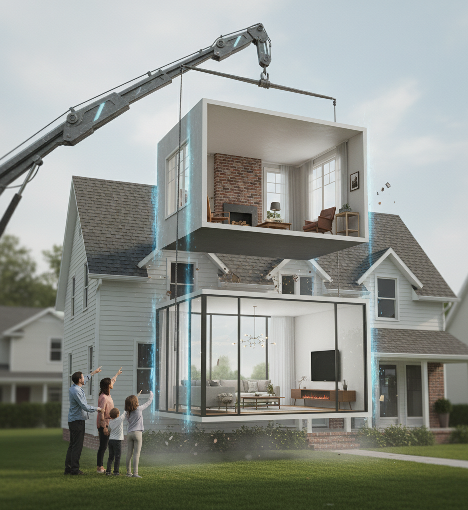
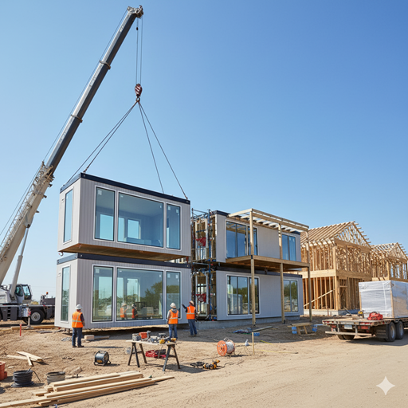
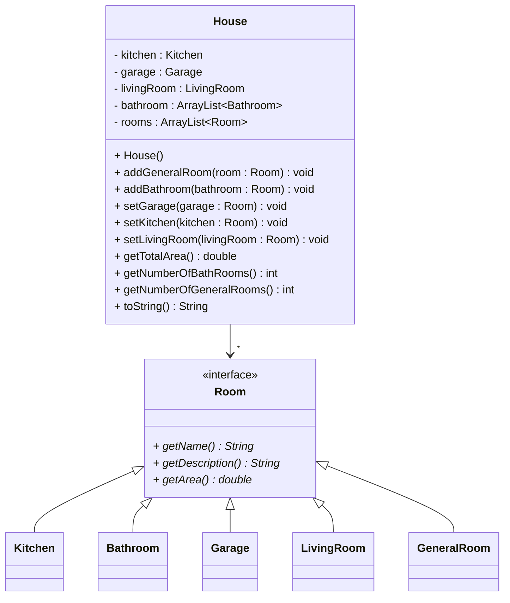

# Exercise - House construction


## Flexibility with interfaces

Interfaces are often used to create a flexible system. This means, you can change out certain parts of the system, without having to change the whole system.

Imagine trying to swap out the living room of your house. Not an easy task.\
But, what if your rooms came as modules, like just putting containers together like lego blocks. Then, you could hoist out one container, and replace it with another. Easily modifying your house.

You want a new kitchen? Normally, you will have to tear down the old kitchen, and build a new one. But, what if you could just hoist out the old kitchen, and replace it with a new one? What an interesting idea.



Essentially, interfaces in programming allows us to swap out certain parts of the system, without having affecting or having to change the rest of the system.

So, let's build a house template, and you will create various houses by putting together the modules.

## Exercise



## UML

Here is a diagram for inspiration:



Yes, the above will allow you to add a bathroom as a kitchen. We will just accept that in our super modular house.


Imagine the description of a room is similar to what you might read in real estate listings. Here are different living room descriptions:
* "A large living room with a fireplace and a large window."
* "A small living room with a small window."
* "An open space with wide windows to let the sun in. Includes a door to the patio."

And so on.

## Main method

Now you need a main method, to create a house, and add some rooms to it.

It could look like this:

```java
public class Main {
    public static void main(String[] args) {
        House house = new House();
        house.setLivingRoom(new LivingRoom("Living Room", "A large living room with a fireplace and a large window."));
        house.setKitchen(new Kitchen("Kitchen", "Huge kitchen with marble countertops and a large window, with a view of the garden."));
        house.setBathroom(new Bathroom("Bathroom", "A bathroom with a small window. Just a toilet and a sink. You will have to wash yourself in the sink."));
        house.setGarage(new Garage("Garage", "This is actually just a drive way."));

        house.addGeneralRoom(new GeneralRoom("Office", "A room with a small window. Great as an office."));
        house.addGeneralRoom(new GeneralRoom("Kids Room", "The perfect kids room with pink colored walls."));

        System.out.println(house.toString());
    }
}
```

And then the output should look like this:
```
A wonderful house with a living room, a kitchen, a bathroom, a garage, and two rooms.
Living Room: A large living room with a fireplace and a large window.
Kitchen: Huge kitchen with marble countertops and a large window, with a view of the garden.
Bathroom: A bathroom with a small window. Just a toilet and a sink. You will have to wash yourself in the sink.
Garage: This is actually just a drive way.
Office: A room with a small window. Great as an office.
Kids Room: The perfect kids room with pink colored walls.
```

## Extra Exercise

You can of course expand this to be a console application, where users can construct their own dream house.
