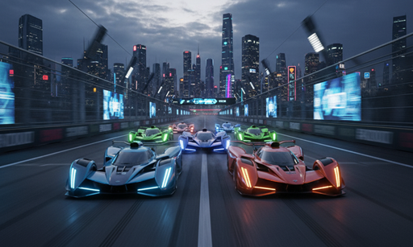

# Exercise: Console Racing Game




## Task

Create a console-based racing game where the player competes against AI opponents. The game uses a dice-rolling mechanic where players guess numbers, and different NPC racers use different strategies to make their guesses.

You will need:
* An interface `NpcRacer` that defines how AI racers make guesses
* Different implementations of `NpcRacer` with unique strategies
* A `RacingGame` class that manages the game state and console UI
* A main class to run the game


The following is a class diagram of the game. You may rework it as you see fit, this is just for inspiration. Maybe you wish to add more interfaces, or more classes.


Now you're probably thinking, maybe it would be smarter to make `NpcRacer` an abstract class, and have the different strategies be subclasses. That would be a good idea, but in this learning path, we practice interfaces. You _could_ introduce an abstract class, which implements the `NpcRacer` interface.

## The Game

* The program should request the player's name.
* The program should ask the user to add NPC racers, with their names.
* The program should ask the user how long the track is (somewhere between 25 is probably a good default, you may add constraints for min and max length)
* The user can then start the game, which will run a number of rounds, with the following steps:
    * Generate two random numbers between 0 and 5
    * Add them together to get the target sum (this will make uneven likelyhoods, so some numbers are more likely to be the target sum than others)
    * Ask the player to guess the target sum
    * Ask the NPC racers to guess the target sum (each should generate a number based on their strategy)
    * Based on the guesses, each racer gets its position updated
    * Check if the player or any of the NPC racers have won
* Any racer that guesses correctly, moves forward based on the probability of that sum:
    * 0 or 10: 4 spaces
    * 1-2 or 8-9: 3 spaces
    * 3-4 or 6-7: 2 spaces
    * 5: 1 space

## UI

The UI should be console-based. You can create a numbered menu, and then for displaying the game's race track, you can use a simple ASCII art. Something like this:

```
Player:  ----------------------------| Goal
Racer 1: ----------------------------|
Racer 2: ----------------------------|
Racer 3: ----------------------------|
Racer 4: ----------------------------|
Racer 5: ----------------------------|
```

Then place an X at the position of each racer, to show where they are:

```
Player:  ---------------------X------| Goal
Racer 1: -------------X--------------|
Racer 2: ------X---------------------|
Racer 3: ----------------X-----------|
Racer 4: ----------X-----------------|
Racer 5: -------------------X--------|
```

Or you can come up with your own ASCII art. IntelliJ can also print various symbols, like 🚗 for a car. Or you can use emojis.


## Interface Design

Create an `NpcRacer` interface with these methods:

```java
public interface NpcRacer {
    int makeGuess();
    String getName();
}
```
## NPC racers

Create different implementations of the `NpcRacer` interface. Each NpcRacer should have a unique strategy for making guesses.\
Strategies can include:
- Random guessing, just pick a random number between 0 and 10
- Conservative guessing, pick a number between 3 and 7, as the likelyhood of these numbers are higher
- Risky guessing, pick a number less than 3 or greater than 7
- Lucky guessing, pick a number between 0 and 10, but vary the likelyhood of each number


## Main Class

```java
public class RacingGameDemo {
    public static void main(String[] args) {
        RacingGame game = new RacingGame();
        game.startGame();
    }
}
```

## UML Class Diagram


## Key Learning Points

### 1. **Interface Polymorphism**
- All NPC racers implement the same `NpcRacer` interface
- The `RacingGame` can work with any racer type without knowing the specific implementation
- Demonstrates how interfaces enable polymorphic behavior

### 2. **Strategy Pattern**
- Different racers use different strategies for making guesses
- Each strategy is encapsulated in its own class
- Easy to add new racer types without modifying existing code

### 3. **Adaptive Behavior**
- `SmartRacer` learns from previous results and adapts its strategy
- `LuckyRacer` gets better over time, simulating "hot streaks"
- Shows how interfaces can support complex, stateful behaviors

### 4. **Console UI Design**
- Visual representation of the race track
- Interactive menu system for game control
- Real-time feedback on game state

### 5. **Game Mechanics**
- Probability-based movement system
- Different strategies have different success rates
- Engaging gameplay that teaches interface concepts

## Extension Ideas

1. **Add more racer types:**
   - `CheaterRacer` - sometimes gets extra moves
   - `CopycatRacer` - copies the player's last guess
   - `PatternRacer` - looks for patterns in dice results

2. **Enhance the game:**
   - Add power-ups and special moves
   - Implement different track types
   - Add betting system

3. **Improve the UI:**
   - Add colors to the console output
   - Create ASCII art for the cars
   - Add sound effects (if possible)

This exercise demonstrates the power of interfaces in creating flexible, engaging systems while being fun to play and educational!
