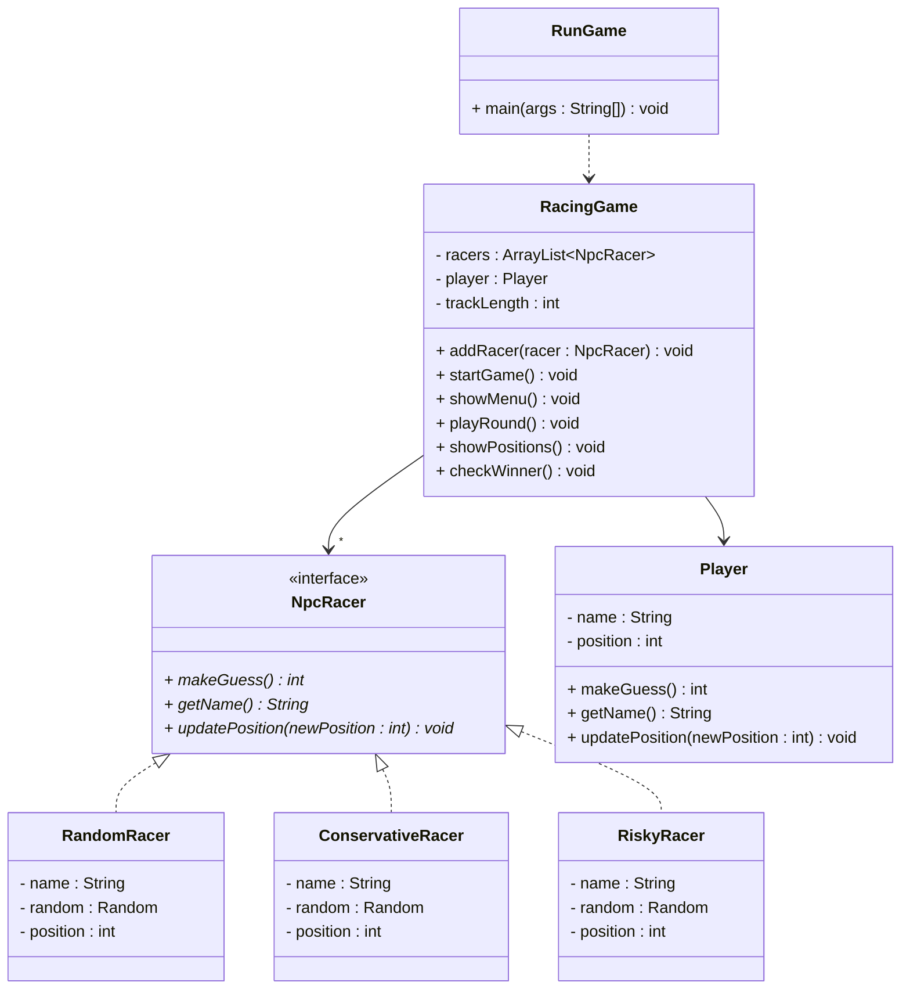
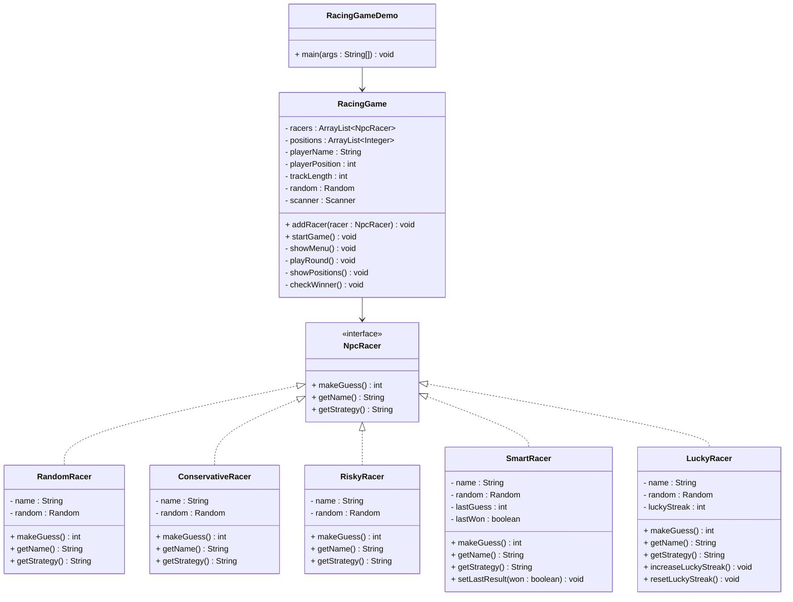

# Exercise: Console Racing Game

## Task

Create a console-based racing game where the player competes against AI opponents. The game uses a dice-rolling mechanic where players guess numbers, and different NPC racers use different strategies to make their guesses.

You will need:
* An interface `NpcRacer` that defines how AI racers make guesses
* Different implementations of `NpcRacer` with unique strategies
* A `RacingGame` class that manages the game state and console UI
* A main class to run the game


The following is a class diagram of the game. You may rework it as you see fit, this is just for inspiration. Maybe you wish to add more interfaces, or more classes.




Now you're probably thinking, maybe it would be smarter to make `NpcRacer` an abstract class, and have the different strategies be subclasses. That would be a good idea, but in this learning path, we practice interfaces. You _could_ introduce an abstract class, which implements the `NpcRacer` interface.

## The Game

* The program should request the player's name.
* The program should ask the user to add NPC racers, with their names.
* The program should ask the user how long the track is (somewhere between 25 is probably a good default, you may add constraints for min and max length)
* The user can then start the game, which will run a number of rounds, with the following steps:
    * Generate two random numbers between 0 and 5
    * Add them together to get the target sum (this will make uneven likelyhoods, so some numbers are more likely to be the target sum than others)
    * Ask the player to guess the target sum
    * Ask the NPC racers to guess the target sum (each should generate a number based on their strategy)
    * Based on the guesses, each racer gets its position updated
    * Check if the player or any of the NPC racers have won
  * Any racer that guesses correctly, moves forward based on the probability of that sum:
    * 0 or 10: 4 spaces
    * 1-2 or 8-9: 3 spaces
    * 3-4 or 6-7: 2 spaces
    * 5: 1 space

## Interface Design

Create an `NpcRacer` interface with these methods:

```java
public interface NpcRacer {
    int makeGuess();
    String getName();
}
```
## NPC racers

Create different implementations of the `NpcRacer` interface. Each NpcRacer should have a unique strategy for making guesses.\
Strategies can include:
- Random guessing, just pick a random number between 0 and 10
- Conservative guessing, pick a number between 3 and 7, as the likelyhood of these numbers are higher
- Risky guessing, pick a number less than 3 or greater than 7
- Lucky guessing, pick a number between 0 and 10, but vary the likelyhood of each number


## Racing Game Class

```java
import java.util.ArrayList;
import java.util.Random;
import java.util.Scanner;

public class RacingGame {
    private ArrayList<NpcRacer> racers;
    private ArrayList<Integer> positions;
    private String playerName;
    private int playerPosition;
    private int trackLength;
    private Random random;
    private Scanner scanner;
    
    public RacingGame() {
        this.racers = new ArrayList<>();
        this.positions = new ArrayList<>();
        this.playerName = "Player";
        this.playerPosition = 0;
        this.trackLength = 50;
        this.random = new Random();
        this.scanner = new Scanner(System.in);
    }
    
    public void addRacer(NpcRacer racer) {
        racers.add(racer);
        positions.add(0);
        System.out.println("Added " + racer.getName() + " (" + racer.getStrategy() + ") to the race!");
    }
    
    public void startGame() {
        System.out.println("=== Welcome to the Console Racing Game! ===");
        System.out.println("Guess numbers 0-10 to move forward!");
        System.out.println("The game generates two random numbers (0-5) and adds them together.");
        System.out.println("If you guess correctly, you move forward based on the probability of that sum.\n");
        
        // Add some default racers if none exist
        if (racers.isEmpty()) {
            addRacer(new RandomRacer("Speedster"));
            addRacer(new ConservativeRacer("Steady"));
            addRacer(new RiskyRacer("Daredevil"));
            addRacer(new SmartRacer("Genius"));
            addRacer(new LuckyRacer("Lucky"));
        }
        
        showMenu();
    }
    
    public void showMenu() {
        while (true) {
            System.out.println("\n=== Racing Game Menu ===");
            System.out.println("1. Add a racer");
            System.out.println("2. List all racers");
            System.out.println("3. Start a race round");
            System.out.println("4. Show current positions");
            System.out.println("5. Reset race");
            System.out.println("6. Exit");
            System.out.print("Choose an option: ");
            
            int choice = scanner.nextInt();
            scanner.nextLine(); // Consume newline
            
            switch (choice) {
                case 1:
                    addCustomRacer();
                    break;
                case 2:
                    listRacers();
                    break;
                case 3:
                    playRound();
                    break;
                case 4:
                    showPositions();
                    break;
                case 5:
                    resetRace();
                    break;
                case 6:
                    System.out.println("Thanks for playing!");
                    return;
                default:
                    System.out.println("Invalid choice. Please try again.");
            }
        }
    }
    
    private void addCustomRacer() {
        System.out.print("Enter racer name: ");
        String name = scanner.nextLine();
        
        System.out.println("Choose racer type:");
        System.out.println("1. Random");
        System.out.println("2. Conservative");
        System.out.println("3. Risky");
        System.out.println("4. Smart");
        System.out.println("5. Lucky");
        System.out.print("Enter choice: ");
        
        int type = scanner.nextInt();
        scanner.nextLine();
        
        NpcRacer racer = null;
        switch (type) {
            case 1:
                racer = new RandomRacer(name);
                break;
            case 2:
                racer = new ConservativeRacer(name);
                break;
            case 3:
                racer = new RiskyRacer(name);
                break;
            case 4:
                racer = new SmartRacer(name);
                break;
            case 5:
                racer = new LuckyRacer(name);
                break;
            default:
                System.out.println("Invalid choice. Adding random racer.");
                racer = new RandomRacer(name);
        }
        
        addRacer(racer);
    }
    
    private void listRacers() {
        System.out.println("\n=== Current Racers ===");
        for (int i = 0; i < racers.size(); i++) {
            System.out.println((i + 1) + ". " + racers.get(i).getName() + 
                             " (" + racers.get(i).getStrategy() + ") - Position: " + positions.get(i));
        }
        System.out.println("Player - Position: " + playerPosition);
    }
    
    private void playRound() {
        System.out.println("\n=== Race Round ===");
        
        // Generate the target sum
        int dice1 = random.nextInt(6); // 0-5
        int dice2 = random.nextInt(6); // 0-5
        int targetSum = dice1 + dice2;
        
        System.out.println("Dice rolled: " + dice1 + " + " + dice2 + " = " + targetSum);
        
        // Get player guess
        System.out.print("Enter your guess (0-10): ");
        int playerGuess = scanner.nextInt();
        scanner.nextLine();
        
        // Process player move
        if (playerGuess == targetSum) {
            int moveDistance = calculateMoveDistance(targetSum);
            playerPosition += moveDistance;
            System.out.println("Correct! You move " + moveDistance + " spaces forward!");
        } else {
            System.out.println("Wrong guess. You stay in place.");
        }
        
        // Process NPC racers
        for (int i = 0; i < racers.size(); i++) {
            NpcRacer racer = racers.get(i);
            int guess = racer.makeGuess();
            
            if (guess == targetSum) {
                int moveDistance = calculateMoveDistance(targetSum);
                positions.set(i, positions.get(i) + moveDistance);
                System.out.println(racer.getName() + " guessed " + guess + " - Correct! Moves " + moveDistance + " spaces!");
                
                // Update smart racer
                if (racer instanceof SmartRacer) {
                    ((SmartRacer) racer).setLastResult(true);
                }
                
                // Update lucky racer
                if (racer instanceof LuckyRacer) {
                    ((LuckyRacer) racer).increaseLuckyStreak();
                }
            } else {
                System.out.println(racer.getName() + " guessed " + guess + " - Wrong! Stays in place.");
                
                // Update smart racer
                if (racer instanceof SmartRacer) {
                    ((SmartRacer) racer).setLastResult(false);
                }
                
                // Reset lucky racer streak
                if (racer instanceof LuckyRacer) {
                    ((LuckyRacer) racer).resetLuckyStreak();
                }
            }
        }
        
        // Show updated positions
        showPositions();
        
        // Check for winner
        checkWinner();
    }
    
    private int calculateMoveDistance(int sum) {
        // More common sums give smaller moves, rarer sums give bigger moves
        switch (sum) {
            case 0:
            case 10:
                return 5; // Very rare
            case 1:
            case 9:
                return 4; // Rare
            case 2:
            case 8:
                return 3; // Uncommon
            case 3:
            case 7:
                return 2; // Somewhat common
            case 4:
            case 6:
                return 1; // Common
            case 5:
                return 1; // Most common
            default:
                return 1;
        }
    }
    
    private void showPositions() {
        System.out.println("\n=== Race Track ===");
        
        // Show NPC racers
        for (int i = 0; i < racers.size(); i++) {
            String racerName = racers.get(i).getName();
            int position = positions.get(i);
            drawRacerLine(racerName, position);
        }
        
        // Show player
        drawRacerLine(playerName, playerPosition);
        
        System.out.println();
    }
    
    private void drawRacerLine(String name, int position) {
        System.out.print(name + ": ");
        
        // Draw track
        for (int i = 0; i < trackLength; i++) {
            if (i == position) {
                System.out.print("🚗"); // Car emoji
            } else if (i == trackLength - 1) {
                System.out.print("| Goal");
            } else {
                System.out.print("-");
            }
        }
        System.out.println();
    }
    
    private void checkWinner() {
        // Check if player won
        if (playerPosition >= trackLength) {
            System.out.println("\n🎉 Congratulations! You won the race! 🎉");
            return;
        }
        
        // Check if any NPC won
        for (int i = 0; i < racers.size(); i++) {
            if (positions.get(i) >= trackLength) {
                System.out.println("\n🏁 " + racers.get(i).getName() + " won the race! 🏁");
                return;
            }
        }
    }
    
    private void resetRace() {
        playerPosition = 0;
        for (int i = 0; i < positions.size(); i++) {
            positions.set(i, 0);
        }
        System.out.println("Race reset! All racers back to start line.");
    }
}
```

## Main Class

```java
public class RacingGameDemo {
    public static void main(String[] args) {
        RacingGame game = new RacingGame();
        game.startGame();
    }
}
```

## UML Class Diagram



## Key Learning Points

### 1. **Interface Polymorphism**
- All NPC racers implement the same `NpcRacer` interface
- The `RacingGame` can work with any racer type without knowing the specific implementation
- Demonstrates how interfaces enable polymorphic behavior

### 2. **Strategy Pattern**
- Different racers use different strategies for making guesses
- Each strategy is encapsulated in its own class
- Easy to add new racer types without modifying existing code

### 3. **Adaptive Behavior**
- `SmartRacer` learns from previous results and adapts its strategy
- `LuckyRacer` gets better over time, simulating "hot streaks"
- Shows how interfaces can support complex, stateful behaviors

### 4. **Console UI Design**
- Visual representation of the race track
- Interactive menu system for game control
- Real-time feedback on game state

### 5. **Game Mechanics**
- Probability-based movement system
- Different strategies have different success rates
- Engaging gameplay that teaches interface concepts

## Extension Ideas

1. **Add more racer types:**
   - `CheaterRacer` - sometimes gets extra moves
   - `CopycatRacer` - copies the player's last guess
   - `PatternRacer` - looks for patterns in dice results

2. **Enhance the game:**
   - Add power-ups and special moves
   - Implement different track types
   - Add betting system

3. **Improve the UI:**
   - Add colors to the console output
   - Create ASCII art for the cars
   - Add sound effects (if possible)

This exercise demonstrates the power of interfaces in creating flexible, engaging systems while being fun to play and educational!
