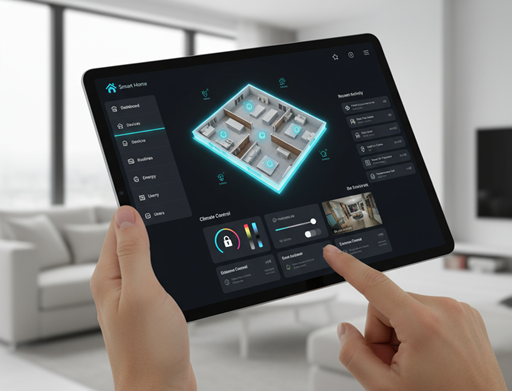

# Exercise: Smart Home Appliance Control



## Task

Create a smart home system where different appliances can be controlled through a common interface. Each appliance has unique behaviors, and some have special features that make them interesting and surprising!

You will need:
* An interface `Appliance` that defines common appliance operations
* Different appliance implementations with unique behaviors
* A `SmartHome` class that can control all appliances
* A main class to demonstrate the smart home system

This will use a console UI.

## Interface Design

Create an `Appliance` interface with these methods:

```java
public interface Appliance {
    void turnOn();
    void turnOff();
    boolean isOn();
    String getStatus();
    String getName();
}
```

## Appliances
Create various classes, which implement the above interface. The methods should just print out a message to the console, indicating that the appliance is doing... something.

Consider appliances like: TV, RobotVacuum, RobotLawnMower, Light (you can create multiple instances for different rooms in your house). Feel free to add more.

## Smart Home Controller

You then need the class to manage all the appliances. And to print the "UI" to the console, so the user can control the appliances.

```java
import java.util.ArrayList;

public class SmartHome {
    private ArrayList<Appliance> appliances;
    
    public SmartHome() {
        this.appliances = new ArrayList<>();
    }
 
    // more methods, like
    // addAppliance(Appliance appliance)
    // listAppliances()
    //...
}
```

The menu should allow the user to:
- Add an appliance
- List all appliances
- Turn on an appliance
- Turn off an appliance
- Control a specific appliance
- Show the status of an appliance
- Show the status of all appliances
- Exit the program

And more, as you see fit.
