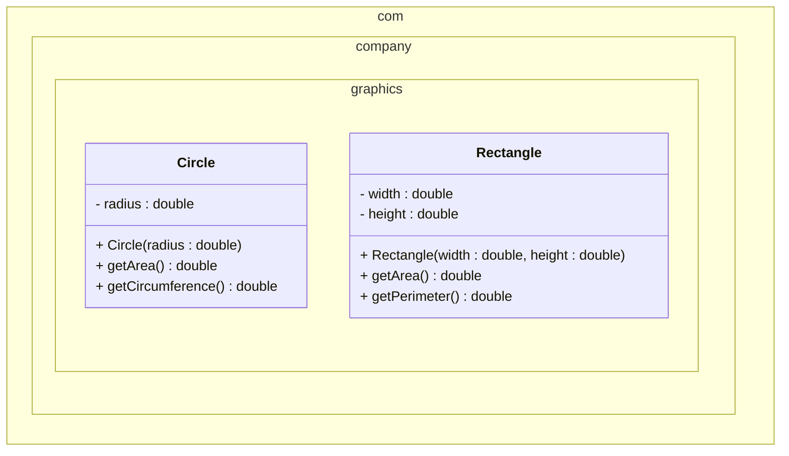
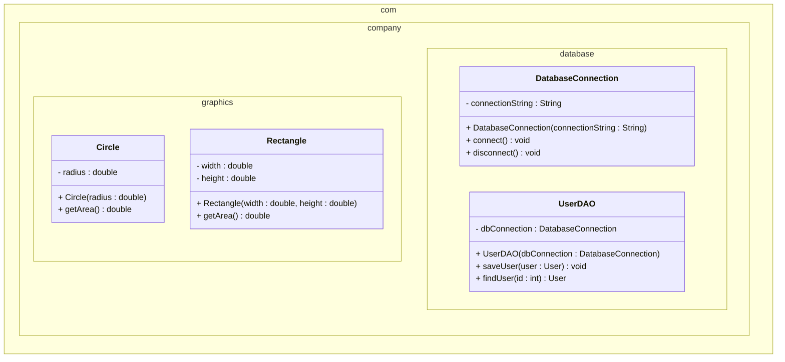

# Packages in UML

## Representing Packages in UML

UML (Unified Modeling Language) provides specific notation to represent packages and their relationships. In Mermaid class diagrams, we can show packages using package notation and demonstrate how classes are organized within them.

## Basic Package Notation

### Simple Package


### Multiple Packages


## Package Dependencies

### Import Relationships
```mermaid
classDiagram
    namespace com.company.graphics {
        class Circle {
            - radius : double
            + Circle(radius : double)
            + getArea() double
        }
    }
    
    namespace com.company.ui {
        class GraphicsPanel {
            - shapes : List~Circle~
            + GraphicsPanel()
            + addShape(shape : Circle) void
            + drawShapes() void
        }
    }
    
    namespace java.util {
        class List {
            <<interface>>
        }
    }
    
    com.company.ui ..> com.company.graphics : imports
    com.company.ui ..> java.util : imports
```

### Service Layer Dependencies
```mermaid
classDiagram
    namespace com.company.model {
        class Product {
            - id : int
            - name : String
            - price : double
            + Product(id : int, name : String, price : double)
            + getId() int
            + getName() String
            + getPrice() double
        }
    }
    
    namespace com.company.dao {
        class ProductDAO {
            + save(product : Product) void
            + findById(id : int) Product
            + findAll() List~Product~
            + delete(id : int) void
        }
    }
    
    namespace com.company.service {
        class ProductService {
            - productDAO : ProductDAO
            + ProductService(productDAO : ProductDAO)
            + addProduct(product : Product) void
            + getProduct(id : int) Product
            + getAllProducts() List~Product~
            + removeProduct(id : int) void
        }
    }
    
    namespace com.company.ui {
        class ProductWindow {
            - productService : ProductService
            + ProductWindow(productService : ProductService)
            + displayProducts() void
            + addProduct() void
        }
    }
    
    com.company.service ..> com.company.model : imports
    com.company.service ..> com.company.dao : imports
    com.company.ui ..> com.company.service : imports
    com.company.ui ..> com.company.model : imports
```

## Complex Package Hierarchy

### E-commerce System Package Structure
```mermaid
classDiagram
    namespace com.ecommerce.model {
        class Product {
            - id : int
            - name : String
            - price : double
            - category : String
            + Product(id : int, name : String, price : double, category : String)
            + getId() int
            + getName() String
            + getPrice() double
            + getCategory() String
        }
        
        class User {
            - id : int
            - username : String
            - email : String
            - password : String
            + User(id : int, username : String, email : String, password : String)
            + getId() int
            + getUsername() String
            + getEmail() String
        }
        
        class Order {
            - id : int
            - userId : int
            - totalAmount : double
            - orderDate : Date
            + Order(id : int, userId : int, totalAmount : double, orderDate : Date)
            + getId() int
            + getUserId() int
            + getTotalAmount() double
            + getOrderDate() Date
        }
    }
    
    namespace com.ecommerce.dao {
        class ProductDAO {
            + save(product : Product) void
            + findById(id : int) Product
            + findByCategory(category : String) List~Product~
            + findAll() List~Product~
            + delete(id : int) void
        }
        
        class UserDAO {
            + save(user : User) void
            + findById(id : int) User
            + findByUsername(username : String) User
            + findByEmail(email : String) User
            + findAll() List~User~
            + delete(id : int) void
        }
        
        class OrderDAO {
            + save(order : Order) void
            + findById(id : int) Order
            + findByUserId(userId : int) List~Order~
            + findAll() List~Order~
            + delete(id : int) void
        }
    }
    
    namespace com.ecommerce.service {
        class ProductService {
            - productDAO : ProductDAO
            + ProductService(productDAO : ProductDAO)
            + addProduct(product : Product) void
            + getProduct(id : int) Product
            + getProductsByCategory(category : String) List~Product~
            + getAllProducts() List~Product~
            + removeProduct(id : int) void
        }
        
        class UserService {
            - userDAO : UserDAO
            + UserService(userDAO : UserDAO)
            + registerUser(user : User) void
            + getUser(id : int) User
            + getUserByUsername(username : String) User
            + getAllUsers() List~User~
            + removeUser(id : int) void
        }
        
        class OrderService {
            - orderDAO : OrderDAO
            - productService : ProductService
            - userService : UserService
            + OrderService(orderDAO : OrderDAO, productService : ProductService, userService : UserService)
            + createOrder(userId : int, productIds : List~int~) Order
            + getOrder(id : int) Order
            + getOrdersByUser(userId : int) List~Order~
            + getAllOrders() List~Order~
            + cancelOrder(id : int) void
        }
    }
    
    namespace com.ecommerce.ui {
        class MainWindow {
            - productService : ProductService
            - userService : UserService
            - orderService : OrderService
            + MainWindow(productService : ProductService, userService : UserService, orderService : OrderService)
            + showMainMenu() void
            + showProducts() void
            + showUsers() void
            + showOrders() void
        }
        
        class ProductWindow {
            - productService : ProductService
            + ProductWindow(productService : ProductService)
            + displayProducts() void
            + addProduct() void
            + editProduct() void
            + deleteProduct() void
        }
        
        class UserWindow {
            - userService : UserService
            + UserWindow(userService : UserService)
            + displayUsers() void
            + addUser() void
            + editUser() void
            + deleteUser() void
        }
        
        class OrderWindow {
            - orderService : OrderService
            + OrderWindow(orderService : OrderService)
            + displayOrders() void
            + createOrder() void
            + viewOrder() void
            + cancelOrder() void
        }
    }
    
    com.ecommerce.service ..> com.ecommerce.model : imports
    com.ecommerce.service ..> com.ecommerce.dao : imports
    com.ecommerce.ui ..> com.ecommerce.service : imports
    com.ecommerce.ui ..> com.ecommerce.model : imports
```

## Package Inheritance and Interfaces

### Interface Packages
```mermaid
classDiagram
    namespace com.company.interfaces {
        class Drawable {
            <<interface>>
            + draw() void
            + setColor(color : String) void
            + getColor() String
        }
        
        class Movable {
            <<interface>>
            + move(x : double, y : double) void
            + getX() double
            + getY() double
        }
        
        class Resizable {
            <<interface>>
            + resize(factor : double) void
            + getWidth() double
            + getHeight() double
        }
    }
    
    namespace com.company.graphics {
        class Circle {
            - x : double
            - y : double
            - radius : double
            - color : String
            + Circle(x : double, y : double, radius : double)
            + draw() void
            + setColor(color : String) void
            + getColor() String
            + move(x : double, y : double) void
            + getX() double
            + getY() double
            + resize(factor : double) void
            + getWidth() double
            + getHeight() double
        }
        
        class Rectangle {
            - x : double
            - y : double
            - width : double
            - height : double
            - color : String
            + Rectangle(x : double, y : double, width : double, height : double)
            + draw() void
            + setColor(color : String) void
            + getColor() String
            + move(x : double, y : double) void
            + getX() double
            + getY() double
            + resize(factor : double) void
            + getWidth() double
            + getHeight() double
        }
    }
    
    com.company.graphics ..> com.company.interfaces : imports
    com.company.interfaces <|.. com.company.graphics : implements
```

## Package Visibility and Access

### Public vs Package-Private Classes
```mermaid
classDiagram
    namespace com.company.model {
        class Product {
            - id : int
            - name : String
            - price : double
            + Product(id : int, name : String, price : double)
            + getId() int
            + getName() String
            + getPrice() double
        }
        
        class ProductHelper {
            - product : Product
            + ProductHelper(product : Product)
            + calculateDiscount(percentage : double) double
            + formatPrice() String
        }
    }
    
    namespace com.company.service {
        class ProductService {
            - productDAO : ProductDAO
            + ProductService(productDAO : ProductDAO)
            + addProduct(product : Product) void
            + getProduct(id : int) Product
        }
    }
    
    namespace com.company.dao {
        class ProductDAO {
            + save(product : Product) void
            + findById(id : int) Product
            + findAll() List~Product~
        }
    }
    
    com.company.service ..> com.company.model : imports
    com.company.service ..> com.company.dao : imports
    com.company.dao ..> com.company.model : imports
```

## Package Dependencies and Layers

### Layered Architecture
```mermaid
classDiagram
    namespace com.company.presentation {
        class ProductController {
            - productService : ProductService
            + ProductController(productService : ProductService)
            + showProducts() void
            + addProduct() void
            + editProduct() void
        }
        
        class UserController {
            - userService : UserService
            + UserController(userService : UserService)
            + showUsers() void
            + addUser() void
            + editUser() void
        }
    }
    
    namespace com.company.business {
        class ProductService {
            - productDAO : ProductDAO
            + ProductService(productDAO : ProductDAO)
            + addProduct(product : Product) void
            + getProduct(id : int) Product
            + getAllProducts() List~Product~
        }
        
        class UserService {
            - userDAO : UserDAO
            + UserService(userDAO : UserDAO)
            + addUser(user : User) void
            + getUser(id : int) User
            + getAllUsers() List~User~
        }
    }
    
    namespace com.company.data {
        class ProductDAO {
            + save(product : Product) void
            + findById(id : int) Product
            + findAll() List~Product~
        }
        
        class UserDAO {
            + save(user : User) void
            + findById(id : int) User
            + findAll() List~User~
        }
    }
    
    namespace com.company.model {
        class Product {
            - id : int
            - name : String
            - price : double
            + Product(id : int, name : String, price : double)
            + getId() int
            + getName() String
            + getPrice() double
        }
        
        class User {
            - id : int
            - username : String
            - email : String
            + User(id : int, username : String, email : String)
            + getId() int
            + getUsername() String
            + getEmail() String
        }
    }
    
    com.company.presentation ..> com.company.business : imports
    com.company.business ..> com.company.data : imports
    com.company.business ..> com.company.model : imports
    com.company.data ..> com.company.model : imports
    com.company.presentation ..> com.company.model : imports
```

## UML Package Notation Rules

### 1. **Package Namespace**
- Use `namespace` keyword to define package boundaries
- Package names should match Java package names
- Use dot notation for hierarchical packages

### 2. **Package Dependencies**
- Use `..>` to show import relationships
- Dependencies flow from importing package to imported package
- Show all necessary dependencies

### 3. **Class Visibility**
- `+` for public classes and methods
- `-` for private fields and methods
- `#` for protected members
- No modifier for package-private members

### 4. **Interface Notation**
- Use `<<interface>>` stereotype for interfaces
- Show implementation relationships with `<|..`
- Group interfaces in appropriate packages

### 5. **Method Parameters**
- Use format: `methodName(parameter : type) returnType`
- Example: `+ calculate(a : double, b : double) double`

## Best Practices for Package UML Diagrams

### 1. **Clear Package Boundaries**
- Use namespace notation to show package boundaries
- Group related classes within packages
- Show clear separation between packages

### 2. **Complete Dependencies**
- Show all import relationships
- Include both direct and indirect dependencies
- Use consistent arrow notation

### 3. **Logical Grouping**
- Group related packages together
- Use spacing to separate different layers
- Consider the flow of dependencies

### 4. **Consistent Naming**
- Use clear, descriptive package names
- Follow Java naming conventions
- Be consistent with class names

### 5. **Appropriate Detail Level**
- Show only necessary classes and methods
- Focus on important relationships
- Use comments for clarification

## Summary

UML package diagrams help you:

- **Visualize package structure** clearly
- **Identify dependencies** between packages
- **Understand relationships** between classes
- **Communicate design** to other developers
- **Plan package organization** before coding

The namespace notation and dependency arrows make it easy to see how packages are organized and how they depend on each other, helping you understand the structure and relationships of your package-based design.
