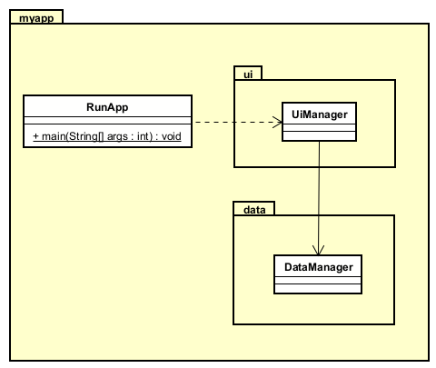

# Packages in UML

## Representing Packages in UML

UML (Unified Modeling Language) provides specific notation to represent packages and their relationships. 




In the above diagram, we see three packages: MyApp, UI, and Data. The latter two are nested inside the MyApp package.

It can be shown as a tree structure like this:

```
myapp/
├── ui/
│   └── UiManager.java
├── data/
│    └── DataManager.java
```	